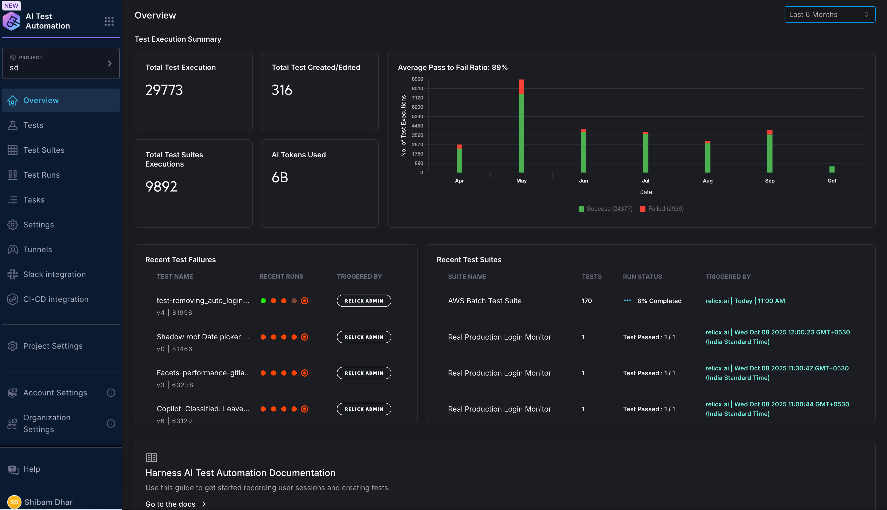

import Tabs from '@theme/Tabs';
import TabItem from '@theme/TabItem';

:::info
To enable Harness AI Test Automation in your account, contact your sales representative or reach out to the team at [ait-interest@harness.io](mailto:support@harness.io).
:::

Harness AI Test Automation is a generative AI-powered platform that transforms how teams create, maintain, and execute automated tests. It combines natural language processing, user behavior analytics, and multi-agent orchestration to deliver a no-code, intent-driven testing experience.

You write automated tests in plain English using prompts like "add the most expensive item to the cart." The AI foundation model interprets your intent alongside the application dynamic UI, making it possible for both technical and non-technical users to author robust, end-to-end test cases without writing code.

---

## What you will learn

- **Platform capabilities:** The core features that enable no-code test creation, self-healing tests, and environment-agnostic execution.
- **How the AI works:** The stages from intent-based authoring through multi-agent execution and real-time self-healing.
- **UI navigation areas:** What each section of the AI Test Automation interface provides.
- **Integration model:** How AI Test Automation fits into your CI/CD pipelines.

---

## Core capabilities

AI Test Automation provides the following capabilities:

- **No-code test creation:** Capture steps automatically through the cloud or author tests with natural language AI prompts.
- **Self-healing tests:** AI dynamically adjusts to UI or workflow changes, maintaining stable tests without manual patching.
- **Environment agnostic:** Define tests once and run across QA, staging, or production by switching environment parameters. Go to [Application environments](/docs/ai-test-automation/test-environments/adding-application-environments) to configure environments.
- **Pipeline integration:** Automate tests within your CI/CD workflows for faster, reliable feedback. Go to [Harness pipeline integration](/docs/ai-test-automation/integrations/harness-cd) to set up pipeline triggers.
- **Comprehensive test suites:** Organize and manage tests grouped logically for batch runs, scheduling, and notifications. Go to [Test suites](/docs/ai-test-automation/suites/harness-ai-suites) to configure suites.
- **Reusable tasks:** Modular components streamline complex workflows like authentication or setup sequences. Go to [Tasks](/docs/ai-test-automation/test-authoring/creating-tests/tasks) to create and manage tasks.
- **Secure execution:** Tests run isolated in Kubernetes pods with strict privacy controls, including no persistent user data.

---

## How it works

Harness breaks testing into AI-powered stages:

1. **Intent-based authoring:** You define tests with natural language, requiring no special coding skills.
2. **AI interpretation:** The core AI evaluates sanitized HTML wireframes and UI screenshots, understanding context and visual structure.
3. **Multi-agent execution:** Specialized agents (such as navigation and date handlers) orchestrate specific test tasks for precise workflows.
4. **Real-time self-healing:** On every run, tests self-correct UI locators based on the latest page layout and element changes.
5. **Caching and parallel runs:** Initial executions reason through intents, but subsequent runs leverage cached copilot memory to accelerate. The platform supports parallel execution of up to 100 tests.

Go to [AI-powered intent testing](/docs/ai-test-automation/get-started/intent-driven) to understand the AI workflow in depth.

---

## UI walkthrough

The following video provides a walkthrough of the AI Test Automation interface:

<iframe src="https://www.loom.com/embed/fb9f3cb6346b4f708e91a529edcc1613?sid=0c2007dc-2521-48bd-80f0-456300aef1ab" width="800" height="450" frameborder="0" allowfullscreen></iframe>

---

## Interface sections

The AI Test Automation interface is organized into the following areas:

- **Overview:** A unified landing view that surfaces activity from both AI Test Automation and Playwright sources, including running test suites, recent runs, pass/fail charts, AI token consumption, and overall project status.
- **Tests:** Create tests, view test lists, and see detailed execution information including pass/fail counts. Provides options to edit, validate, and add to test suites.
- **Test Suites:** Group tests together for batch execution. View suite summaries including last run results.
- **Test Runs:** View information about previous test runs, including duration and associated test suites.
- **Tasks:** Group steps into reusable functions. Includes options to create login tasks and general tasks.
- **Settings:** Define environments for different test suites and configure detailed execution parameters.
- **Tunnels:** Establish secure connections between cloud-based test runners and private or firewalled internal resources. Go to [Testing firewall-protected apps](/docs/ai-test-automation/test-environments/testing-firewall-protected-apps) to configure tunnels.
- **CI/CD integration:** Automate test triggers within your continuous integration and deployment pipelines. Go to [Harness pipeline integration](/docs/ai-test-automation/integrations/harness-cd) to configure pipeline integration.

---

## Benefits

| Area | What you get |
|------|-------------|
| **Test creation** | Empower non-technical team members to author high-quality tests with AI-assisted guidance. Reduce the time and expertise required to design and build test suites. |
| **Test maintenance** | Cut maintenance time with AI-driven self-healing that adapts to UI and application changes. Eliminate brittle scripts by automatically updating selectors and flows when apps evolve. |
| **Testing efficiency** | Accelerate releases with faster, more reliable execution powered by AI semantic validation and visual regression. Expand coverage through intelligent assertions and risk-based prioritization. |
| **Pipeline integration** | Ensure continuous, automated quality checks with environment-agnostic tests and CI/CD triggers. Streamline collaboration across dev and QA with standardized workflows. |
| **Security and scale** | Enterprise-grade security with tests running in isolated Kubernetes pods. No persistent user data. Cloud-ready architecture that scales with your needs. |

---

## Future capabilities

Harness is innovating continuously with upcoming capabilities:

- **Autonomous test generation:** Automatically generate tests from real user flows and requirements.
- **Advanced AI validation:** Implement confidence scoring for nuanced assertion controls.
- **Expanded integrations:** Sync with test management tools and external systems for full lifecycle coverage.
- **Performance enhancements:** Ongoing improvements in AI models and architecture to drive faster test execution and broader scalability.

---

## Why choose Harness AI Test Automation

Harness AI Test Automation transcends traditional scripted testing by dynamically reasoning across UI changes and intent, rather than relying on fragile static locators. This approach ensures:

- Greater test resilience and lower failure rates.
- Faster onboarding and broader team participation.
- Improved release velocity with trustworthy automation coverage.

The combination of AI-powered adaptability and deep pipeline integration makes it a strong choice for organizations seeking smarter, scalable software testing.

---

## Next steps

- [Get started with AI Test Automation](/docs/ai-test-automation/get-started/quickstart): Create your first test and login task.
- [AI-powered intent testing](/docs/ai-test-automation/get-started/intent-driven): Understand how the AI interprets natural language test instructions.
- [Best practices for creating and maintaining tests](/docs/ai-test-automation/best-practices/creating-and-maintaining-tests-best-practices): Proven strategies for reliable test automation.
- [Running tests](/docs/ai-test-automation/test-execution/running-tests): Configure execution modes and schedules.
