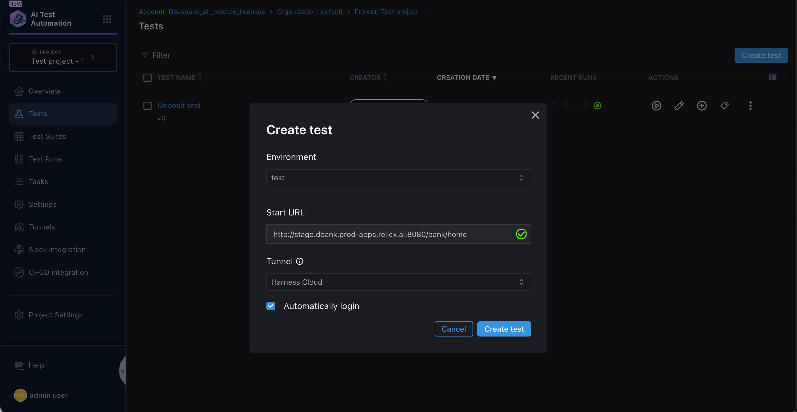

import Tabs from '@theme/Tabs';
import TabItem from '@theme/TabItem';

Harness AI Test Automation is an AI-powered testing platform designed to streamline test creation and maintenance for software development teams. The tool uses generative AI to transform plain text test cases into automated tests, and implements self-healing mechanisms that automatically update tests when application interfaces or workflows change, reducing the manual overhead of test maintenance.

Getting started with AI Test Automation follows these steps:
- [Create your first test](/docs/ai-test-automation/get-started/quickstart#create-your-first-test)
- [Create a login task](/docs/ai-test-automation/get-started/quickstart#create-a-login-task)

<!-- Note: If you are an existing Relicx customer, please continue to refer to 
[Relicx documentation](https://docs.relicx.ai/) -->

## Prerequisite
Your application must be accessible from the public cloud. For testing applications behind a corporate firewall please contact Harness support. 

## Sign-up

This document assumes that you already have an account with Harness. Login using your harness account and select AI test Automation from the module selector. 

### Select or Add a Project

Select the project where you want to add your tests. If one doesn't exist then create a new project. Once a project is created and you select AI Test Automation, you will be prompted to add your test environment

###
---

## Create your first test

After you have signed up, the first step would be to create an AI powered test.

The `Create Test` button sets up a test pod where you can author your test while interacting with the browser.

Before you can start recording your test, check the Start URL. This should be the url pointing to your app. If needed update the URL and click on the create test button. You will now be on the `Interactive AI trainer` and you can start recording your test.

Once on the trainer, you can interact with the browser or may also choose to enter a natural language prompt and start authoring a test.

Once you are done, save the test and give it a name 

If you choose to run the test after save, it will be executed and you can follow the execution on the test run page 

## Create a login task

If your application requires authentication, you may wonder how can you avoid adding the login steps into your test every time. Harness AI Test Automation provides the ability to add a login task that is automatically called when a test is either created or executed. You just need to create it once and add your login credentials;

Once the `Create a login task` button is clicked then you will be present with the following modal, where you will have to enter a few details. Keep in mind this is a one time creation and the experience is very similar to creating a test.

In the above screen, you will enter a task name ( e.g. Login task) and a Login URL. For a majority of application the application base URL is used for logging into the app, so no change is necessary. In the subsequent step, you can enter the username, password or any other details like an OTP etc.

The task should have all the steps that are necessary to login to your application.

It is always a good idea to add an assertion at the end of the login task to make sure the login is successful. 

Once the login task is created, you will be able to automatically add it to your tests

Once you have created your login task and created your first test, you should be in a position to add more tests. Once you have a handful of tests, create a test suite and run your tests together. 