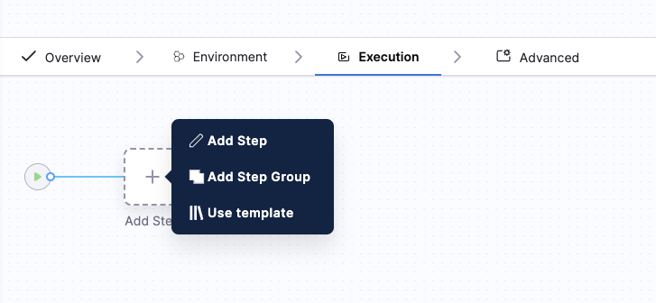
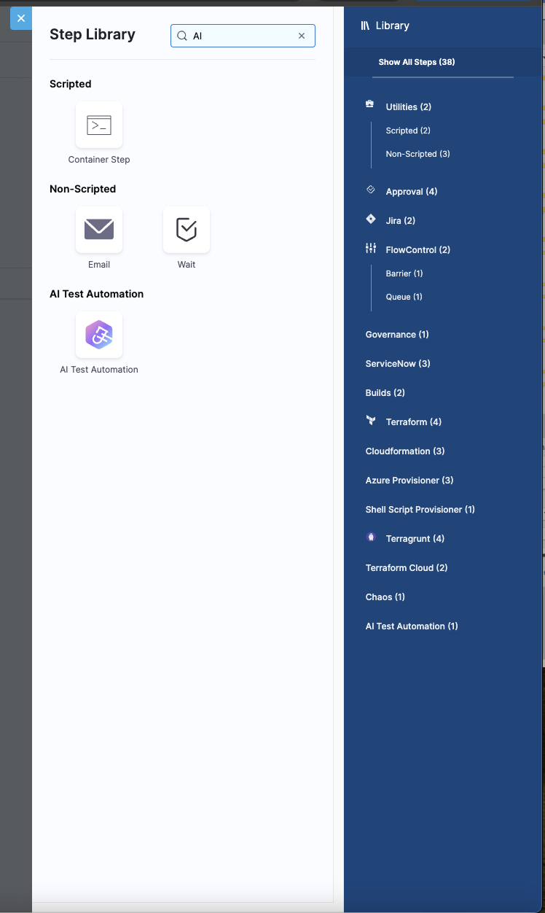
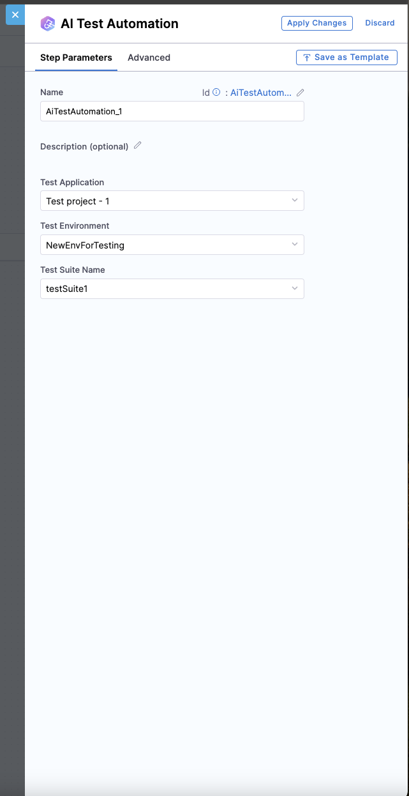

# AI Test Automation with Harness CD

## Overview

AI Test Automation is seamlessly integrated into the Harness Platform, enabling frictionless quality verification within your CI/CD pipelines. This integration allows development teams to automatically validate application functionality before deploying to new environments, reducing the risk of defects reaching production.

## Benefits

- **Simplified Pipeline Integration**: Add automated testing directly within your existing Harness CD pipeline
- **Early Detection of Issues**: Identify and resolve potential problems before they reach production environments
- **Increased Release Confidence**: Deploy with confidence knowing your application has passed AI-powered testing
- **Reduced Manual Testing**: Decrease dependency on time-consuming manual verification steps
- **Continuous Validation**: Ensure application performance meets expectations in each environment

## How It Works

The AI Test Automation feature works by executing comprehensive test suites at strategic points in your deployment process. These tests analyze application behavior and functionality to verify that everything operates as expected before proceeding to the next stage.

## Setup Instructions

### Adding AI Test Automation to Your Pipeline

1. Navigate to your Harness CD pipeline configuration
2. Select the deployment stage where you want to add verification

3. Add a new step and select "AI Test Automation" from the available options

4. Configure your test suite settings 

 

5. Save your pipeline configuration

### Configuration Options

| Option | Description |
|--------|-------------|
| Step Name | Assign a name to this step |
| Test Application | Select the name of the application to be tested |
| Test Environment | Environment against which the test suite will be executed |
| Test suite Name | The test suite to be executed |

## Sample video explaining the flow

<iframe src="https://www.loom.com/embed/c55bb24b5f124f9fbe369d097f6528c4?sid=6a3332d4-f145-4de8-ad64-f7b2228fcb3b" width="960" height="540" frameborder="0" allowfullscreen>></iframe>

## Conclusion

AI Test Automation in Harness CD provides a powerful way to ensure application quality throughout your deployment process. By integrating automated testing directly into your pipelines, you can deploy with greater confidence while reducing manual testing effort.

