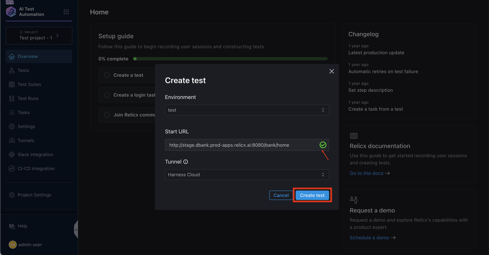
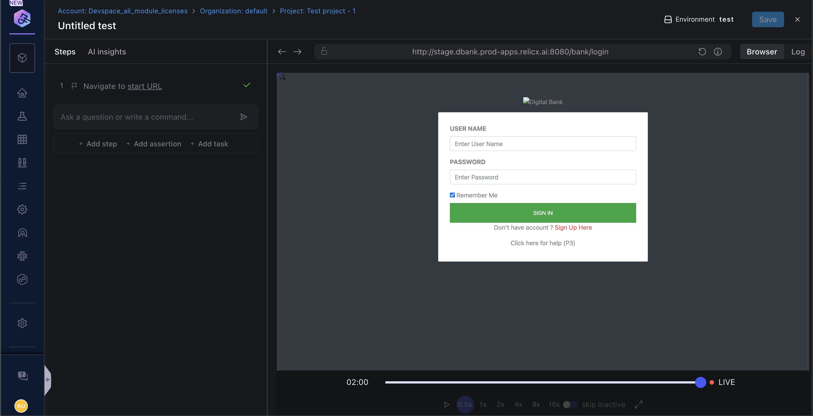
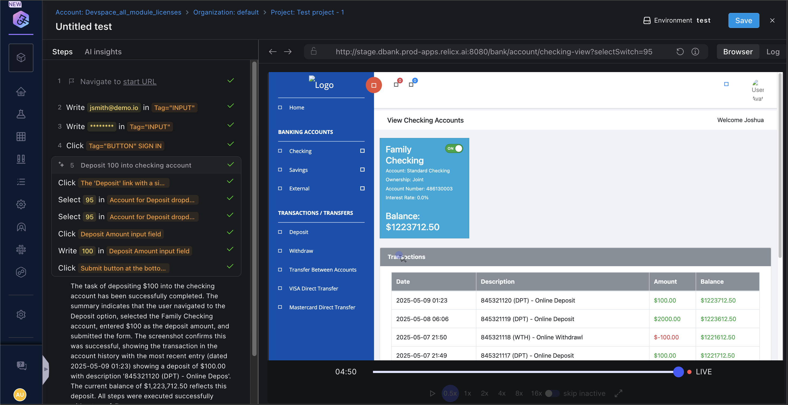
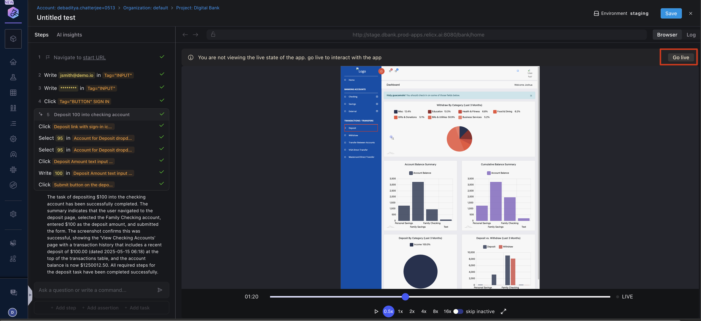

# Creating Tests with Interactive Authoring

Creating a test with Harness AI Test Automation's interactive authoring is simple and straightforward. This no-code approach allows you to navigate through your application and perform a specific workflow while the system records your actions. Once created, you can enhance your tests with parameters and assertions to ensure they work robustly across different environments.

## Quick Overview

To begin, click the `Create Test` button on the Test Listing page. The video below demonstrates how to create a test using interactive mode:

<iframe src="https://www.loom.com/embed/1b7da99dac25492d85fcc8859ca47f55?sid=419a3fe2-ae2d-421e-86df-d3ac28babbfb" width="800" height="450" frameborder="0" allowfullscreen></iframe>

## Getting Started

Follow these steps to create your first test:

1. Click the `Create Test` button on the test listing page to open the **Create Test** modal.
2. Complete the following fields:

   - **Environment Name**: Select the target environment where you'll create and initially run your test
   - **Start URL**: Enter the URL where your test will begin (typically your application's home page or another relevant page)
   - **Tunnel**: *Enterprise Customers Only* - Select a tunnel to access environments behind a firewall
   - **Automatically login**: Disabled by default. When enabled, you'll need to create an auto-login task and update your test environment with login credentials

:::info
For more information about adding environments, see the [Adding a New Test Environment](../../test-environments/adding-application-environments.md) page.
:::



After providing these inputs, Harness AI Test Automation (Harness AIT) will deploy a test pod, allowing you to begin test creation. If your start URL leads to a page behind a login screen, you'll need to record the login steps first.

When you click the `Create Test` button, as shown below, our demo app will display a screen to capture your login steps. During subsequent test runs in this environment, the test will automatically use these credentials.



## Recording Test Steps

As you interact with your application, Harness AIT captures each step and displays them in the left navigation bar.



During test creation, you can:

- Select [User Actions](./user-actions.md) from the dropdown menu
- Add [Assertions](./assertions.md) to verify expected outcomes
- Return to previous steps for modifications (use caution, as Harness AIT won't revalidate these changes)

If you need to resume recording after making changes, click the `Go Live` button to return the browser to its current state.



The next sections will cover the various commands available during test creation.


```mdx-code-block
import DocCardList from '@theme/DocCardList';

<DocCardList />
```
