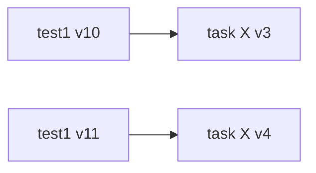
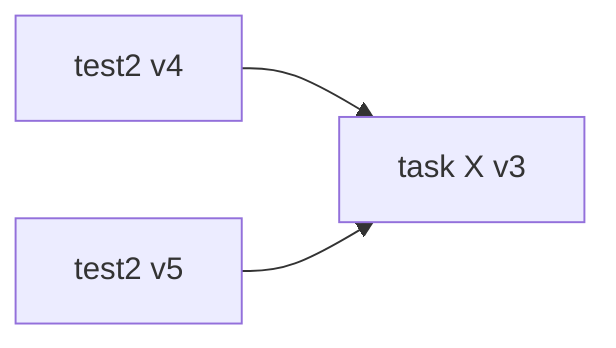
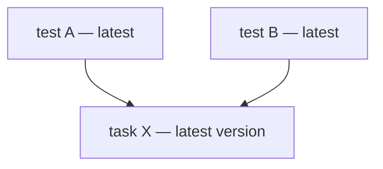

Tasks are reusable functions designed to perform a series of commonly used steps. In AI Test Automation, there are two types of tasks: **Login tasks** and **General tasks**. Login tasks, the most frequently used, are designed to capture credentials and are automatically included in any test during its creation and execution. General tasks, on the other hand, are manually added by the test creator, who selects them from a list of available tasks.

Login tasks ([Create a login task](<./../../get-started/quickstart.md#create-a-login-task>) ) are created through interactive authoring, while General tasks are defined by selecting a series of consecutive steps in the test details page.&#x20;

Once a test is created and you think a set of consecutive steps will be reused in various other tests then you can simply select the steps and create a task. Once the task is created you can add the task to any new test in interactive authoring or during Editing.&#x20;

<DocImage
  path={require('./static/create-task.png')}
  alt="Create a task"
  title="Click to view full size image"
  width={400}
  height={400}
/>

## Add a task to a test&#x20;

During test authoring, you can add a task to a test by selecting one from the list.&#x20;

<DocImage
  path={require('./static/add-task.png')}
  alt="Add a task"
  title="Click to view full size image"
  width={400}
  height={400}
/>

Once added, simply click on the `Continue` button at the top of the step panel to execute all the task steps and make it part of the test definition&#x20;

<DocImage
  path={require('./static/continue-task.png')}
  alt="Continue to execute"
  title="Click to view full size image"
  width={600}
  height={900}
/>

Here is a video explaining how tasks can be created

<iframe src="https://www.loom.com/embed/ed40cb4ed4854df79ddf44964fe5fd4e?sid=ce56db9e-9693-4806-92b6-93face064f3c" width="960" height="540" frameborder="0" allowfullscreen></iframe>

## Task versioning

Task versioning in AI Test Automation aligns with **test** versioning: each save produces history you can inspect, copy, or restore. Open the **Version History** tab on the task details page to see changes for the task.

<DocImage
  path={require('./static/task-version-history.png')}
  alt="Task details showing the Version History tab with multiple task versions"
  title="Task version history with options to show edits, create a copy, and restore"
  width="80%"
/>

### Save rules
Each time you save an **edited** task, the system creates a **new version** rather than silently overwriting the only copy. If you save a **new test version** after editing the test (including after **live editing**) and the **task** referenced by that test **did not change**, the task version should **not** advance—only real task edits create a new task version.

### History actions
**View** all previous versions, **copy** any version to **create a new task** (fork from that snapshot), or **restore** an older version so it becomes the **current** version of the task. Restoring or advancing the current task version affects **every test** that references that task, so use **copy** when you need a different line of work without changing other tests.

<DocImage
  path={require('./static/task-version-history-show-edits.png')}
  alt="Task version history with a modal showing edits between two task versions"
  title="Show edits between task versions"
  width="80%"
/>

#### How test and task versions relate
Each **test version** is a snapshot that **remembers which task version** was current when that test version was saved. The **latest** test version is expected to use the **latest** task version, so when the task moves forward, the newest test version moves with it while older test versions keep their historical pointers.

### One task, one head
For a given **task X**, the **latest** version is what every test using **task X** aligns with at the tip. To work from an **older** task definition without changing what others get, branch off (copy from history into a **new task**, and often **copy the test**—see below).

<DocImage
  path={require('./static/task-used-in-test-steps.png')}
  alt="Test steps panel showing a task expanded into its underlying steps"
  title="A task in a test expands into task steps"
  width="100%"
/>

- The **latest version of a test** points to the **latest version of the task** it uses.
- When you edit **both** test and task (for example live editing **test1** and **task X**), each new **test** version keeps the **task version** that was current when that test version was saved.
- When you save a **new test version** without changing the task, the **task version number** stays the same; the new test version can still reference that same task version.

| Test snapshot | Points to task X |
|---------------|------------------|
| **test1 v10** | **v3** (when v10 was saved) |
| **test1 v11** | **v4** (after task X was updated) |

If **test2** goes from v4 to v5 but **task X** is unchanged, both snapshots can point at the **same** task version (for example **v3**); the task should not get a new version when it was not edited.

Conversely, when you save a new test version **without** changing the task, the older test version and the new test version both point to the same task version—which may still be the latest task version at that point.

**When you want the next version of a test to use an older task version:** This often comes up when **task X** is referenced by **multiple tests**. You need the **next** edits on **your** test to start from an **older snapshot** of task X, but you cannot restore or replace the shared task without affecting everyone else.

1. **Copy the test** so follow-on work happens on a separate test line and other tests are unchanged.
2. **Open task X Version History** and find the older task version you want to start from.
3. **Create a new task from that version** using **Create a copy** on that older snapshot.
4. **Swap the task in the copied test:** remove **task X** and add the **new task** you just created.

After this, other tests keep using the latest **task X**, while your copied test uses the **new task** created from the older snapshot.

**Variant for a single test only:** Create a **new task** by copying the task (or a specific version from history), then open the test, remove the original task, and add the new one.

## Parameters in Tasks

It's common to have parameters within tasks, as users often need to run tests with varying values to cover different scenarios. In AI Test Automation, you can set runtime overrides when running a test in standalone mode through the run modal. However, manual overrides aren’t available when running multiple tests, or test suites, via CI/CD integration. To address this, AI Test Automation allows users to set parameter overrides at four levels in a hierarchical structure:

1. **Tasks**: Each parameter has a default value, typically set when the task is created. If no other overrides are applied, this default value is used in any test that includes the task.
2. **Environment**: This override lets you specify a unique value for a parameter when a task runs in a specific environment. For example, if you set an override for `Environment 1` but **not** for `Environment 2`, the task will use the override in `Environment 1` and the default in `Environment 2`.
3. **Test**: A test-level override supersedes the environment and task-level values. You can also define a parameter override for a specific combination of environment and test.
4. **Test Suites**: This is the highest level in the hierarchy. Parameter overrides set at the test suite level apply during test suite execution and take precedence over all other levels.

Here is a **short video** explaining how to set overrides for a Task parameter.&#x20;

<iframe src="https://www.loom.com/embed/e9a34c116e254ad7b93f49f1744195d2?sid=5716f09d-cd35-4452-95ab-47671630f954" width="960" height="540" frameborder="0" allowfullscreen></iframe>

### Set a task level default

To set the task level default simply edit the value on the parameters modal as shown below.&#x20;

<DocImage
  path={require('./static/task-default.png')}
  alt="Continue to execute"
  title="Click to view full size image"
  width={600}
  height={500}
/>
