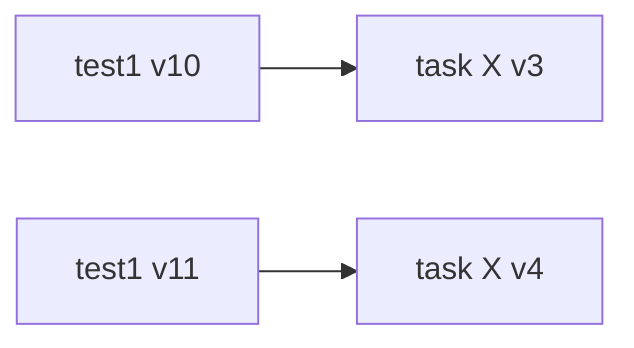
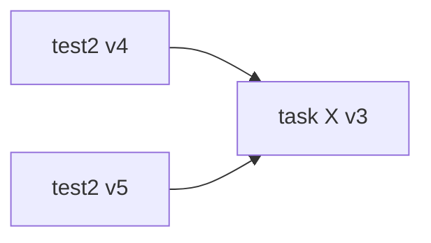
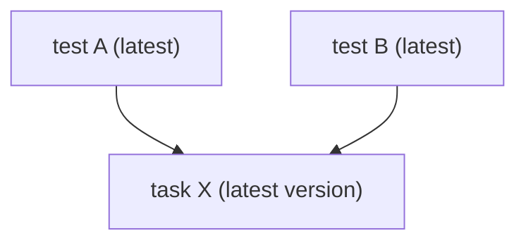

Tasks are reusable functions that perform a series of commonly used steps. Instead of recreating the same sequence of actions in every test, you define a task once and reference it wherever needed.

AI Test Automation supports two types of tasks. **Login tasks** capture credentials and are automatically included in every test during creation and execution. **General tasks** are manually added by the test creator from a list of available tasks. You create Login tasks through interactive authoring, while you define General tasks by selecting a series of consecutive steps in the test details page.

---

## What you will learn

- **Task types:** The difference between Login tasks and General tasks, and when each is used.
- **Adding tasks to tests:** How to include a reusable task during test authoring.
- **Task version history:** How versioning works, how test and task versions relate, and how to restore or copy older versions.
- **Parameter override hierarchy:** The four levels of parameter overrides (task, environment, test, test suite) and their precedence.

---

## Before you begin

This guide assumes familiarity with:

- Basic test creation in AI Test Automation. Go to [Get started with AI Test Automation](/docs/ai-test-automation/get-started/quickstart) to create your first test.
- The concept of interactive authoring (recording steps in a browser session to build tests).

---

## Task types

AI Test Automation has two task categories:

- **Login tasks:** Capture authentication credentials and are automatically added to every new test. You create them during the initial quickstart setup through interactive authoring. Go to [Create a login task](/docs/ai-test-automation/get-started/quickstart#create-a-login-task) to set one up.
- **General tasks:** Contain any reusable sequence of steps (navigation, form fills, verifications). You create them by selecting consecutive steps in the test details page and choosing **Create Task**.

<DocImage
  path={require('./static/create-task.png')}
  alt="Create a task by selecting consecutive steps"
  title="Click to view full size image"
  width={400}
  height={400}
/>

---

## Add a task to a test

During interactive authoring, you can insert a task into a test by selecting one from the available task list.

<DocImage
  path={require('./static/add-task.png')}
  alt="Add a task from the task list during authoring"
  title="Click to view full size image"
  width={400}
  height={400}
/>

After adding the task, select the **Continue** button at the top of the step panel to execute all task steps and include them in the test definition.

<DocImage
  path={require('./static/continue-task.png')}
  alt="Continue button to execute task steps"
  title="Click to view full size image"
  width={600}
  height={900}
/>

The following video demonstrates how to create and add tasks:

<iframe src="https://www.loom.com/embed/ed40cb4ed4854df79ddf44964fe5fd4e?sid=ce56db9e-9693-4806-92b6-93face064f3c" width="960" height="540" frameborder="0" allowfullscreen></iframe>

---

## Task version history

Task versioning aligns with test versioning. Each time you save an edited task, the system creates a new version rather than overwriting the existing one. Open the **Version History** tab on the task details page to view all previous versions.

<DocImage
  path={require('./static/task-version-history.png')}
  alt="Task details showing the Version History tab with multiple task versions"
  title="Task version history with options to show edits, create a copy, and restore"
  width="80%"
/>

### Save behavior

The system creates a new task version only when you save actual edits to the task. If you save a new test version but the referenced task did not change, the task version does not advance.

### Available history actions

From the Version History tab, you can perform three actions on any previous version:

- **View:** Inspect the exact state of the task at that point in time.
- **Copy:** Create a new, independent task based on that version snapshot. Use this when you need a different line of work without affecting other tests.
- **Restore:** Make an older version the current version of the task. This affects every test that references the task, so use copy when you need isolation.

<DocImage
  path={require('./static/task-version-history-show-edits.png')}
  alt="Task version history with a modal showing edits between two task versions"
  title="Show edits between task versions"
  width="80%"
/>

### How test and task versions relate

Each test version records which task version was current when that test version was saved. The latest test version always references the latest task version, while older test versions retain their historical pointers.

<DocImage
  path={require('./static/task-used-in-test-steps.png')}
  alt="Test steps panel showing a task expanded into its underlying steps"
  title="A task in a test expands into task steps"
  width="100%"
/>

Key behaviors:

- The latest version of a test points to the latest version of the task it uses.
- When you edit both a test and its task (for example, during live editing), each new test version captures the task version that was current at save time.
- When you save a new test version without changing the task, the task version number stays the same.

| Test snapshot | Points to task X |
|---------------|------------------|
| **test1 v10** | **v3** (when v10 was saved) |
| **test1 v11** | **v4** (after task X was updated) |

If test2 goes from v4 to v5 but task X is unchanged, both test snapshots point to the same task version:

Multiple tests can also share the latest task version simultaneously:

### Use an older task version without affecting other tests

When a task is shared across multiple tests and you need to base your next edits on an older task snapshot without affecting others, follow these steps:

1. Copy the test so follow-on work happens on a separate test line.
2. Open the task **Version History** and find the older version you need.
3. Select **Create a copy** on that version to create a new independent task.
4. In the copied test, remove the original task and add the new task you just created.

After this, other tests continue using the latest version of the original task, while your copied test uses the new task created from the older snapshot.

---

## Parameter override hierarchy

Tasks commonly contain parameters that allow you to run tests with varying values across different scenarios. AI Test Automation provides four levels of parameter overrides, listed from lowest to highest precedence:

1. **Task level (default):** Each parameter has a default value set when the task is created. If no other overrides are applied, this default value is used in any test that includes the task.
2. **Environment level:** Specify a unique value for a parameter when a task runs in a specific environment. For example, if you set an override for Environment 1 but not Environment 2, the task uses the override in Environment 1 and the default in Environment 2. Go to [Application environments](/docs/ai-test-automation/test-environments/adding-application-environments) to configure environments.
3. **Test level:** A test-level override supersedes both environment and task-level values. You can also define a parameter override for a specific combination of environment and test.
4. **Test suite level:** The highest level in the hierarchy. Parameter overrides set at the test suite level take precedence over all other levels during test suite execution. Go to [Test suites](/docs/ai-test-automation/test-suite) to learn about suite configuration.

:::tip
When running a test in standalone mode, you can set runtime overrides through the run modal. For tests running in bulk via CI/CD integration, use the hierarchy levels above. Go to [Harness pipeline integration](/docs/ai-test-automation/integrations/harness-cd) to configure CI/CD execution.
:::

The following video demonstrates how to set parameter overrides at the task level:

<iframe src="https://www.loom.com/embed/e9a34c116e254ad7b93f49f1744195d2?sid=5716f09d-cd35-4452-95ab-47671630f954" width="960" height="540" frameborder="0" allowfullscreen></iframe>

### Set a task-level default

To set the task-level default, edit the value on the parameters modal:

<DocImage
  path={require('./static/task-default.png')}
  alt="Parameters modal showing how to set the task-level default value"
  title="Click to view full size image"
  width={600}
  height={500}
/>

---

## Next steps

- [Assertions](/docs/ai-test-automation/test-authoring/creating-tests/assertions): Define validation checks within your test steps.
- [Conditionals](/docs/ai-test-automation/test-authoring/creating-tests/conditionals): Add conditional logic to control test flow.
- [User actions](/docs/ai-test-automation/test-authoring/creating-tests/user-actions): Reference of all available user actions in test steps.
- [Test suites](/docs/ai-test-automation/test-suite): Group tests for bulk execution with shared configuration.
- [Task parameter overrides](/docs/ai-test-automation/guides/task-parameter-overrides): Detailed guide on setting overrides at each hierarchy level.
