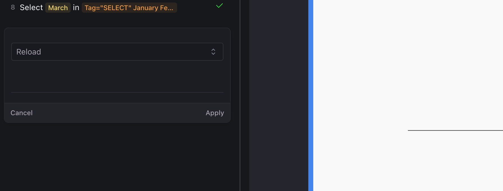

import Tabs from '@theme/Tabs';
import TabItem from '@theme/TabItem';

# User Actions
## Overview

Harness AI Test Automation transforms testing with its intuitive interactive authoring experience. As you naturally interact with your application, the system intelligently captures each action and converts them into robust test steps, no coding required. 

This document explores all available user actions that can be added using the *"+ Add step"* button during test creation, including clicks, text inputs, selections, navigation, keyboard interactions, and more specialized commands like waits and viewport adjustments. 

Each action can be enhanced with assertions to validate expected behavior, parametrized for flexibility, and seamlessly integrated into CI/CD pipelines. Understanding these powerful actions will help you create comprehensive test coverage for your applications, whether you're building simple workflows or complex test scenarios.

<DocImage 
  path={require('./static/user-action.png')}
  alt="User Action"
  title="Click to view full size image"
/>

## Supported Actions

### Click

:::tip
For a basic click, no additional configuration is required. It allows you to explicitly specify which element to click when multiple elements might match the selector, ensuring precision in complex UI interactions. SO just simply click on the element you want to select in the step.
:::

Click on any place in the viewport to register a click command as a test step. No additional action required. 

<DocImage path={require('./static/click.png')} 
alt="click"
title="Click"
/>

#### Advanced Options

<Tabs>
  <TabItem value="navigation" label="Navigation & Timing">

  - **Wait for document ready** - Pauses test execution until the document's ready state is reached, ensuring elements are available for interaction. Options include `Yes`, `No`, and `App Default`.
  - **Expected ready state** - Specifies which document ready state to wait for, such as `complete`, `interactive`, `loaded`, or `app`.
  - **Wait for network requests** - Delays test execution until all in-flight network requests complete. Options include `Yes` and `No`.
  - **Wait for document timeout (ms)** - Maximum time in milliseconds to wait for the document to reach the ready state before timing out.
  - **Wait for network request timeout (ms)** - Maximum time in milliseconds to wait for network requests to complete before continuing.

  </TabItem>

  <TabItem value="parameterization" label="Parameterization">

  - **Text param** - Allows you to use dynamic values in your click action by connecting it to parameters defined in your test. Parameters can be set at the test level or provided at runtime, making your tests more flexible and reusable.
  > You can use from the dropdown list or use the `+ Create Parameter` button to create a new parameter.

  </TabItem>

  <TabItem value="response" label="Response Data Capture">

  - **URL Pattern / Regular Expression** - Defines which network requests to capture data from, using either a simple URL pattern or a regular expression to match specific endpoints
  - **Parameter name for Response body** - The name of the parameter where the captured response data of the body will be stored for later use in your test
  - **Response Body Path (JSONPath)** - Extracts specific data from a JSON response using JSONPath syntax, allowing you to capture only the values you need
  - **Scope**: App, Test Suite, or Runtime - Determines where the captured parameter is stored and how widely it can be accessed across tests

  </TabItem>

  <TabItem value="others" label="Others">

  - **Use Touch** - Enables touch events simulation along with mouse clicks, useful when testing applications designed for mobile or touch interfaces

  </TabItem>
</Tabs>

### Write

Write text in any input field, text area, or editable element in your application. This action simulates a user typing content into a field, supporting both static text and dynamic parameters. It works with standard HTML inputs, WYSIWYG editors, rich text fields, and most other editable interfaces. 

>Can be parameterized directly using available parameters or by creating new ones by clicking on the `{}` button 

<DocImage path={require('./static/write.png')} 
alt="write"
title="Write"
/>

:::tip
For a basic write action, simply specify the text you want to input and select the appropriate input field based on your selection.
:::

#### Advanced Options

<Tabs>
  <TabItem value="navigation" label="Navigation & Timing">

  - **Wait for document ready** - Pauses test execution until the document's ready state is reached, ensuring elements are available for interaction, you get options like `Yes`, `No`, and `App Default`.
  - **Expected ready state** - Specifies which document ready state to wait for (complete, interactive, loaded, app)
  - **Wait for network requests** - Delays test execution until all in-flight network requests complete, with option like `Yes` and `No`.
  - **Wait for document timeout (ms)** - Maximum time in milliseconds to wait for the document to reach the ready state before timing out
  - **Wait for network request timeout (ms)** - Maximum time in milliseconds to wait for network requests to complete before continuing

  </TabItem>

  <TabItem value="response" label="Response Data Capture">

  - **URL Pattern / Regular Expression** - Defines which network requests to capture data from following the write action
  - **Parameter name for Response body** - The name of the parameter where the captured response data will be stored
  - **Response Body Path (JSONPath)** - Extracts specific data from a JSON response using JSONPath syntax
  - **Scope**: App, Test Suite, or Runtime - Determines the scope and accessibility of the captured parameter

  </TabItem>

  <TabItem value="others" label="Others">
  - **Append Text** - When enabled (true), adds the specified text to the end of any existing text in the field rather than replacing it
  - **Hide text** - When enabled, masks the input text in logs and displays, useful for sensitive information like passwords

  </TabItem>
</Tabs>

### Select

Select a value from dropdown menus, select boxes, or other list interfaces. This action simulates a user choosing an option from a dropdown, allowing your test to interact with form selection elements. The system will capture both the display text and underlying value of the selected option. 

<DocImage 
  path={require('./static/select.png')}
  alt="Select"
  title="Select"
/>

:::info
Click, Write, and Select are automatically detected by Harness AI Test Automation. Users need not have to select these commands from a list.
:::

### File Upload

Uploads a file to the selected input element on a webpage. Specify the absolute or relative path to the file you want to upload, and select the appropriate file input element in your application.
The file input element where you want to upload the file. Click on the appropriate file input element in your application.

> You can upload files from your local system or from your test resources directory. This will host to S3 bucket and the file path will be used in the test.

<DocImage 
  path={require('./static/file-upload.png')}
  alt="File Upload"
  title="File Upload"
/>

### Navigate
Navigate to a specific URL or relative path, allowing you to direct your test to different pages or websites. Supports both absolute URLs (starting with http:// or https://) and relative paths that will be appended to your environment's base URL. 

<DocImage 
  path={require('./static/navigate.png')}
  alt="Navigate"
  title="Navigate"
/>

#### Advanced Options

<Tabs>

  <TabItem value="navigation" label="Navigation & Timing">

  - **Wait for document ready** - Pauses test execution until the document's ready state is reached, ensuring elements are available for interaction, you get options like `Yes`, `No`, and `App Default`.
  - **Expected ready state** - Specifies which document ready state to wait for (complete, interactive, loaded, app)
  - **Wait for network requests** - Delays test execution until all in-flight network requests complete, with option like `Yes` and `No`.
  - **Wait for document timeout (ms)** - Maximum time in milliseconds to wait for the document to reach the ready state before timing out
  - **Wait for network request timeout (ms)** - Maximum time in milliseconds to wait for network requests to complete before continuing

  </TabItem>

  <TabItem value="parameterization" label="Parameterization">

  - **Skip BASE_URL translation** - When set to true, prevents the system from prepending the environment's base URL to relative paths. Default is false, which automatically prepends the base URL to relative paths.

  </TabItem>

  <TabItem value="response" label="Response Data Capture">

  - **URL Pattern / Regular Expression** - Defines which network requests to capture data from during navigation
  - **Parameter name for Response body** - Name of the parameter where captured response data will be stored
  - **Response Body Path (JSONPath)** - JSONPath expression to extract specific data from responses
  - **Scope**: App, Test Suite, or Runtime - Determines the scope and accessibility of captured parameters

  </TabItem>
</Tabs>

### Wait for Time

Creates a timed pause in test execution.

| Feature | Description |
|---------|-------------|
| **Description** | Wait for a specified period of time |
| **Parameter options** | Time in milliseconds to wait |
| **Advanced options** | No |
| **Return value** | None |

<DocImage
  path={require('./static/wait-for-time.png')}
  alt="set-parameter"
  title="Click to view full size image"
  width={450}
  height={400}
/>

### Reload

Just add this action step to refresh the current page.
 

### Viewport

Adjusts the screen dimensions for testing responsive designs. Set the width and height of the screen to emulate different device sizes.

<DocImage
  path={require('./static/viewport.png')}
  alt="viewport"
/>

### Key Press

Simulates a keyboard input action. Specify the key to press, for example, "Enter" or "Backspace". For key combinations, provide an array of keys like `["Control", "c"]`. Explore all supported keys from [here](`https://github.com/getgauge/taiko/blob/master/lib/data/USKeyboardLayout.js).

> You would have to pick a target element to perform the key press action on.

<DocImage
  path={require('./static/keypress.png')}
  alt="keypress"
/>

### Mouse Over

Simulates hovering over elements.

| Feature | Description |
|---------|-------------|
| **Description** | Point the mouse to a specific target (useful for displaying hover menus) |
| **Parameter options** | None |
| **Advanced options** | No |
| **Return value** | None |

### Double Click

Performs a double-click action.

| Feature | Description |
|---------|-------------|
| **Description** | Double click on a target |
| **Parameter options** | None |
| **Advanced options** | No |
| **Return value** | None |

### Right Click

Simulates a right-click mouse action.

| Feature | Description |
|---------|-------------|
| **Description** | Right-click on a target |
| **Parameter options** | None |
| **Advanced options** | No |
| **Return value** | None |

### Set Parameter

Creates dynamic variables for test execution.

| Feature | Description |
|---------|-------------|
| **Description** | Set a parameter during test execution to use values dynamically between steps |
| **Parameter options** | • Name of the parameter Value of the parameter (select from list or use custom script) |
| **Advanced options** | Set context as `Run time`, `App`, or `Test Suite` |
| **Return value** | None |

<DocImage
  path={require('./static/set-parameter.png')}
  alt="set-parameter"
  title="Click to view full size image"
  width={500}
  height={750}
/>

### Set Checkbox

Toggles a checkbox or radio button to the selected state. Use this action to check or uncheck form elements without simulating a click action.
Determines whether to check or uncheck the element. Set to `true` to check the element or `false` to uncheck it.
 It works on the checkbox or radio button element you want to manipulate. Click on the appropriate element in your application.

<DocImage
  path={require('./static/set-checkbox.png')}
  alt="set-checkbox"
  title="set-checkbox"

/>
