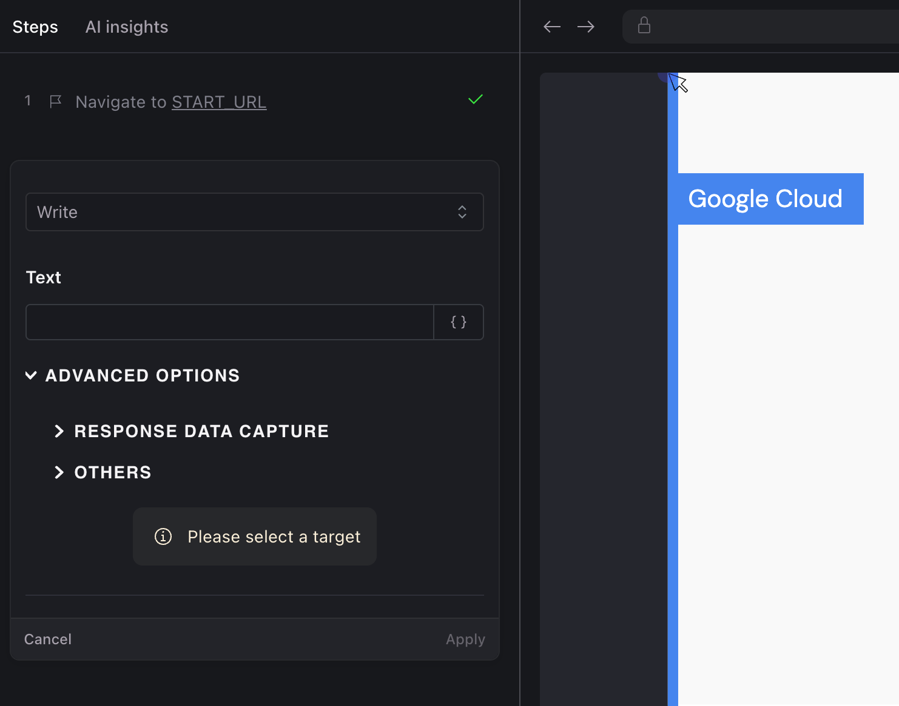
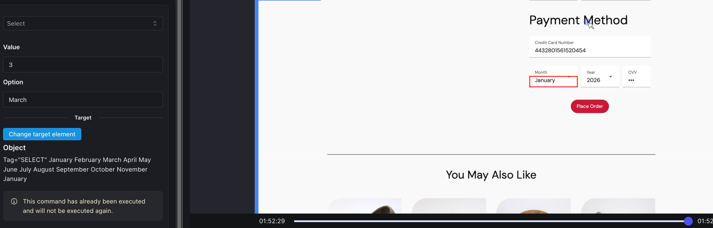

# User Actions

## Overview

In interactive authoring of tests, Harness AIT automatically records each user action as you interact with your application. These actions create a sequence of steps that represent your activity. While user actions are captured automatically, you can also add assertions to ensure test steps execute as expected.

This document provides an overview of all supported user actions. For information on assertions, please review the [Assertions](./assertions.md) section.

## Supported Actions

### Click

The most commonly used command in all tests.

| Feature | Description |
|---------|-------------|
| **Description** | Click on any place in the viewport to register a click command as a test step. No additional action required. |
| **Parameter options** | Yes. Parameterize based on input |
| **Advanced options** | Control Network based waits |
| **Return value** | None |

### Write

Used to input text into form fields.

| Feature | Description |
|---------|-------------|
| **Description** | Write text in any input field |
| **Parameter options** | Can be parameterized by first setting a parameter using the `Set Parameter` command |
| **Advanced options** | None |
| **Return value** | None |

### Select

Used for selecting values from dropdown lists.

| Feature | Description |
|---------|-------------|
| **Description** | Select a value from a list |
| **Parameter options** | No |
| **Advanced options** | None |
| **Return value** | None |

:::hint{type="info"}
Click, Write, and Select are automatically detected by Harness AIT. Users don't need to select these commands from a list.
:::

### Navigate

Used to navigate to specific URLs.

| Feature | Description |
|---------|-------------|
| **Description** | Navigate to a specific URL |
| **Parameter options** | No |
| **Advanced options** | `BASE_URL` translation: Set to `True` or `False` depending on URL type. For external URLs, set to `False` |
| **Return value** | None |

<DocImage
  path={require('./static/navigate.png')}
  alt="set-parameter"
  title="Click to view full size image"
  width={350}
  height={450}
/>

### Wait for Time

Creates a timed pause in test execution.

| Feature | Description |
|---------|-------------|
| **Description** | Wait for a specified period of time |
| **Parameter options** | Time in milliseconds to wait |
| **Advanced options** | No |
| **Return value** | None |

<DocImage
  path={require('./static/wait-for-time.png')}
  alt="set-parameter"
  title="Click to view full size image"
  width={450}
  height={400}
/>

### Reload

Refreshes the current page.

| Feature | Description |
|---------|-------------|
| **Description** | Reload or refresh the page (infrequently used) |
| **Parameter options** | No |
| **Advanced options** | No |
| **Return value** | None |

### Viewport

Adjusts the screen dimensions for testing responsive designs.

| Feature | Description |
|---------|-------------|
| **Description** | Set the width and height of the screen to emulate different device sizes |
| **Parameter options** | Width (e.g., 1440 px), Height (e.g., 900 px) |
| **Advanced options** | No |
| **Return value** | None |

<DocImage
  path={require('./static/viewport.png')}
  alt="viewport"
  title="Click to view full size image"
  width={500}
  height={450}
/> 

### Key Press

Simulates keyboard input.

| Feature | Description |
|---------|-------------|
| **Description** | Perform a key press action (e.g., `Enter` while in a text field) |
| **Parameter options** | Command to be sent |
| **Advanced options** | No |
| **Return value** | None |

<DocImage
  path={require('./static/keypress.png')}
  alt="keypress"
  title="Click to view full size image"
  width={500}
  height={450}
/>

### Mouse Over

Simulates hovering over elements.

| Feature | Description |
|---------|-------------|
| **Description** | Point the mouse to a specific target (useful for displaying hover menus) |
| **Parameter options** | None |
| **Advanced options** | No |
| **Return value** | None |

### Double Click

Performs a double-click action.

| Feature | Description |
|---------|-------------|
| **Description** | Double click on a target |
| **Parameter options** | None |
| **Advanced options** | No |
| **Return value** | None |

### Right Click

Simulates a right-click mouse action.

| Feature | Description |
|---------|-------------|
| **Description** | Right-click on a target |
| **Parameter options** | None |
| **Advanced options** | No |
| **Return value** | None |

### Set Parameter

Creates dynamic variables for test execution.

| Feature | Description |
|---------|-------------|
| **Description** | Set a parameter during test execution to use values dynamically between steps |
| **Parameter options** | • Name of the parameter Value of the parameter (select from list or use custom script) |
| **Advanced options** | Set context as `Run time`, `App`, or `Test Suite` |
| **Return value** | None |

<DocImage
  path={require('./static/set-parameter.png')}
  alt="set-parameter"
  title="Click to view full size image"
  width={500}
  height={750}
/>
