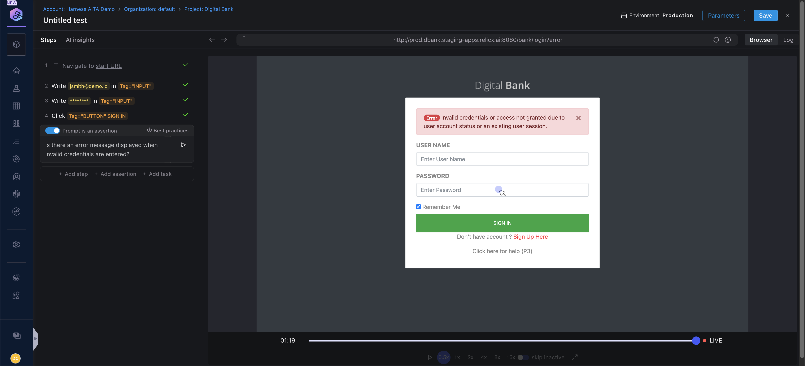
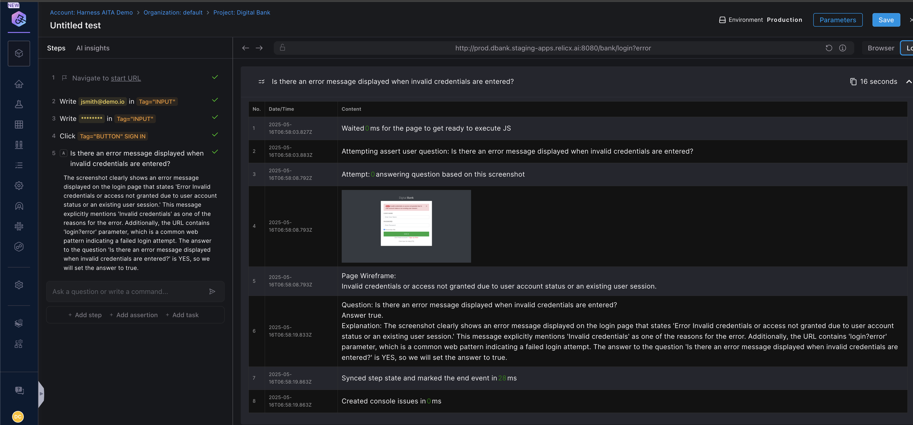
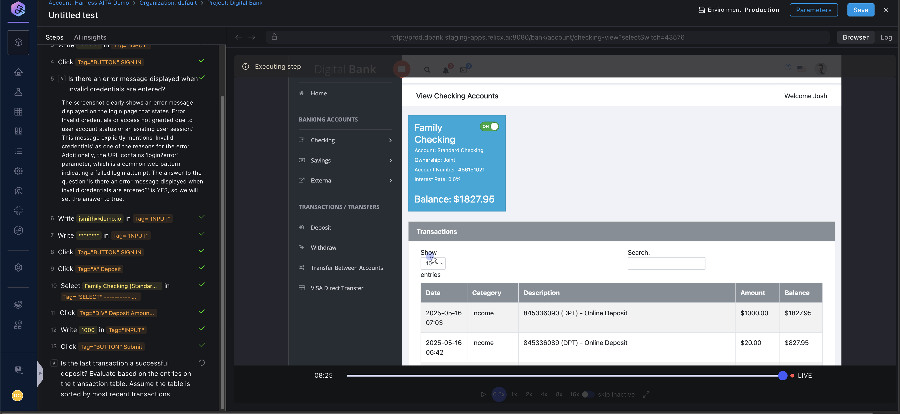

**Harness AI Test Automation** introduces a new type of assertion where the tester can ask a question that our AI evaluates as either True or False. If it is True, the test continues to execute otherwise it stops. In the section below we will show you a couple of examples where the “Copilot query assertion” can be used effectively. This approach proves advantageous as it eliminates the need for users to write complex code to accomplish similar outcomes.

***

Here is a quick demonstration of the Harness AI Assertion

<iframe src="https://www.loom.com/embed/fb8a8fb25ff2462782725bb31e6b5a4b?sid=39664d67-9d2a-4c9c-ac2d-a08c06c11275" width="800" height="450" frameborder="0" allowfullscreen></iframe>

***
In this example, we need to ensure that a login failure triggers an error message. The screenshot below shows that incorrect credentials were entered and an error message was displayed. How can we create a resilient assertion that will still work even if the location of the message content changes?

You can select the “Assert user question” assertion type from the list of commands and enter a question like “**Is there an error message displayed when invalid credentials are entered?**”. The Harness generative AI model evaluates the question and returns true or false depending on the state of the application under test. 

The evaluation log is available here

In this second scenario, we will try to evaluate whether the last transaction in a table is a withdrawal or a deposit. 

As you can see in the screenshot below, we have deposited $10 to my family's checking account in our sample digital bank application. When the transaction is completed, we want to make sure it was done correctly. So we have entered this question for the Copilot query assertion prompt:

**“Is the last transaction a successful deposit? Evaluate based on the entries on the transaction table. Assume the table is sorted by most recent transactions**”

The above question evaluates to true and the step is successfully executed. It eliminated the need to write any complex code to evaluate the first row of the transaction table for a deposit or withdrawal. 

### Guidelines for **AI Assertion**

Keep in mind that the questions we are asking are a prompt to our AI engine. The AI then evaluates the page and comes back with a true or false answer. Here are a few best practices to keep in mind:

- Keep the prompt simple and specific about the action you want it to evaluate.
- The AI doesn’t have any context of any previous step in the test. So if you want it to consider any specific criteria include that in the prompt. For example, in the second scenario, I have added the extra context that the transaction table is sorted by date in descending order. 

Make sure to test the assertion for negative cases as well i.e. test the same question by changing deposit to withdrawal and see if the assertion evaluates to false. 
