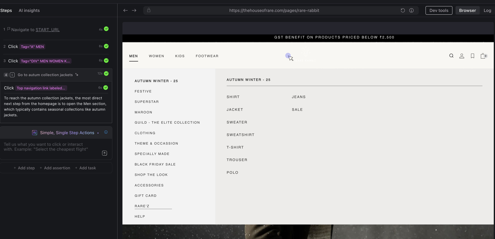
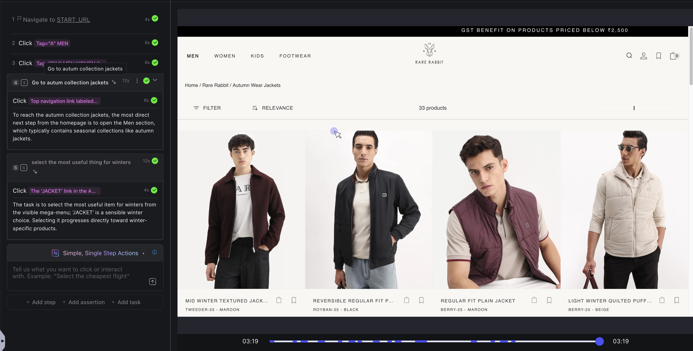

Simple steps in Harness AI Test Automation allow you to instruct the AI to perform specific, discrete actions within your application interface, similar to how a user would interact with UI elements. Instead of writing complex selectors or code, you describe what you want to do in natural language, and the AI handles the implementation details.

## What are Simple Steps?

Simple steps are AI-driven commands that execute single, focused actions in your test scenarios. They represent individual user interactions such as clicking buttons, filling forms, navigating pages, or verifying content. Each simple step is self-contained and performs one clear action.

**Key characteristics:**

- **Natural language based** - Write commands as you would describe them to a colleague
- **Intent-driven** - Focus on what you want to achieve, not how to achieve it
- **Self-healing** - AI adapts to minor UI changes automatically
- **Context-aware** - AI understands the application state and locates elements intelligently

## Creating Simple Steps

To create a simple step in your test, use the AI command interface to describe the action you want to perform.



### Basic Syntax

Simple steps follow a straightforward natural language pattern:

```
[Action] [Target Element] [Optional Context]
```

**Examples:**

- `Click the 'Login' button`
- `Enter 'john@example.com' in the email field`
- `Verify the success message appears`
- `Navigate to the dashboard page`

## Example: Complete Test Scenario

Simple steps can be chained together to create comprehensive test scenarios. Each step builds upon the previous one, creating a logical flow that mirrors real user behaviour.

The example below shows an e-commerce test scenario where the AI navigates through a website to find winter jackets. The left panel displays the test steps with green check marks indicating successful execution, whilst the right panel shows the live browser rendering the actual website.



**The test scenario includes:**

1. **Navigate to the start URL** - Opens the website homepage
2. **Click the men category** - Selects the men's section from the navigation menu
3. **Click the autumn collection jackets subcategory** - Navigates to the seasonal collection
4. **Go to the autumn collection jackets** - Enters the specific product category
5. **Select the most useful item for winters** - Uses AI reasoning to identify that a jacket is the most sensible winter option
6. **Click the jacket link** - Selects the appropriate product from the autumn collection

Steps 4 and 5 are written in natural language and include AI-generated reasoning that explains why certain actions were taken. For example, the AI identifies that "jacket is a winter appropriate choice" when selecting products, demonstrating context-aware decision-making.

The browser preview on the right confirms that each action executed correctly, showing the final result: a product grid displaying autumn wear jackets with filtering and sorting options. Green check marks validate that all steps completed successfully.

This demonstrates how simple steps work together to create intelligent, self-documenting tests that both technical and non-technical team members can understand and maintain.


## Advantages of Simple Steps

- **Faster test authoring** - Write tests in natural language without learning complex APIs
- **Improved maintainability** - Tests are self-documenting and easy to understand
- **Reduced brittleness** - AI adapts to minor UI changes automatically
- **Better collaboration** - Non-technical team members can read and understand tests
- **Intelligent element location** - AI finds elements even when selectors change

## Next Steps

- Learn about [Complex Steps](/docs/ai-test-automation/test-authoring/harness-ai-copilot/natural-language-tests) for multi-action scenarios
- Explore [Assertions and Validations](/docs/ai-test-automation/test-authoring/harness-ai-copilot/ai-assertions) for comprehensive testing
- Understand [AI Copilot capabilities](/docs/category/harness-ai-1) in depth