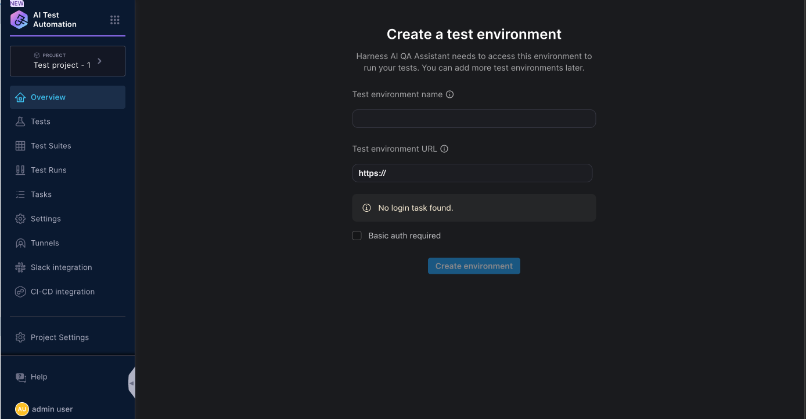

In AI Test Automation, projects created in the Harness platform are automatically inherited as applications. When the user accesses AI Test Automation from the available modules they are prompted to enter the environment name and an URL. This is usually the URL to your test environment. Make sure to enter the URL that you will use to access the application in your browser. This URL may redirect to a login screen and ask the user to enter the credentials. While recording tests we will add the credentials. 

Please make sure this URL is accessible from the public cloud.

Once you enter the details and click on create environment you will land on the dashboard page. Now you are ready to create your first test. 

You can now start creating test on this new application

### Define Application Environments

AI Test Automation users can add a Test environment during the onboarding flow but if you want to add another test environment you can add another one anytime. You can access the environment page from `Settings` --> `Application Name` --> Environments tab. Click on the `Add Test Environment` button to access the Test Environment screen,&#x20;

Once the inputs are provided, Harness AI  will attempt to login into your test environment using the information provided and make sure it is accessible.

### Add a Test Environment

<iframe src="https://www.loom.com/embed/8f96283c41044b06898e8db894b52f40?sid=3c439487-6ee4-4fc2-8f78-62d3ad938cab" width="960" height="540" frameborder="0" allowfullscreen></iframe>
