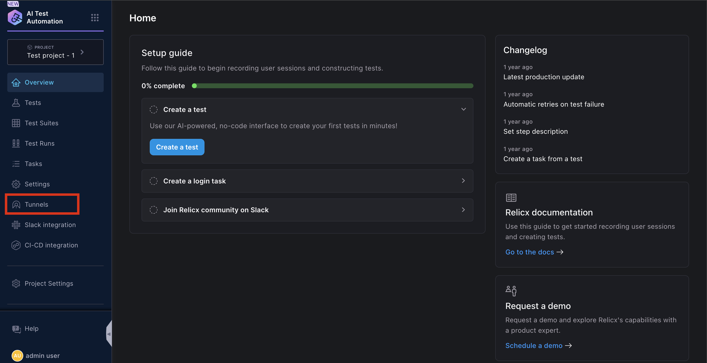
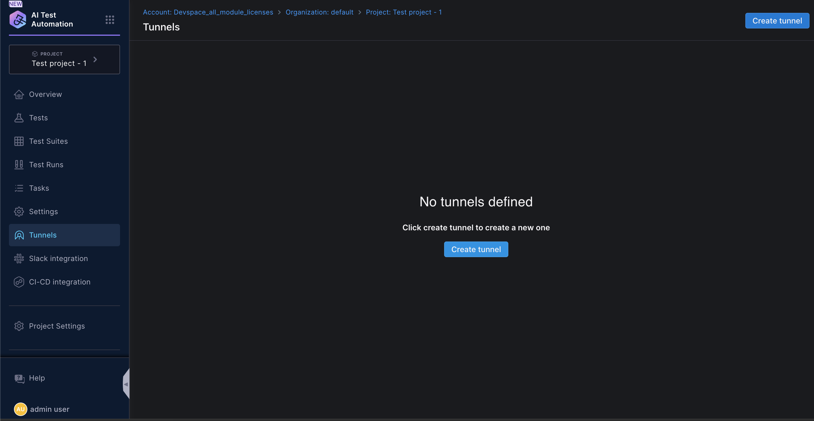
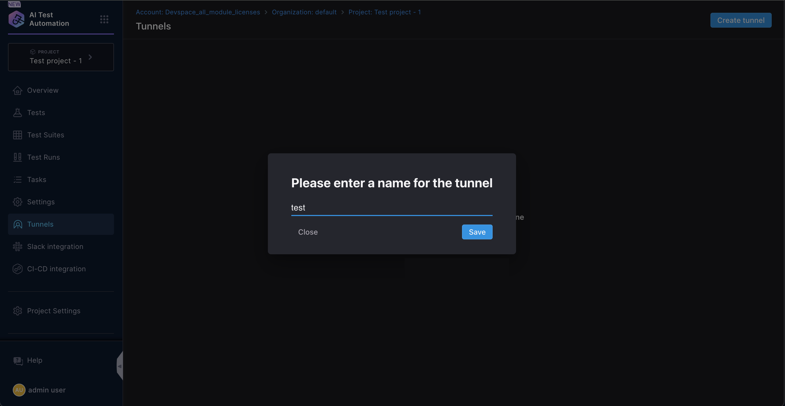
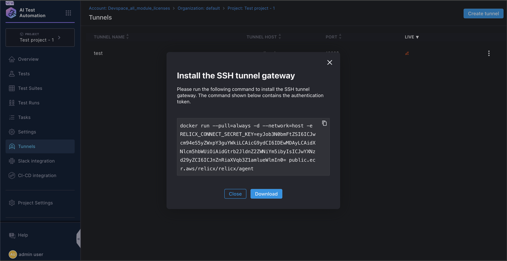
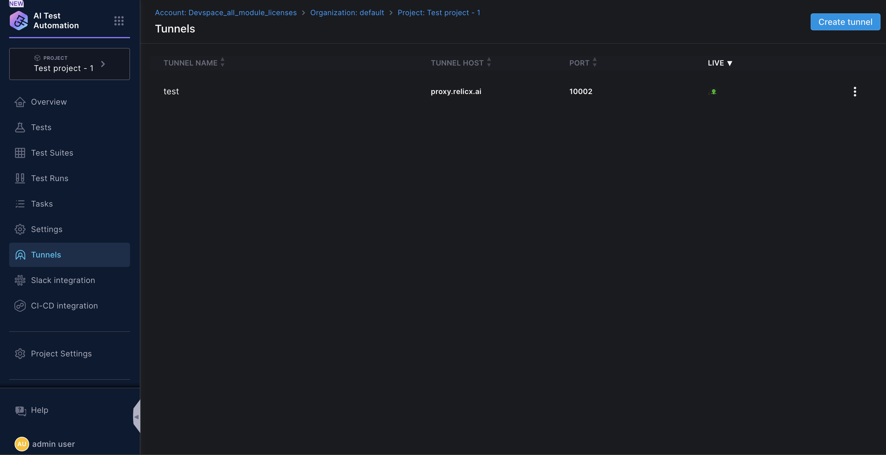

:::info
This feature is available in the Enterprise Tier Plan
:::

Harness AI Test Automation  executes tests from cloud locations. However, if the applications being tested are not accessible over the public internet, Harness AI Test Automation  provides support for private locations. To enable this feature, customers can install a dockerized Harness AI  agent (based on the <a href="https://github.com/jpillora/chisel" target="_blank">Open Source Chisel project</a>) within their network. This creates a secure outbound connection to the Harness cloud endpoint (proxy.relicx.ai). The connection is established through a TCP tunnel that is transported over HTTPS and runs a socks proxy server, which is locally exposed via a reverse port forward. Each agent/location has a unique set of credentials generated for authentication purposes, which allows the Harness test execution service in the cloud to access the private location securely. The agent is automatically disconnected when the private location is deleted.

### Creating and installing a Tunnel

To create a private location, click on “**Tunnels**” on the navigation bar and the “**Create Tunnel**” button on the top of the Tunnels page.

Next Click on Create Tunnel 

Enter the **name** of the Tunnel and click on save

Once the Tunnel is saved, you will be prompted to **copy the docker command** or download it as a script.&#x20;

Copy this command and execute it on a Terminal window to initiate the container. Docker will download the image from the repository and run this container. Make sure to run this command on a machine that can communicate to the internet ( i.e. Harness Cloud) and is also not shutdown frequently. The connection will be lost once container is shutdown or it is no longer running.

<DocImage
  path={require('./static/tunnel-5.png')}
  alt="Tunnel install"
  title="Click to view full size image"
  width={1000}
  height={200}
/>

Once the container is running, you can refresh the Tunnels page and see the green status icon next to it.&#x20;

