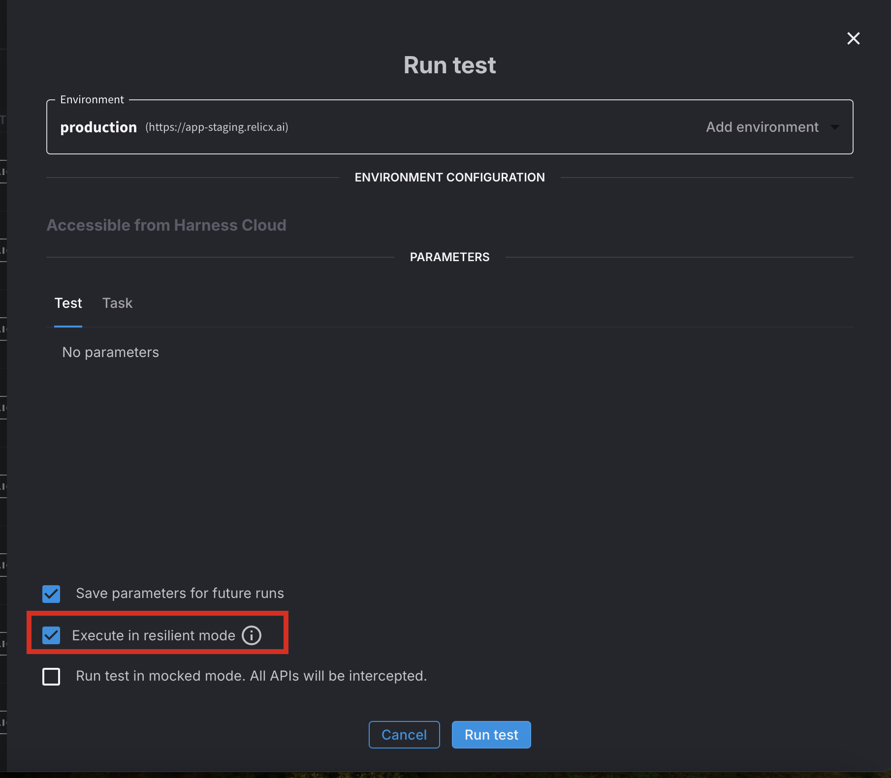

Harness AI Test Automation offers two modes for running tests: fast mode and resilient mode. By default, tests are executed in fast mode, but users have the flexibility to choose resilient mode when running a test. Resilient mode testing enhances the reliability and robustness of your test scripts. This documentation provides an overview of the different aspects of resilient mode testing and offers best practices for achieving more stable and accurate test results.

:::

## Smart Selector

Harness AI employs advanced Smart Selector intelligence to accurately locate elements on the page. In resilient mode, it utilizes additional processing and matching techniques to improve the selection process. This includes generating all possible locator matches and selecting candidates with a confidence score of 0.8 or higher.

## Additional Waits and Retries

To accommodate lazy or deferred element loading in certain applications, AI Test Automation incorporates extra waits and retries during the Smart Selector matching process. It will attempt the selection at least 2 times before proceeding, ensuring that elements are correctly identified.

## Validation Issues

In case AI Test Automation fails to find an element with a confidence score of at least 0.8, it flags those steps as validation issues. This allows you to examine and address any potential problems that may affect the reliability of your tests.

## Automatic Navigation Waits

Harness AI Test Automation includes automatic navigation waits to ensure proper page loading and eliminate flaky test execution. It employs the following techniques:

## Wait for All Network Pending Requests to Complete

Harness AI Test Automation waits for all network pending requests to be completed before proceeding. By waiting for the page to fully load, it prevents the execution of steps that could be affected by incomplete network requests, thus increasing the stability of your tests.

## Flag Network Pending Validation Issues

If any network load requests fail to complete within 30 seconds, Harness AIT flags them as validation issues. This allows you to identify potential problems with network dependencies affecting the reliability of your tests.

## Ignore Third-Party Requests

Harness AI Test Automation automatically ignores multiple third-party requests made by applications, such as requests to Google Analytics. However, if your tests encounter navigation pending failures on a third-party site not automatically ignored by Harness AIT, you can manually add it to the ignore list.

## Scrolls

Harness AI Test Automation ensures that elements being scrolled into view are properly brought into focus, emulating human interaction. To achieve this, Harness AIT may need to locate the element using Smart Selectors, resulting in slightly longer scroll times. This additional work guarantees thorough testing and prevents misleading results.

## Automatic Validation

Automatic Validation, while not exclusively related to Resilient mode, is an important feature that contributes to the reliability of your tests. It involves additional processing time but offers significant benefits. Consider the following best practices:

### Best Practices

- Create Smaller Tests: Breaking down complex tests into smaller, focused ones improves test maintainability and reduces the likelihood of errors.
- Use Auto-Login: Decouple login steps by utilizing auto-login features. This enables tests to start from a logged-in state consistently, reducing the reliance on login steps and improving test efficiency.

By following these best practices and leveraging the resilience features of Harness AIT, you can create more robust and dependable test scripts that deliver accurate results.
