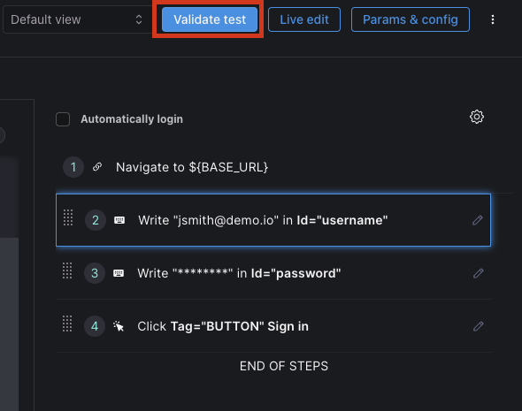
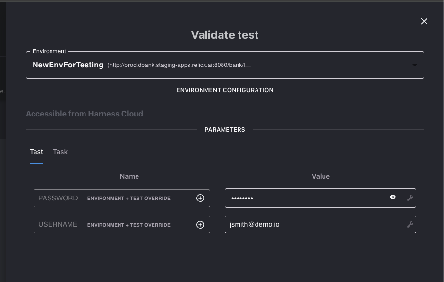
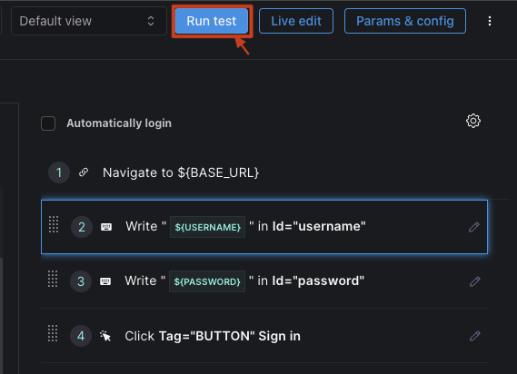
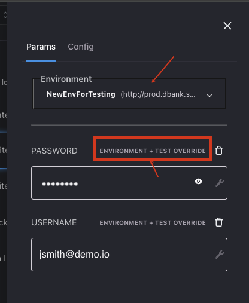

Harness AI Test Automation (referred as AIT) allows users to Validate their test runs before implementing in order to sort out any data or parameterization issues. After Validation, AIT offers several options for regularly running tests. Whether manually kicking off test in the Harness Platform or integrating tests in your CI/CD Pipeline, users can execute tests directly in the cloud without the needof spinning up any cloud infra.

## Running Tests

### Validate Test

If you have created a new test, it will be marked as a Draft after creation. You can select the Test and click on the **VALIDATE TEST** button in the Upper Right corner. This will run the test for the first time to help you validate any data and parametrization issues. Once the validation run is successful, the test can be activated.

Clicking on the VALIDATE TEST will bring up the test run modal, where you can specify

- *Environment*: against which the validation run should be performed. Harness AI Test Automation will pick your Pre-Release environment by default but you can pick any environment from the pick list.
- *Execution Location*: You can run tests from our default cloud location if your test environment is accessible on the Internet. Harness AIT also supports a Private Tunnels for test environments that are behind a firewall.
- *Test Parameters*: default to values entered by the user, unless those inputs are redacted. You can update the defualt values based on the data available in your test environment. The updated values will be saved for the future run.

#### Run a Test

Once a Test has been validated, the option to "Run Test" will automatically appear. Tests with this option have already gone through the Validation process.

  

### Environment Parameters

Environment parameters allow users to override individually defined test parameters in order to make bulk editing easier. Once these test have been executed, Running States will show where the test in the execution timeline.

Parameters can be defined at the Applicaiton Environment Level. For Example, the Base URL for Staging will be different than the Base URL for production and can affect the outcome of the test. Harness AIT handles these changes across environments by allowing parameters to be assigned at the environment level so that if the location where the test is being run against changes, the user does not have to remember which parameters will need to be changed as a result.

Below "Environment Override" and "Test Default" are denoted by which variables will be used based on the environment chosen.

