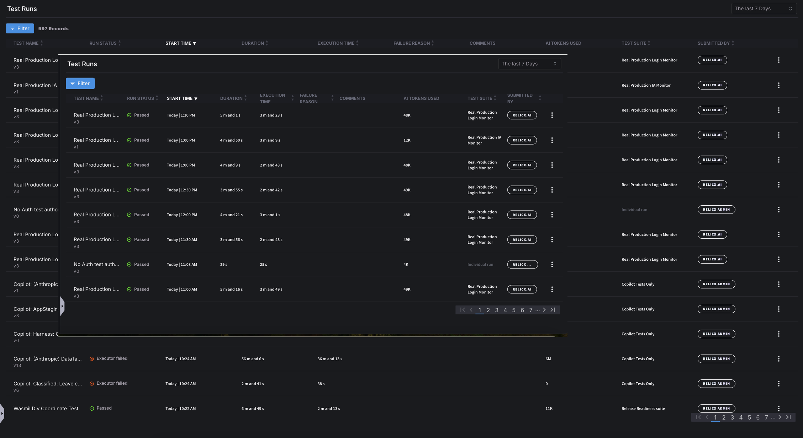
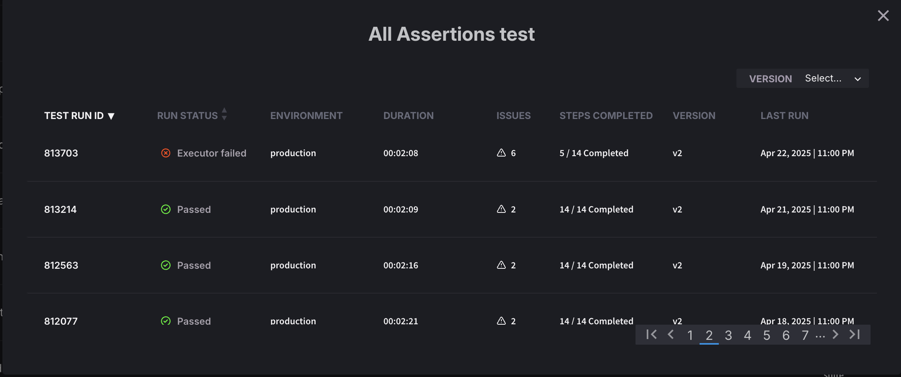
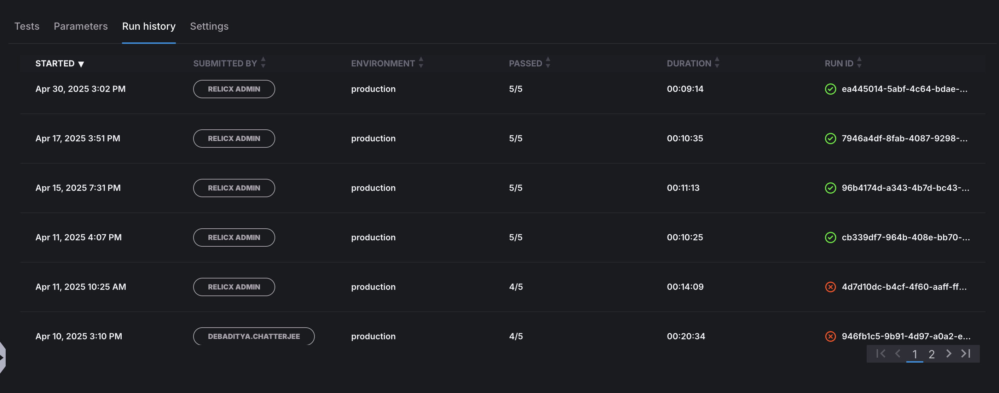
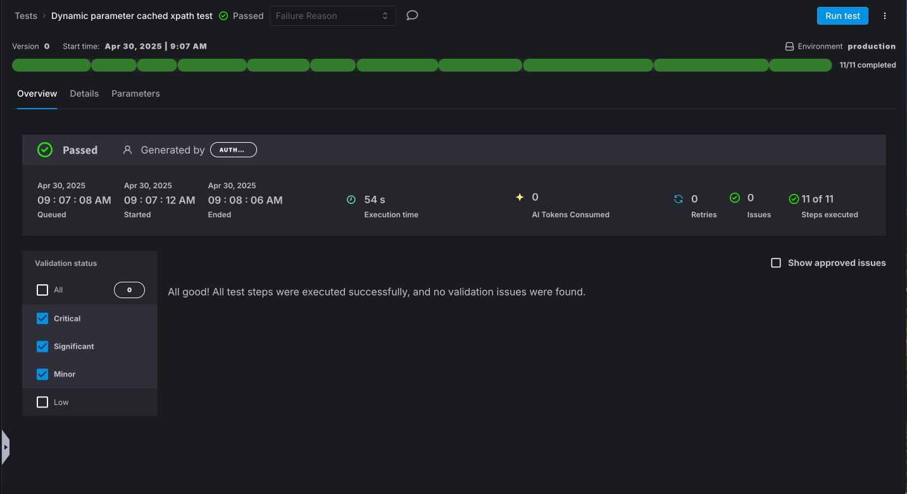
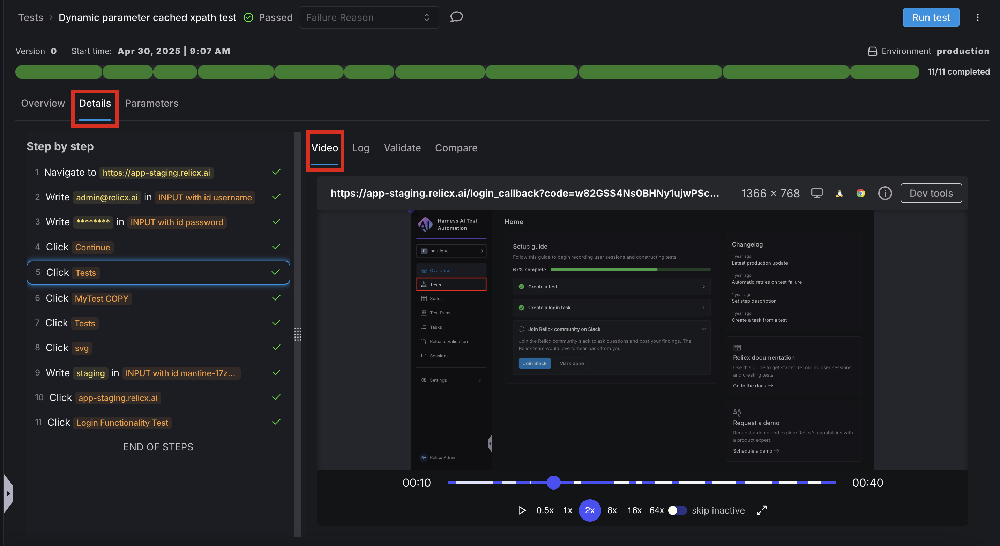
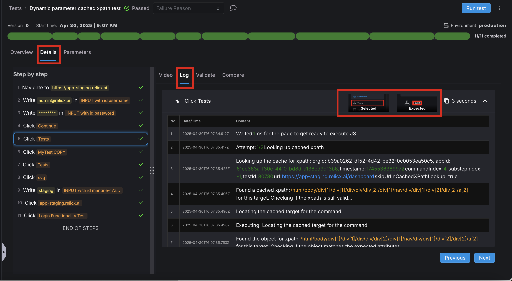
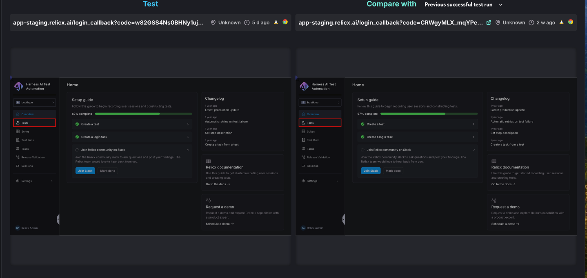

A history of Test Runs provides a visual overview of how a test (or Test Suite) has been performing overtime.&#x20;

This is helpful if at a quick glance, a user would like to see what passed or failed, how long the test took to complete, who ran the test, and more.

# Test Runs

All Test Runs can be viewed on the Tests Runs page. This is a comprhensive list of Test Runs both from Individual and Test Suite Runs. A comprehensive history for an individual Test Run can be seen by clicking the three dots on the right of the screen and selecting "Run History".

This view can show if the test has been passing or failing over time, as well as version and step completion information.

Likewise, the Run History for any Test Suite, by going into the main Test Suite View, under "Run History" a view of number of Tests Passed and the Test Duration can be seen.

# Test Run Report

The Overview of a test runs shows a list of errors and basic information about how the test run went. This view can be seen by clicking on any test run via a single test or one located in a test suite.

## Details

If you would like more details on troubleshooting test failures, Harness AI Test Automation (Harness AIT)  provides several in depth options for viewing a Test Run. The Steps and Validations can be seen on the left hand side of the screen and when chosen, the Video, Log, Validation Information and Comparison will reflect the details for that Test Step.

## Video

The Video for a test run shows exactly how it was executed on the application screen. A user can playback the full video at a desired speed, having the option to skip inactive portions of the video.

## Log

The Log section will show developer details about the Test Step chosen on the left side of the screen. It will also show any visual Cues as to what the Test expected to find and what it actually found.

## Validate

The Validate sections provides what problems occured, even if overall they did not cause the test to fail. If the "Details" tab is chosen, Harness AIT provides a break down or the error as well as a step log. The Stacktrace can also be seen from this view and if there are any Suggested Actions based on the results.

## Compare

The Compare view provides a visual way to see what the current application being tested looks like compared to either a previously successful run or the original session used to created the test. This is particularly helpful if the application has visually changed.

