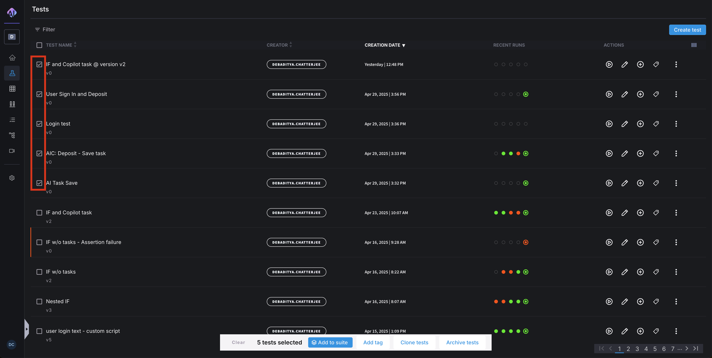
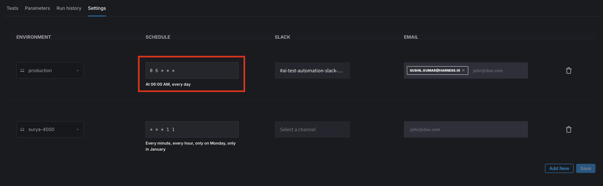

Test Suites provide a way to group tests together. This allows for a batch of tests to be run all at once, instead of having to individually kick off tests. This is especially useful in CI/CD applications or where different types of tests need to be run together.

## Creating a Test Suite

In order to create a test suite, select one or more test from the Main Test listing page. Once the desired tests are chosen, choose "Add to Suite" at the bottom of the page.

To view all of the existing Test Suites, select the "Suites" tab on the Test listing page.

## Execution

A test suite can be executed against any of the parent application's test environments. Tests in the suite are run with defaulse parameters and can be bulk edited when preparing to run the suite.&#x20;

<DocImage
  path={require('./static/run-test-suite.png')}
  alt="Assert Script Success"
  title="Click to view full size image"
  width={600}
  height={800}
/>

## Sequencing

By defaults the sequence number for tests in a test suite are denoted the be "50". This just means that the order of execution for that test does not matter. However, if a user desires to execute tests in a sequential order, they can change what number is executed first through the pencil icon next to "SEQ NO" in the Details page of the Test Suite. The maximum number of parallel test executions can also be changed here, the default for this value is "5".

<DocImage
  path={require('./static/test-suite-sequencing.png')}
  alt="Assert Script Success"
  title="Click to view full size image"
  width={800}
  height={800}
/>

### Scheduling and Notifications

Harness AI Test Automation  allows to schedule your test suite on a given schedule and also setup notification on completion;

**Scheduling**

You can input your desired schedule in the cron expression. If you want to schedule to run every day at 4 p.m. UTC, then the expression would be `0 4 * * *` . Please refer to this <a href="https://crontab.guru/" target="_blank">site</a> for creating the crontab expression.

**Notification**

To be notified after the Test Suite execution is complete, please enter your desired Slack channel or enter the email addresses in the notification section. You will be notified after every execution of this test suite.

The following video gives an overview of the test suites in Harness AI Test Automation. 

### Test Suites Overview Video

<iframe src="https://www.loom.com/embed/82b37c54cbb24b4db74f926c0f719e7a" width="960" height="540" frameborder="0" allowfullscreen></iframe>

