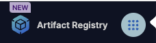
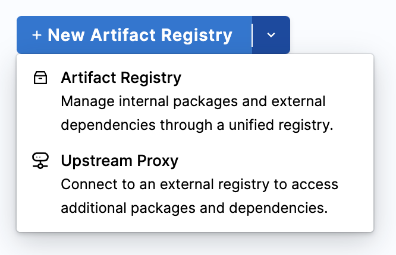

The Harness Artifact Registry module allows you to quickly and easily store your digital artifacts. 

Use this quick start guide to learn what the module has to offer and how to use it. 

## Prerequisite

This quick start guide requires the use of docker, so ensure that you can use the docker CLI locally. 

## Creating a registry

This first section will go over how to create and configure a registry for use. 

### Enable and select the module

You can find the Artifact Registry module in the module selector in the left nav.



### Create a docker registry

1. Select **+ New Artifact Registry** under the **Registries** tab. 
1. Select a [registry type](/docs/artifact-registry/whats-supported#supported-registry-types). In this guide, we will use **Docker**.
1. Enter a **Registry Name** and, optionally, a **Description** or **Labels**.
    :::tip
    This registry name must start with a letter and can only contain lowercase alphanumerics, `_`, `.` and `-`
    :::
1. Select **Create Registry**.

## Create a docker upstream proxy

An **Upstream Proxy** for an **Artifact Registry** is a proxy configuration that allows the registry to fetch artifacts from another external or remote registry. When a user requests an artifact that isn't available in the local registry, the registry directs the request to a configured upstream proxy. To create one, follow these steps: 

1. Select the dropdown next to **+ New Artifact Registry**, and then select **Upstream Proxy**.

    

1. Select 
1. Enter the **Upstream Proxy Key**. This is the identifier or name for the proxy within Harness and is chosen by you. 
   :::tip
    This proxy key must start with a letter and can only contain lowercase alphanumerics, `_`, `.` and `-`
   :::
1. For the source, select Docker Hub.
1. Choose your **Authentication** method. In this case, we only want to use public docker images, so we will select **Anonymous**.
1. Select **Create Upstream Proxy**.

### Set the upstream proxy

After creating an upstream proxy, you need to set it in your local artifact registry. To do so, follow these steps:

1. In the docker registry we created above, select **Configuration**.
2. Open the **Advanced (Optional)** dropdown menu. 
3. Select **Configure Upstream**.
4. Under **Available upstream proxies**, you will see a list of available upstream proxies. Select as many as you would like. 
5. Under **Selected proxies**, you will see an ordered list of selected proxies for this registry. When the registry receives a request, the proxies will be *queried in order* from top to bottom.
6. Click **Save** in the top right corner. 

## Use a registry

Next, lets use the registry we created. To do so, we will pull an artifact from the proxy, tag it, and add it to our local registry. 

Operations that interact with your registry all start with the **Setup Client** button in the top right corner of your registry.


### Login to your registry

1. Click **Setup Client**.
2. Copy the docker login command shown. It should look something like: `docker login pkg.app.harness.io`
3. Then, open a terminal window and paste the command.
4. When prompted, enter the username given in the **Setup Client** tab. 
5. When prompted for a password, click **Generate Token** in the **Setup Client** tab. Use this token as your password.


### Pull an image

Next, we will try and pull an image from your registry.

1. Open the **Setup Client** tab in your registry.
2. Scroll to the bottom and find the **Pull an image** section.
3. Copy the pull image command. It should look something like this: 

```
docker pull pkg.qa.harness.io/<ACCOUNT_ID>/docs-registry/<IMAGE_NAME>:<TAG>
```

4. Run the command in terminal but replace `<IMAGE_NAME>:<TAG>` with the name and tag of the image you want to pull. In this case, we will pull the image `library/nginx` with no tag. In the end, the command will look like this: 
```
docker pull pkg.qa.harness.io/<ACCOUNT_ID>/docs-registry/library/nginx
```

This first attempts to pull the image from the registry `docs-registry` but the image doesn't exist. Therefore, it will check the proxy next and find it in DockerHub. 

### Push an image

Next, we will tag and push the nginx image to the registry to store locally. 

1. Open the **Setup Client** tab in your registry.
2. Find the **Retag and Push the image** section.
3. Copy the tag image command. It should look like this: 

```
docker tag <IMAGE_NAME>:<TAG> pkg.qa.harness.io/<ACCOUNT_ID>/docs-registry/<IMAGE_NAME>:<TAG>
```

4. Replace `<IMAGE_NAME>` with `nginx` and the second `<TAG>` with `test`. `<ACCOUNT_ID>` should be filled for you. The command will look like this:

```
docker tag nginx pkg.qa.harness.io/<ACCOUNT_ID>/docs-registry/nginx:test
```

5. Copy the push image command and make the replacements, it will look like this: 

```
docker push pkg.qa.harness.io/<ACCOUNT_ID>/docs-registry/nginx:test
```

Now, you should see the artifact appear in your docker registry as well as the **Artifacts** tab in the left navigation panel.

That concludes the quick start guide! You should now have enough to get started with Artifact Registry. 

## See Also

To learn more go to:

- [Configure Registries](/docs/artifact-registry/manage-registries/configure-registry)
- [Manage Artifacts](/docs/artifact-registry/manage-artifacts/artifact-management)