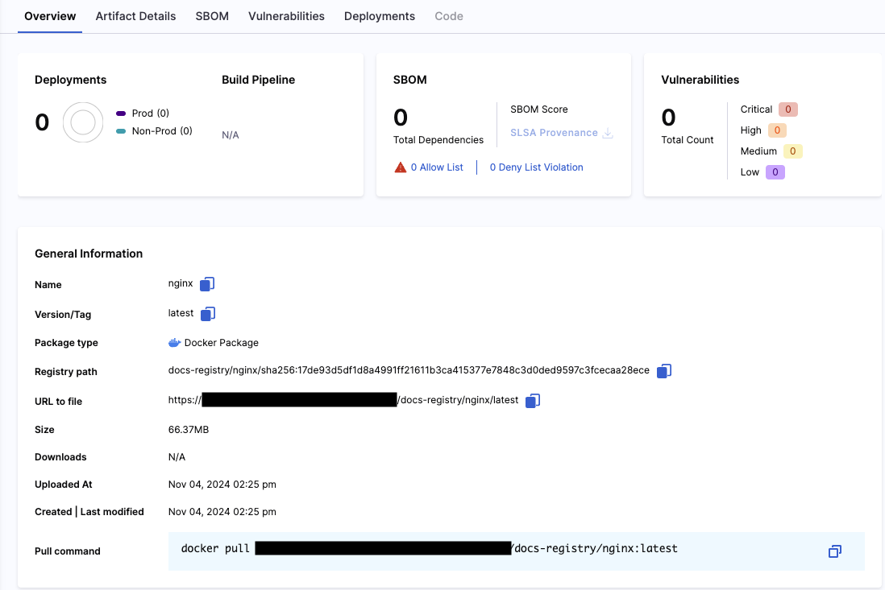

The artifact details page can be found by clicking an artifact in the **Artifacts** tab. 

This page offers the following information:
- General Information
- Artifact Details
- SBOM
- Vulnerabilities
- Deployments
- Code

This information will change based on what type of artifact it is. 

## General Information/Overview

This section includes an overview of the artifact, offering a glimpse at all it's relevant information needed to manage it. Use this page to copy relevant information like the registry path or the pull command required to download the artifact.

## Artifact Details

The **Artifact Details** tab contains the artifact's layer and manifest. 

## SBOM 

The **SBOM** tab will show results for the artifact's bill of materials including dependency lists, software suppliers, package managers, etc. To use this feature, you will require the [SCS module](/docs/software-supply-chain-assurance). 

## Vulnerabilities

The **Vulnerabilities** tab will show results from security tests run on the artifact. Therefore, this feature will only be available to customers who also have the [STO module](/docs/security-testing-orchestration/).

## Deployments

The **Deployments** tab displays information pertaining to the artifact's deployments. This information includes the deployment environments and the number of instances deployed. Therefore, this feature will only be available to customers who also have the [CD module](/docs/continuous-delivery).

## Code

*Coming Soon*