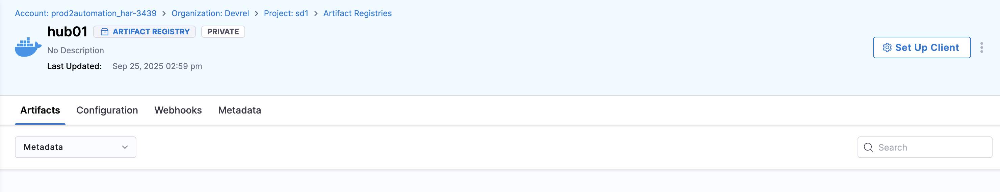

This page will teach you how to do artifact operations using Harness Artifact Registry. 

All artifact operations start with the **Setup Client** page found inside your registry at the top right. 

## Login to your registry

1. Click **Setup Client**.
2. Copy the login command shown.
3. Then, open a terminal window and paste the command.
4. When prompted, enter the login information given in the **Setup Client** tab.
5. If prompted for a password, click **Generate Token** in the **Setup Client** tab. Use this token as your password.

## Pull an artifact

1. Open the **Setup Client** tab in your registry.
2. Scroll to the bottom and find the **Pull** section.
3. Copy the pull command. It should look something like this: 
4. Run the command in terminal but replace `<IMAGE_NAME>` and `<TAG>` with the name and tag of the image you want to pull.

This first attempts to pull the image from your registry and then any upstream proxies if they exist. 

If you have multiple upstream proxies, the image will be pulled from the top most proxy that has the image in the list. 

## Push an artifact

1. Open the **Setup Client** tab in your registry.
2. Find the **Push** section.
3. Copy the push command. You will need to replace anything with brackets (`<>`) with the relevant artifact information. For example, replace `<TAG>` with the artifact version or tag that you want.
4. Run the command in terminal.

Now, you should see the artifact appear in your registry as well as the **Artifacts** tab in the left navigation panel.

## See Also

For a more in depth guide on how to pull and push docker artifacts, go to the [Quickstart Guide](/docs/artifact-registry/get-started/quickstart)