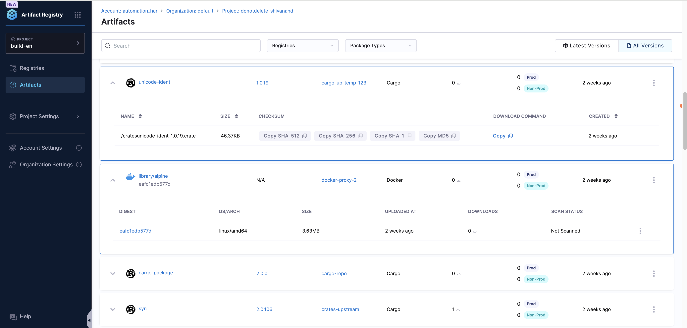

You can find your artifacts in two different ways:
- Within your registry
- Within the **Artifacts** tab

## Inside a registry

In order to find your artifact:

1. Navigate to the registry where your artifact is stored.
2. In the **Artifacts** tab, you will see a list of the artifacts in the registry.

You can see which tag was most recently pushed to the registry for this artifact based on the **Latest Version** column on the right. 

<!-- ### Artifact Details

In order to see all versions of your artifact, click the artifact **Name** in the left column.

Doing so will give a list of all tagged versions of the artifact. Selecting any version on this list will provide the following information:
- Digest
- OS/ARCH
- Size
- Uploaded Date and Time (Hover over the value for more information)
- Downloads/Last Download
- (Security) Scan Status

Each artifact version will also have a download command that you can copy and use, but don't forget to [login to the registry first](/docs/artifact-registry/get-started/quickstart#login-to-your-registry). -->

## Inside the Artifacts tab

You can also find your artifact in the **Artifacts** tab in the left navigation bar. Here, you can search for your artifact by name and filter by registry name and package type. 

Clicking an artifact brings it to its [Artifact Details](/docs/artifact-registry/manage-artifacts/artifact-details) page.