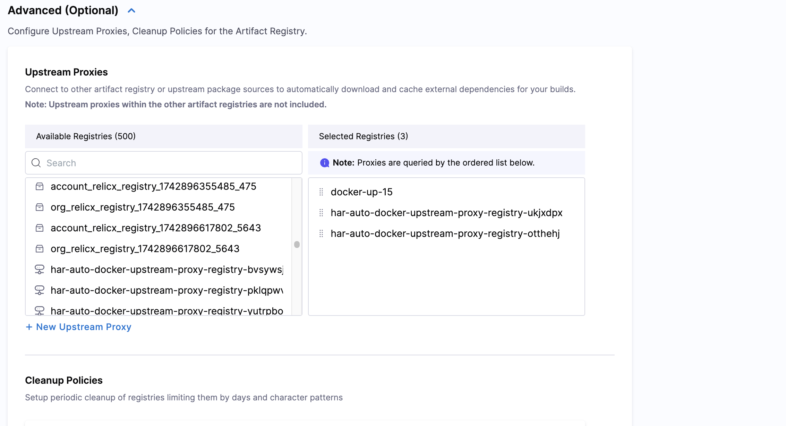

## Artifact Registry Definition

To change your registry settings, go to the registry and select **Configuration**."

Here you can:
- Change your registry **Description**.
- Add a label under **Labels**.
- Manage configuration options relative to your registry type such as setting a security scanner for docker registries.
- Manage **Advanced** settings which includes setting an **Upstream Proxy**. 

## Security

<DocImage path={require('./static/securty-registry.png')} />

### Built-in Container Scanners

:::note
This feature is only available for docker and helm registries.
:::

When the [Harness Supply Chain Security module](/docs/software-supply-chain-assurance/) is enabled, artifacts in the Harness Artifact Registry are automatically scanned using AquaTrivy, the currently supported scanner. Built-in container scanning creates a pipeline to ensure every artifact is scanned upon entry. Additional scanner options will be introduced in the future.

### Policy Sets

:::note
This feature is only available for docker and helm registries.
:::

Policy Sets allow you to define a collection of rules that automatically evaluate and take action on your artifacts. In Artifact Registry, these rules are evaluated as part of the scan pipeline that is triggered automatically when artifacts are ingested. You can add multiple policy sets to a registry for comprehensive protection; for vulnerability enforcement in this context, the policy set must be a Security Tests policy set.
  
  :::tip
  Based on the vulnerabilities detected by the built-in container scanner, you can create a Security Tests policy set to automatically quarantine or block artifacts based on the severity of vulnerabilities found.
  :::

When an artifact violates a policy, it can be automatically quarantined to prevent it from being used in pipelines or downloaded by users. You can learn more about managing manually quarantined artifacts in the [Artifact Quarantine](/docs/artifact-registry/manage-artifacts/artifact-management.md#quarantine-an-artifact) section.

### Artifact Filtering Rules

Use these rules to establish which artifacts are allowed or blocked entry into your registry.

#### Allowed patterns

In **Allowed Patterns**, use a regex string to define which artifacts will be allowed into the registry. The regex will match against each incoming artifact and, if the match is successful, allow the push operation. 

In **Blocked Patterns**, use a regex string to define which artifacts will be blocked from the registry. The regex will match against each incoming artifact and, if the match is successful, disallow the push operation. 

**Example**:

If you wanted to set a registry to store only prod artifacts and block all dev artifacts you could:

- Set the **Allowed Patterns** regex to `.*-prod`.
- Set the **Blocked Patterns** regex to `dev-.*`.

This will allow in any artifact that ends with `-prod` and block any artifact that starts with `dev-`.

## Advanced settings

### Set proxy for registry

You can configure your artifact registry to fetch artifacts from public upstream registries as well as other configured artifact registries. Harness supports two types of proxy configurations:

- **Upstream Proxy**: Connect to external registries (e.g., Docker Hub, Maven Central). Learn how to [create an upstream proxy](/docs/artifact-registry/manage-registries/upstream-proxy).
- **Artifact Registry**: Aggregate multiple Harness artifact registries within your account into a single access point.

#### Configure proxy settings

To set up either an upstream proxy or aggregate multiple registries into a single access point:

1. In your registry, select **Configuration**.
2. Open the **Advanced (Optional)** dropdown menu. 
3. Select **Configure Upstream**.
4. Under **Available upstream proxies**, you will see a list that includes:
   - Upstream proxy (indicated by a proxy icon)
   - Artifact Registry (indicated by a registry icon)
5. Select the proxies you want to use. You can select multiple proxies of either type.
6. Under **Selected proxies**, arrange the order of proxies. When the registry receives a request, it will query the proxies in order from top to bottom.

*In the example above, the registry has three selected proxies. When the registry is asked for an artifact, it will query the base registry first, then `docker-up-15`, followed by the two local registries in order.*

7. Click **Save** in the top right corner.

:::note Feature flag requirement
The feature to add Artifact Registry to the Upstream Proxy list is currently behind the feature flag `HAR_SUPPORT_LOCAL_REGISTRY_AS_UPSTREAM_PROXY`. Contact [Harness Support](mailto:support@harness.io) to enable it.
:::

:::info Important
If you are adding an Artifact Registry to the Upstream Proxy list, ensure that there are no upstream proxies configured within your artifact registry.
:::

### Cleanup Policies

*Coming Soon*

:::info

### Registry Metadata

Enhance your registry organization and searchability by adding custom metadata. Metadata allows you to attach key-value pairs to your registries, making it easier to categorize, filter, and manage them based on your organization's specific needs.

You can add metadata such as owner information, environment tags, team assignments, or any custom attributes that help you organize your registries effectively.

To learn more about adding and managing metadata at the registry, artifact, and package levels, see [Artifact Registry Metadata](/docs/artifact-registry/metadate-registry).

:::
