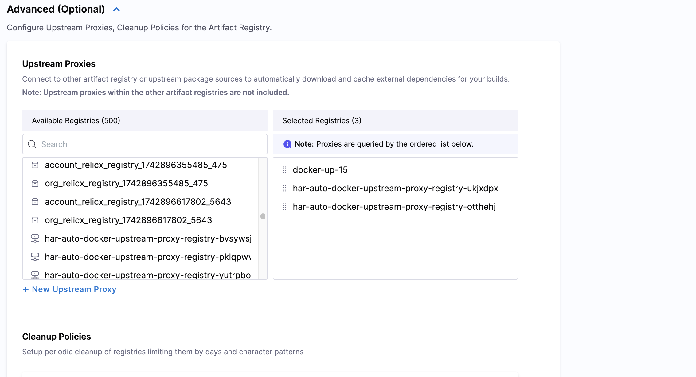

This guide covers the configuration options available for your Harness Artifact Registry, including security scanning, policy enforcement, artifact filtering rules, and upstream proxy settings.

---

## Before you begin

- **Harness account** with Artifact Registry enabled.
- **Registry created:** Go to [Create a registry](/docs/artifact-registry/manage-registries/create-registry) to set up your first registry.

---

## Access registry configuration

To change your registry settings, go to the registry and select **Configuration**.

From the configuration page you can:

- Change your registry **Description**.
- Add a label under **Labels**.
- Manage configuration options relative to your registry type such as setting a security scanner for Docker registries.
- Manage **Advanced** settings which includes setting an upstream proxy.

---

## Security

<DocImage path={require('./static/securty-registry.png')} />

### Built-in container scanners

:::note
This feature is only available for Docker and Helm registries.
:::

When the [Harness Supply Chain Security module](/docs/software-supply-chain-assurance/) is enabled, artifacts in the Harness Artifact Registry are automatically scanned using AquaTrivy, the currently supported scanner. Built-in container scanning creates a pipeline to ensure every artifact is scanned upon entry. Additional scanner options will be introduced in the future.

### Policy sets

:::note
This feature is only available for Docker and Helm registries.
:::

Policy sets allow you to define a collection of rules that automatically evaluate and take action on your artifacts. In Artifact Registry, these rules are evaluated as part of the scan pipeline that is triggered automatically when artifacts are ingested. You can add multiple policy sets to a registry for comprehensive protection; for vulnerability enforcement in this context, the policy set must be a Security Tests policy set.

:::tip
Based on the vulnerabilities detected by the built-in container scanner, you can create a Security Tests policy set to automatically quarantine or block artifacts based on the severity of vulnerabilities found.
:::

When an artifact violates a policy, it can be automatically quarantined to prevent it from being used in pipelines or downloaded by users. Go to [Artifact quarantine](/docs/artifact-registry/manage-artifacts/artifact-management#quarantine-an-artifact) to manage quarantined artifacts.

### Artifact filtering rules

Use these rules to establish which artifacts are allowed or blocked entry into your registry.

#### Allowed patterns

In **Allowed Patterns**, use a regex string to define which artifacts are allowed into the registry. The regex matches against each incoming artifact and, if the match is successful, allows the push operation.

In **Blocked Patterns**, use a regex string to define which artifacts are blocked from the registry. The regex matches against each incoming artifact and, if the match is successful, disallows the push operation.

**Example:**

If you want to set a registry to store only prod artifacts and block all dev artifacts:

- Set the **Allowed Patterns** regex to `.*-prod`.
- Set the **Blocked Patterns** regex to `dev-.*`.

This allows any artifact that ends with `-prod` and blocks any artifact that starts with `dev-`.

---

## Advanced settings

### Set proxy for registry

You can configure your artifact registry to fetch artifacts from public upstream registries as well as other configured artifact registries. Harness supports two types of proxy configurations:

- **Upstream Proxy:** Connect to external registries (for example, Docker Hub, Maven Central). Go to [Create an upstream proxy](/docs/artifact-registry/manage-registries/upstream-proxy) to set one up.
- **Artifact Registry:** Aggregate multiple Harness artifact registries within your account into a single access point.

#### Configure proxy settings

To set up either an upstream proxy or aggregate multiple registries into a single access point:

1. In your registry, select **Configuration**.
2. Open the **Advanced (Optional)** dropdown menu.
3. Select **Configure Upstream**.
4. Under **Available upstream proxies**, you will see a list that includes:
   - Upstream proxy (indicated by a proxy icon)
   - Artifact Registry (indicated by a registry icon)
5. Select the proxies you want to use. You can select multiple proxies of either type.
6. Under **Selected proxies**, arrange the order of proxies. When the registry receives a request, it queries the proxies in order from top to bottom.

In the example above, the registry has three selected proxies. When the registry is asked for an artifact, it queries the base registry first, then `docker-up-15`, followed by the two local registries in order.

7. Select **Save** in the top right corner.

:::note Feature flag requirement
The feature to add Artifact Registry to the Upstream Proxy list is currently behind the feature flag `HAR_SUPPORT_LOCAL_REGISTRY_AS_UPSTREAM_PROXY`. Contact [Harness Support](mailto:support@harness.io) to enable it.
:::

:::info
If you are adding an Artifact Registry to the Upstream Proxy list, ensure that there are no upstream proxies configured within your artifact registry.
:::

### Enable dependency firewall

:::info Feature flag
This feature is behind the feature flag `HAR_DEPENDENCY_FIREWALL`. Contact [Harness Support](mailto:support@harness.io) to enable it.
:::

For upstream proxy registries, you can enable **Dependency Firewall** to control and secure artifacts fetched from external sources. When enabled, Dependency Firewall acts as a gatekeeper that evaluates every artifact version against configured security policies before allowing it to be cached in your registry.

To enable Dependency Firewall:

1. In your upstream proxy registry, select **Configuration**.
2. Open the **Advanced (Optional)** dropdown menu.
3. Toggle **Enable Dependency Firewall** to ON.
4. Select the **Mode** for how policy violations should be handled:
   - **Block:** All artifacts with policy violations are blocked and not cached in your registry. Blocked artifacts cannot be downloaded or used.
   - **Warn:** All artifacts with policy violations are cached and flagged with a warning status for review. Warning artifacts can still be downloaded and used.
5. Select **Save** to apply the changes.

<DocImage path={require('./static/enable-dependency-firewall.png')} />

Once enabled, all artifacts fetched from external sources through this upstream proxy are automatically evaluated against your configured policy sets. The selected mode determines whether policy violations result in blocked artifacts (not cached) or warnings (cached but flagged for review).

Go to [Dependency Firewall](/docs/artifact-registry/dependency-firewall/overview) to understand how it works and how to view violations.

### Cleanup policies

Cleanup policies for artifact registries are coming soon.

### Registry metadata

Enhance your registry organization and searchability by adding custom metadata. Metadata allows you to attach key-value pairs to your registries, making it easier to categorize, filter, and manage them based on your organization's specific needs.

You can add metadata such as owner information, environment tags, team assignments, or any custom attributes that help you organize your registries effectively.

Go to [Artifact Registry metadata](/docs/artifact-registry/metadate-registry) to add and manage metadata at the registry, artifact, and package levels.

---

## Next steps

- [Create a registry](/docs/artifact-registry/manage-registries/create-registry): Set up new registries in your project.
- [Create an upstream proxy](/docs/artifact-registry/manage-registries/upstream-proxy): Connect to external registries like Docker Hub.
- [Dependency Firewall](/docs/artifact-registry/dependency-firewall/overview): Configure policies to control artifact ingestion.
- [Artifact management](/docs/artifact-registry/manage-artifacts/artifact-management): Manage artifacts including quarantine and deletion.
