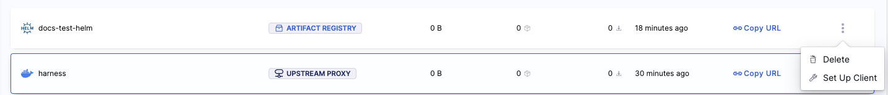

:::warning

Deleting a registry will *permanently* delete all artifacts contained within. This is an irreversible operation, please proceed with caution!

:::

1. In **Registries**, select the three dots on the right of the registry you want to delete. 
2. Select **Delete**.

OR

1. In your registry, select the three dots on the top right next to **Setup Client**.
2. Select **Delete**. 

