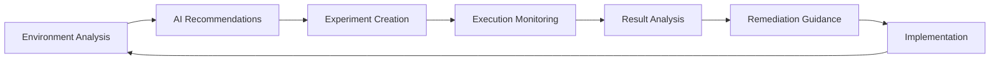

# AI Reliability Agent

:::info Experimental Feature
AI Reliability Agent is currently under the feature flag `CHAOS_AI_RECOMMENDATION_DEV`. Contact your sales representative to enable it for your account.
:::

## Overview

The AI Reliability Agent transforms your chaos engineering practice by using artificial intelligence to automate experiment creation, execution guidance, and remediation recommendations. It addresses the key challenge of scaling chaos engineering across organizations by reducing the expertise barrier.

## Key Capabilities

### Intelligent Automation
- **Smart Experiment Creation**: AI recommends chaos experiments with optimized parameters based on your environment
- **Targeted Execution**: Suggests specific experiments with clear reasoning for resilience verification
- **Automated Remediation**: Provides customized fix recommendations for failed probes
- **One-Click Implementation**: Create experiments or apply fixes with minimal effort

### Enhanced Decision Making
- **Environment Analysis**: Monitors your infrastructure to identify resilience gaps
- **Risk Assessment**: Evaluates potential failure scenarios and their impact
- **Best Practice Guidance**: Recommends industry-standard chaos engineering patterns

## Platform Support

| Infrastructure Type | AI Agent Support |
|---------------------|------------------|
| Kubernetes HD* | ✅ Supported |
| Kubernetes | ❌ Not Available |
| Linux | ❌ Not Available |
| Windows | ❌ Not Available |

*Kubernetes HD refers to Kubernetes infrastructure managed by Harness Delegate.

## Getting Started

### Step 1: Enable Feature Access
Contact your Harness sales representative to activate the AI Reliability Agent feature flag for your account.

### Step 2: Configure AI for Your Infrastructure

1. **Navigate to Environments**
   - Go to your Harness Chaos Engineering module
   - Select **Environments** from the left navigation

2. **Select Infrastructure**
   - Choose the environment you want to enable AI for
   - Select an existing infrastructure

3. **Enable AI Agent**
   - Click the **More Options** menu (⋮) and select **Edit**
   - Locate the **Enable AI** toggle at the top of the edit panel
   - Turn on the toggle to activate AI analysis

   

4. **Save Configuration**
   - Click **Save** to apply your changes
   - The AI Reliability Agent will now automatically analyze experiment results

:::tip Identification
AI-enabled infrastructures display an "AI Enabled" badge next to their name in the infrastructure list.
:::

## How It Works

### Experiment Lifecycle Enhancement

### AI-Powered Workflow

1. **Analysis Phase**: AI continuously monitors your infrastructure and applications
2. **Recommendation Phase**: Suggests relevant chaos experiments based on observed patterns
3. **Execution Phase**: Provides guidance during experiment runs
4. **Learning Phase**: Analyzes results and provides actionable remediation steps

## Security & Privacy

:::warning Data Processing
The AI agent may leverage public LLMs (such as OpenAI) when generating recommendations. Always validate AI-generated suggestions with your application or infrastructure experts before implementation.
:::

### Best Practices
- **Review Recommendations**: Always validate AI suggestions before implementation
- **Test in Non-Production**: Start with development environments
- **Monitor Impact**: Track the effectiveness of AI-recommended changes
- **Maintain Oversight**: Keep human expertise in the decision loop

## Interactive Guide

<DocVideo src="https://app.tango.us/app/embed/9f4cb748-7bcd-46e9-b4f0-e7757cd90c65?skipCover=false&defaultListView=false&skipBranding=false&makeViewOnly=false&hideAuthorAndDetails=true" title="Enable AI Reliability Agent in Harness" />

## Next Steps

After enabling the AI Reliability Agent:

1. **Run Your First AI-Recommended Experiment**: Let the AI suggest experiments for your environment
2. **Review AI Insights**: Analyze the recommendations and understand the reasoning
3. **Implement Fixes**: Apply AI-suggested remediation for any identified issues
4. **Scale Gradually**: Expand AI usage across more environments as you gain confidence

:::note Getting Help
For questions about AI Reliability Agent or to request feature enhancements, contact your Harness support team or sales representative.
:::
