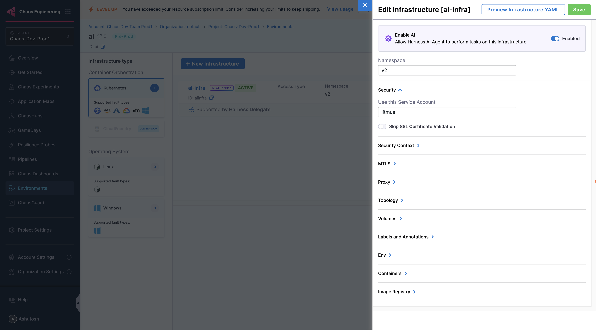

:::info note
AI Reliability Agent is an experimental feature and is under this feature flag: `CHAOS_AI_RECOMMENDATION_DEV`. Contact your sales representative to enable it for your account.
:::

## What is AI Reliability Agent?

The AI Reliability Agent enhances your chaos engineering capabilities by leveraging artificial intelligence to automate and optimize reliability testing and analysis.

One of the challenges of scaling up the Chaos Engineering practice within the organization is skilling up the users to create or run chaos experiments and to come up with solutions to mitigate the risks that are identified during the chaos experiment execution. Chaos Engineering module comes with an AI Agent called "AI Reliability Agent" that helps in these aspects.

| | AI Reliability Agent |
|---|---|
| Kubernetes HD | YES |
| Kubernetes | NO |
| Linux | NO |
| Windows | NO |

:::info note
Kubernetes HD means the Kubernetes infrastructure that is driven by Harness Delegate.
:::

## Key Features

The AI Reliability Agent offers these capabilities:

- **Intelligent Experiment Creation**: Recommends new chaos experiments with pre-tuned parameters based on your environment monitoring
- **Targeted Experiment Execution**: Suggests running specific experiments with clear resilience-verification reasoning
- **Automated Remediation Guidance**: Provides customized fix recommendations for failed probes to improve application resilience
- **One-Click Implementation**: Create recommended experiments or apply suggested fixes with minimal effort

:::note
The agent may leverage public LLMs such as OpenAI when generating fix recommendations. Always validate these recommendations with your application or infrastructure experts before implementation.
:::

## Interactive Setup Guide

Follow along with this interactive guide to enable and configure AI Reliability Agent:

<DocVideo src="https://app.tango.us/app/embed/9f4cb748-7bcd-46e9-b4f0-e7757cd90c65?skipCover=false&defaultListView=false&skipBranding=false&makeViewOnly=false&hideAuthorAndDetails=true" title="Enable AI Reliability Agent in Harness" />

## Getting Started

### 1. Enable the Feature Flag

- Reach out to your Harness sales representative to enable the AI Reliability Agent feature flag for your account

### 2. Set Up Your First AI Reliability Analysis

Once the feature flag is enabled:

1. Navigate to your Harness Chaos Engineering module
2. Go to **Environments** in the left navigation menu, choose the environment you want to enable AI Reliability Agent for
3. Select an existing infrastructure and click the **More Options** menu (⋮) then select **Edit**
4. In the infrastructure edit panel, locate the **Enable AI** toggle at the top
5. Turn on the toggle to enable Harness AI Agent to perform tasks on this infrastructure

   

6. Click **Save** to apply your changes
7. That's it! Now, the AI Reliability Agent will automatically analyze your experiment results

:::tip
You can identify AI-enabled infrastructures by the "AI Enabled" badge next to their name in the infrastructure list.
:::
