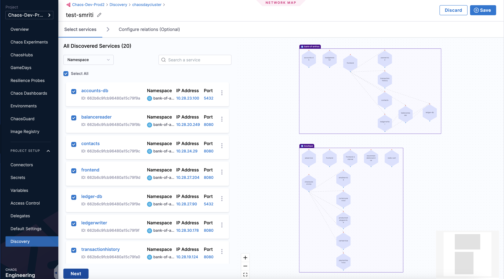

# Application Maps

Application maps provide a visual representation of your system architecture in the context of Harness Chaos Engineering, helping you understand service dependencies and plan effective chaos experiments.

## Overview

Application maps in Harness Chaos Engineering help you:
- **Visualize service relationships** discovered through service discovery
- **Plan targeted chaos experiments** based on service dependencies
- **Understand blast radius** of potential failures
- **Associate experiments** with specific application components
- **Track chaos engineering coverage** across your applications

## Prerequisites

Before creating application maps, ensure you have:
- **Service Discovery configured** - [Learn about Service Discovery](./service-discovery)
- **Discovery Agent deployed** - [Create Discovery Agent](/docs/platform/service-discovery/customize-agent#create-discovery-agent)
- **Platform Application Maps knowledge** - [What is Application Map?](/docs/platform/application-map)

## Creating Application Maps

### Step 1: Navigate to Discovery Settings

You can access application map creation through two paths:

**Option A: Through Project Settings**
1. Navigate to **Chaos** module
2. Select **Project Settings**
3. Select **Discovery**

**Option B: Direct Navigation**
1. Navigate to **Chaos** module
2. Select **Application Maps**
3. Click **Manage Discovery in Project Settings**


### Step 2: Create Application Map

Follow the standard [application map creation process](/docs/platform/application-map#create-application-map) with these chaos engineering specific considerations:

1. **Select discovered services** that you want to include in your chaos experiments
2. **Choose services for chaos injection** - focus on services where you plan to inject faults
3. **Consider service dependencies** when selecting targets
4. **Click Next** to proceed with map creation



### Step 3: Associate with Chaos Experiments

Once your application map is created, you can:

**View Chaos-Enabled Maps:**
- Navigate to **Chaos** module
- Select **Application Maps**
- View maps with associated chaos experiments


**Manual Association:**
To manually associate experiments with an application map, add the following tag to your experiment:

```yaml
metadata:
  labels:
    applicationmap: "<application-map-identity>"
```

## Using Application Maps for Chaos Engineering

### Experiment Planning
Application maps help you:
- **Identify critical services** that should be tested first
- **Understand service dependencies** before injecting faults
- **Plan experiment scope** based on service relationships
- **Avoid unintended cascading failures**

### Target Selection
When creating chaos experiments:
- **Use discovered services** shown in the application map
- **Consider downstream dependencies** when selecting targets
- **Plan fault injection points** based on service topology
- **Validate experiment scope** against the visual map

### Impact Analysis
Application maps enable:
- **Blast radius visualization** for planned experiments
- **Dependency impact assessment** before execution
- **Service relationship understanding** for better experiment design
- **Risk evaluation** based on service criticality

## Best Practices

### Map Design
- **Include critical services** that are essential for business functions
- **Focus on services** where you plan to conduct chaos experiments
- **Keep maps focused** - avoid including too many unrelated services
- **Update maps regularly** as your architecture evolves

### Chaos Integration
- **Tag experiments consistently** with application map identifiers
- **Use service discovery** to keep maps current with actual infrastructure
- **Plan experiments** based on service relationships shown in maps
- **Document experiment coverage** across different application components

### Team Collaboration
- **Share maps** with development and operations teams
- **Use maps** during GameDay planning and execution
- **Reference maps** when discussing experiment results
- **Keep maps accessible** for incident response scenarios

## Management Operations

### Editing Application Maps
- [Edit Application Map](/docs/platform/application-map#edit-application-map)
- Update service selections based on infrastructure changes
- Modify map scope as chaos engineering coverage expands

### Deleting Application Maps
- [Delete Application Map](/docs/platform/application-map#delete-application-map)
- Clean up unused maps to maintain clarity
- Archive maps for historical reference if needed

## Integration with Other Features

### Service Discovery
- **Automatic updates** - Maps reflect discovered services
- **Real-time sync** - Changes in infrastructure update maps
- **Filtered views** - Show only services relevant to chaos engineering

### Chaos Experiments
- **Visual experiment planning** using service relationships
- **Target selection** from mapped services
- **Impact visualization** during experiment execution

### GameDays
- **Scenario planning** using application maps
- **Team coordination** around mapped service dependencies
- **Exercise scope definition** based on service relationships

## Troubleshooting

### Common Issues

**Services not appearing in maps:**
- Verify service discovery is working correctly
- Check discovery agent health and permissions
- Ensure services match discovery filters

**Maps not updating:**
- Refresh discovery agent data
- Check service discovery configuration
- Verify network connectivity between services

**Experiment association issues:**
- Verify application map tags in experiment metadata
- Check tag format and spelling
- Ensure application map identity is correct

## Next Steps

Ready to leverage application maps for better chaos engineering?

1. **[Configure Service Discovery](./service-discovery)** - Set up automatic service discovery
2. **[Create Chaos Experiments](./chaos-experiments)** - Use mapped services as experiment targets
3. **[Plan GameDays](./gamedays)** - Use maps for team exercise planning
4. **[Set up Probes](./probes)** - Monitor services shown in your maps

Application maps provide the visual foundation for understanding your system architecture and planning effective chaos engineering experiments.
