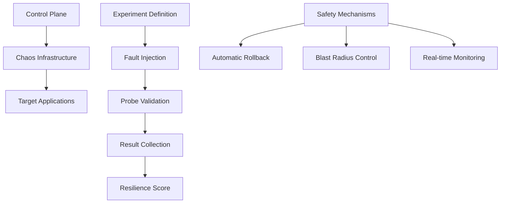

# Chaos Experiments

Chaos experiments are the foundation of chaos engineering - controlled, hypothesis-driven tests that intentionally introduce failures to validate and improve system resilience. This comprehensive guide covers everything you need to master chaos experiments with Harness.

## What are Chaos Experiments?

A **chaos experiment** in Harness consists of one or more chaos faults arranged in a specific sequence to create realistic failure scenarios. Each experiment:

- **Tests specific hypotheses** about system behavior under failure conditions
- **Measures resilience** through automated probes and monitoring
- **Provides quantitative results** via resilience scoring
- **Ensures safety** through automatic rollback mechanisms
- **Integrates seamlessly** with your existing CI/CD workflows

## Core Components

### Chaos Faults
Pre-built failure scenarios from the Enterprise ChaosHub:
- **Infrastructure Faults**: CPU stress, memory exhaustion, network disruption
- **Application Faults**: Pod deletion, service disruption, container kills
- **Cloud Platform Faults**: AWS ECS stop, Azure VM restart, GCP function failure
- **Custom Faults**: Organization-specific failure scenarios

### Resilience Probes
Automated validation mechanisms that run during experiments:
- **HTTP Probes**: Check service availability and response times
- **Command Probes**: Execute custom validation commands
- **Kubernetes Probes**: Monitor pod and service health
- **Prometheus Probes**: Query metrics for system health validation

### Resilience Scoring
Quantitative measurement of system resilience:
- **Fault Weights**: Assign importance levels (1-10) to different faults
- **Probe Success Rate**: Percentage of successful health validations
- **Overall Score**: Weighted calculation of experiment success

## Experiment Architecture



## Getting Started

### Prerequisites
Before creating experiments, ensure you have:
- **Environment** set up for your deployment scenario
- **Chaos Infrastructure** installed in your target environment
- **Proper permissions** for experiment creation and execution
- **Target applications** identified and accessible

### Quick Start Path
1. **[Create Your First Experiment](./create-experiments)** - Step-by-step experiment creation
2. **[Execute and Monitor](./run-experiments)** - Run experiments safely with monitoring
3. **[Analyze Results](./analyze-results)** - Understand resilience scores and insights
4. **[Manage Experiments](./manage-experiments)** - Organize and maintain your experiments

## Experiment Types by Use Case

### Infrastructure Resilience
**Validate infrastructure fault tolerance:**
- Node failures and recovery
- Network partitions and latency
- Resource exhaustion scenarios
- Storage and disk failures

### Application Resilience
**Test application-level fault handling:**
- Service dependency failures
- Database connection issues
- Memory leaks and CPU spikes
- Configuration errors

### Cloud Platform Resilience
**Verify cloud service resilience:**
- Availability zone failures
- Load balancer disruptions
- Auto-scaling behavior
- Managed service outages

### End-to-End Scenarios
**Complex, multi-component failures:**
- Cascading failure scenarios
- Disaster recovery testing
- Peak load with failures
- Multi-region failover

## Safety and Governance

### Built-in Safety Features
- **Automatic Rollback**: Experiments stop automatically if safety thresholds are breached
- **Blast Radius Control**: Limit experiment impact to specific components or percentages
- **Pre-flight Checks**: Validate system health before experiment execution
- **Real-time Monitoring**: Continuous observation during experiment execution

### Governance Integration
- **ChaosGuard**: Policy-based experiment approval and control
- **RBAC**: Role-based access control for experiment management
- **Audit Logs**: Complete tracking of all experiment activities
- **Compliance**: Support for regulatory and organizational requirements

## Integration Capabilities

### CI/CD Integration
- **Pipeline Steps**: Add chaos experiments to Harness CD pipelines
- **GitOps**: Manage experiments as code with version control
- **Automated Scheduling**: Run experiments on schedules or triggers
- **Quality Gates**: Use resilience scores as deployment criteria

### Observability Integration
- **Prometheus**: Query metrics during experiments
- **Grafana**: Visualize system behavior and experiment results
- **Custom Dashboards**: Monitor experiment progress and system health
- **Alert Integration**: Receive notifications for experiment events

## Best Practices

### Experiment Design
- **Start Small**: Begin with low-impact experiments and gradually increase scope
- **Clear Hypotheses**: Define specific, testable predictions about system behavior
- **Comprehensive Probes**: Use multiple validation methods to assess impact
- **Realistic Scenarios**: Simulate actual failure conditions your system might face

### Execution Strategy
- **Off-Peak Testing**: Run initial experiments during low-traffic periods
- **Gradual Rollout**: Increase experiment scope and complexity over time
- **Team Coordination**: Ensure proper communication and preparation
- **Documentation**: Record experiment goals, procedures, and outcomes

### Continuous Improvement
- **Regular Reviews**: Analyze results and refine experiments
- **Automation**: Integrate successful experiments into regular testing
- **Knowledge Sharing**: Document learnings and share across teams
- **Iterative Approach**: Continuously improve based on results and feedback

## Detailed Guides

Explore specific aspects of chaos experiments:

### **[Create Experiments](./create-experiments)**
Step-by-step guide to building your first chaos experiment, from blank canvas to complex scenarios.

### **[Run & Schedule Experiments](./run-experiments)**
Learn how to execute experiments safely, schedule recurring runs, and monitor execution.

### **[Analyze Results](./analyze-results)**
Understand resilience scores, interpret experiment outcomes, and derive actionable insights.

### **[Manage Experiments](./manage-experiments)**
Organize, edit, export, and maintain your experiment library effectively.
Resolve common issues and optimize experiment performance.

## Success Metrics

Track your chaos engineering maturity:

### Beginner (Getting Started)
- First experiment created and executed
- Basic fault types understood
- Simple probes configured
- Resilience score interpretation

### Intermediate (Building Confidence)
- Multiple experiment types created
- Complex probe configurations
- Scheduled experiment execution
- Integration with monitoring systems

### Advanced (Chaos Engineering Maturity)
- Automated experiment pipelines
- Custom fault development
- Organization-wide chaos practices
- Continuous resilience validation

## Next Steps

Ready to start your chaos engineering journey?

1. **[Create Your First Experiment](./create-experiments)** - Begin with a simple, safe experiment
2. **[Explore Fault Types](../../faults/chaos-faults)** - Understand available chaos faults
3. **[Set Up Monitoring](../probes)** - Configure probes and validation
4. **[Join the Community](https://community.harness.io)** - Connect with other chaos engineers

Chaos experiments are your gateway to building truly resilient systems. Start small, learn continuously, and gradually expand your chaos engineering practices to cover your entire infrastructure and application stack.
- **CPU Stress**: Consume CPU resources to test auto-scaling
- **Memory Stress**: Exhaust memory to validate OOM handling
- **Disk Stress**: Fill disk space or stress I/O operations
- **Network Stress**: Add latency, packet loss, or bandwidth limits

#### **Component Failures**
- **Pod/Container Kill**: Terminate running containers
- **Node Failure**: Simulate entire node unavailability
- **Service Disruption**: Stop critical system services
- **Storage Failures**: Simulate disk or volume failures

### Application Experiments
Focus on application-level resilience:

#### **Service Dependencies**
- **External Service Failures**: Simulate third-party service outages
- **Database Unavailability**: Test database failover mechanisms
- **API Rate Limiting**: Simulate API throttling scenarios
- **Authentication Failures**: Test auth service disruptions

#### **Application Faults**
- **HTTP Error Injection**: Return specific HTTP error codes
- **Response Delays**: Add latency to API responses
- **Memory Leaks**: Simulate gradual memory consumption
- **Configuration Errors**: Test invalid configuration handling

### Platform Experiments
Target container and orchestration platforms:

#### **Kubernetes Faults**
- **Pod Deletion**: Random or targeted pod termination
- **Resource Limits**: Apply CPU/memory constraints
- **Network Policies**: Disrupt service-to-service communication
- **Volume Failures**: Simulate persistent volume issues

#### **Cloud Provider Faults**
- **Instance Termination**: Stop cloud instances
- **AZ Failures**: Simulate availability zone outages
- **Load Balancer Issues**: Disrupt traffic distribution
- **Managed Service Failures**: Test cloud service dependencies

## Experiment Configuration

### Target Selection
Choose what to target in your experiments:

```yaml
# Example: Target selection criteria
targets:
  - type: "kubernetes"
    namespace: "production"
    labels:
      app: "web-service"
    percentage: 50  # Affect 50% of matching pods
  
  - type: "aws-ec2"
    region: "us-west-2"
    tags:
      Environment: "prod"
    count: 2  # Affect 2 instances
```

### Fault Configuration
Define the specific fault to inject:

```yaml
# Example: CPU stress configuration
fault:
  type: "cpu-stress"
  parameters:
    cpu_cores: 2
    cpu_load: 80
    duration: "5m"
  
# Example: Network latency configuration
fault:
  type: "network-latency"
  parameters:
    latency: "100ms"
    jitter: "10ms"
    duration: "10m"
```

### Success Criteria
Define what constitutes a successful experiment:

```yaml
# Example: Success criteria
success_criteria:
  - metric: "response_time_p95"
    threshold: "< 500ms"
    
  - metric: "error_rate"
    threshold: "< 1%"
    
  - metric: "availability"
    threshold: "> 99%"
```

## Best Practices

### Start Small
- **Begin with staging environments** before production
- **Limit blast radius** to minimize impact
- **Use short durations** for initial experiments
- **Target non-critical systems** first

### Gradual Expansion
- **Increase scope** as confidence grows
- **Add more fault types** progressively
- **Extend to production** with proper safeguards
- **Involve more team members** in planning

### Safety First
- **Always have rollback plans** ready
- **Set up comprehensive monitoring** before experiments
- **Use automatic rollback conditions** to prevent damage
- **Communicate with stakeholders** about planned experiments

### Continuous Learning
- **Document all findings** and insights
- **Share results** with the broader team
- **Update system designs** based on learnings
- **Schedule regular re-testing** to validate improvements

## Common Experiment Patterns

### Resilience Validation
Test how well your system handles expected failures:
- **Database failover testing**
- **Load balancer failure scenarios**
- **Auto-scaling validation**
- **Circuit breaker testing**

### Dependency Testing
Validate behavior when dependencies fail:
- **Third-party service outages**
- **Internal service failures**
- **Network partitions**
- **Authentication service disruptions**

### Performance Testing
Understand system behavior under stress:
- **Resource exhaustion scenarios**
- **Traffic spike simulation**
- **Slow dependency responses**
- **Memory pressure testing**

### Recovery Testing
Validate disaster recovery procedures:
- **Data center failures**
- **Multi-region failover**
- **Backup and restore procedures**
- **Emergency response protocols**

## Monitoring and Observability

### Key Metrics to Track
- **Response times**: API and service response latencies
- **Error rates**: HTTP errors, application exceptions
- **Throughput**: Requests per second, transaction rates
- **Resource utilization**: CPU, memory, disk, network
- **Business metrics**: User experience, revenue impact

### Alerting Setup
Configure alerts for experiment monitoring:
- **Experiment start/stop notifications**
- **Threshold breach alerts**
- **Automatic rollback triggers**
- **Post-experiment summary reports**

## Troubleshooting Experiments

### Common Issues
- **Experiments won't start**: Check permissions and connectivity
- **Unexpected results**: Validate hypothesis and success criteria
- **System instability**: Review blast radius and safety measures
- **Monitoring gaps**: Ensure comprehensive observability coverage

### Debugging Steps
1. **Review experiment logs** for error messages
2. **Check target system health** before and during experiments
3. **Validate monitoring setup** and probe configurations
4. **Verify network connectivity** and permissions
5. **Analyze system dependencies** and potential side effects

## Next Steps

Ready to create your first experiment? Here's what to do next:

1. **[Set up Probes & Actions](./probes-actions)** - Learn about monitoring and automated responses
2. **[Explore GameDays](./gamedays)** - Organize team-wide chaos engineering exercises
3. **[Build Pipelines](./pipelines)** - Automate chaos testing in your CI/CD workflows
4. **[Check Integrations](./integrations)** - Connect with your existing monitoring tools

:::tip Pro Tip
Start with simple experiments like pod deletion or CPU stress, then gradually work your way up to more complex scenarios. The key is to build confidence and learn from each experiment!
:::
