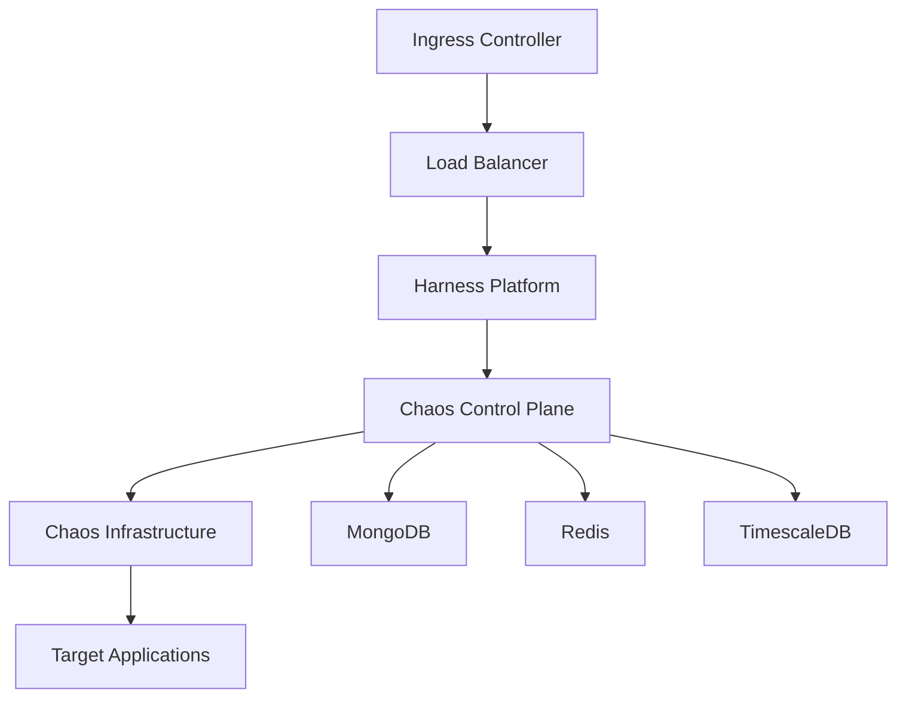

# On-premises (SMP)

Deploy Harness Chaos Engineering in your own infrastructure using the Self-Managed Platform (SMP) for complete control over your chaos engineering environment.

## Overview

The Self-Managed Platform (SMP) allows you to run Harness Chaos Engineering entirely within your own infrastructure, providing:

- **Complete Data Control**: All data remains within your environment
- **Enhanced Security**: Meet strict compliance and security requirements
- **Network Isolation**: Deploy in air-gapped or restricted network environments
- **Custom Configuration**: Tailor the platform to your specific needs
- **Reduced Latency**: Minimize network hops for better performance

## Architecture

### Core Components

The on-premises SMP deployment consists of:



### Key Services

1. **Chaos Control Plane**: Manages experiments, workflows, and orchestration
2. **Chaos Infrastructure**: Executes chaos experiments on target systems
3. **Database Layer**: Stores experiment data, results, and configurations
4. **Monitoring Stack**: Observability and metrics collection
5. **Authentication Service**: User management and access control

## Prerequisites

### Infrastructure Requirements

#### Minimum System Requirements
- **CPU**: 16 cores
- **Memory**: 32 GB RAM
- **Storage**: 500 GB SSD
- **Network**: 1 Gbps connectivity

#### Recommended System Requirements
- **CPU**: 32 cores
- **Memory**: 64 GB RAM
- **Storage**: 1 TB NVMe SSD
- **Network**: 10 Gbps connectivity

### Software Prerequisites

#### Kubernetes Cluster
```yaml
# Minimum Kubernetes version: 1.20+
# Recommended: 1.24+
apiVersion: v1
kind: Namespace
metadata:
  name: harness-chaos-smp
```

#### Required Tools
- **kubectl**: v1.20+
- **Helm**: v3.8+
- **Docker**: v20.10+
- **Git**: v2.30+

### Network Requirements

#### Inbound Ports
- **443**: HTTPS traffic
- **80**: HTTP traffic (redirect to HTTPS)
- **9090**: Prometheus metrics
- **3000**: Grafana dashboard

#### Outbound Connectivity
- **Container Registry**: Access to pull Harness images
- **License Server**: Periodic license validation
- **Update Server**: Platform updates and patches

## Installation

### Step 1: Prepare the Environment

Create the namespace and required resources:

```bash
# Create namespace
kubectl create namespace harness-chaos-smp

# Create service account
kubectl create serviceaccount harness-chaos-sa -n harness-chaos-smp

# Apply RBAC permissions
kubectl apply -f - <<EOF
apiVersion: rbac.authorization.k8s.io/v1
kind: ClusterRole
metadata:
  name: harness-chaos-role
rules:
- apiGroups: [""]
  resources: ["*"]
  verbs: ["*"]
- apiGroups: ["apps", "extensions"]
  resources: ["*"]
  verbs: ["*"]
EOF
```

### Step 2: Configure Storage

Set up persistent storage for databases:

```yaml
apiVersion: v1
kind: PersistentVolumeClaim
metadata:
  name: chaos-mongodb-pvc
  namespace: harness-chaos-smp
spec:
  accessModes:
    - ReadWriteOnce
  resources:
    requests:
      storage: 100Gi
  storageClassName: fast-ssd
---
apiVersion: v1
kind: PersistentVolumeClaim
metadata:
  name: chaos-timescaledb-pvc
  namespace: harness-chaos-smp
spec:
  accessModes:
    - ReadWriteOnce
  resources:
    requests:
      storage: 200Gi
  storageClassName: fast-ssd
```

### Step 3: Install Using Helm

Add the Harness Helm repository:

```bash
# Add Harness Helm repo
helm repo add harness https://harness.github.io/helm-charts
helm repo update

# Create values file
cat > chaos-smp-values.yaml <<EOF
global:
  license:
    cg: "YOUR_LICENSE_KEY"
  ingress:
    enabled: true
    className: "nginx"
    hosts:
      - host: chaos.your-domain.com
        paths:
          - path: /
            pathType: Prefix
    tls:
      - secretName: chaos-tls-secret
        hosts:
          - chaos.your-domain.com

chaos:
  enabled: true
  mongodb:
    persistence:
      enabled: true
      existingClaim: chaos-mongodb-pvc
  timescaledb:
    persistence:
      enabled: true
      existingClaim: chaos-timescaledb-pvc
  
  resources:
    limits:
      cpu: 4
      memory: 8Gi
    requests:
      cpu: 2
      memory: 4Gi
EOF

# Install Harness Chaos Engineering SMP
helm install harness-chaos harness/harness \
  -n harness-chaos-smp \
  -f chaos-smp-values.yaml
```

### Step 4: Configure TLS

Set up SSL/TLS certificates:

```bash
# Create TLS secret (replace with your certificates)
kubectl create secret tls chaos-tls-secret \
  --cert=path/to/tls.crt \
  --key=path/to/tls.key \
  -n harness-chaos-smp
```

### Step 5: Verify Installation

Check the deployment status:

```bash
# Check pod status
kubectl get pods -n harness-chaos-smp

# Check services
kubectl get svc -n harness-chaos-smp

# Check ingress
kubectl get ingress -n harness-chaos-smp

# View logs
kubectl logs -l app=harness-chaos -n harness-chaos-smp
```

## Configuration

### Database Configuration

#### MongoDB Settings
```yaml
mongodb:
  auth:
    enabled: true
    rootPassword: "secure-root-password"
    username: "chaosuser"
    password: "secure-user-password"
    database: "chaosdb"
  persistence:
    size: 100Gi
  resources:
    limits:
      cpu: 2
      memory: 4Gi
```

#### TimescaleDB Settings
```yaml
timescaledb:
  auth:
    postgresPassword: "secure-postgres-password"
  persistence:
    size: 200Gi
  resources:
    limits:
      cpu: 4
      memory: 8Gi
```

### Authentication Configuration

#### LDAP Integration
```yaml
auth:
  ldap:
    enabled: true
    url: "ldap://your-ldap-server:389"
    bindDN: "cn=admin,dc=example,dc=com"
    bindPassword: "admin-password"
    userSearchBase: "ou=users,dc=example,dc=com"
    groupSearchBase: "ou=groups,dc=example,dc=com"
```

#### SAML Integration
```yaml
auth:
  saml:
    enabled: true
    idpMetadataUrl: "https://your-idp.com/metadata"
    entityId: "harness-chaos-smp"
    callbackUrl: "https://chaos.your-domain.com/auth/saml/callback"
```

### Monitoring Configuration

#### Prometheus Settings
```yaml
prometheus:
  enabled: true
  retention: "30d"
  storage:
    size: 50Gi
  resources:
    limits:
      cpu: 2
      memory: 4Gi
```

#### Grafana Settings
```yaml
grafana:
  enabled: true
  adminPassword: "secure-admin-password"
  persistence:
    enabled: true
    size: 10Gi
  dashboards:
    chaos:
      enabled: true
```

## Management

### Backup and Recovery

#### Database Backup
```bash
# MongoDB backup
kubectl exec -it mongodb-pod -n harness-chaos-smp -- \
  mongodump --host localhost --port 27017 \
  --username chaosuser --password secure-user-password \
  --db chaosdb --out /backup/

# TimescaleDB backup
kubectl exec -it timescaledb-pod -n harness-chaos-smp -- \
  pg_dump -h localhost -U postgres chaosdb > /backup/chaosdb.sql
```

#### Configuration Backup
```bash
# Backup Kubernetes resources
kubectl get all,configmaps,secrets,pvc -n harness-chaos-smp -o yaml > chaos-smp-backup.yaml

# Backup Helm values
helm get values harness-chaos -n harness-chaos-smp > chaos-values-backup.yaml
```

### Updates and Upgrades

#### Platform Updates
```bash
# Update Helm repository
helm repo update harness

# Check available versions
helm search repo harness/harness --versions

# Upgrade to new version
helm upgrade harness-chaos harness/harness \
  -n harness-chaos-smp \
  -f chaos-smp-values.yaml \
  --version NEW_VERSION
```

#### Rolling Updates
```bash
# Update specific components
kubectl patch deployment chaos-control-plane \
  -n harness-chaos-smp \
  -p '{"spec":{"template":{"spec":{"containers":[{"name":"chaos-control-plane","image":"harness/chaos-control-plane:NEW_TAG"}]}}}}'
```

### Scaling

#### Horizontal Scaling
```yaml
# Scale control plane
apiVersion: apps/v1
kind: Deployment
metadata:
  name: chaos-control-plane
spec:
  replicas: 3
  template:
    spec:
      containers:
      - name: chaos-control-plane
        resources:
          limits:
            cpu: 2
            memory: 4Gi
          requests:
            cpu: 1
            memory: 2Gi
```

#### Vertical Scaling
```bash
# Scale resources
kubectl patch deployment chaos-control-plane \
  -n harness-chaos-smp \
  -p '{"spec":{"template":{"spec":{"containers":[{"name":"chaos-control-plane","resources":{"limits":{"cpu":"4","memory":"8Gi"},"requests":{"cpu":"2","memory":"4Gi"}}}]}}}}'
```

## Security

### Network Security

#### Network Policies
```yaml
apiVersion: networking.k8s.io/v1
kind: NetworkPolicy
metadata:
  name: chaos-network-policy
  namespace: harness-chaos-smp
spec:
  podSelector: {}
  policyTypes:
  - Ingress
  - Egress
  ingress:
  - from:
    - namespaceSelector:
        matchLabels:
          name: ingress-nginx
    ports:
    - protocol: TCP
      port: 8080
  egress:
  - to: []
    ports:
    - protocol: TCP
      port: 443
    - protocol: TCP
      port: 53
    - protocol: UDP
      port: 53
```

#### Pod Security Standards
```yaml
apiVersion: v1
kind: Pod
metadata:
  name: chaos-control-plane
spec:
  securityContext:
    runAsNonRoot: true
    runAsUser: 1000
    fsGroup: 2000
  containers:
  - name: chaos-control-plane
    securityContext:
      allowPrivilegeEscalation: false
      readOnlyRootFilesystem: true
      capabilities:
        drop:
        - ALL
```

### Data Encryption

#### Encryption at Rest
```yaml
# Enable encryption for MongoDB
mongodb:
  auth:
    enabled: true
  encryption:
    enabled: true
    keyFile: "/etc/mongodb-encryption/key"

# Enable encryption for TimescaleDB
timescaledb:
  encryption:
    enabled: true
    tdeKey: "your-tde-key"
```

#### Encryption in Transit
```yaml
# TLS configuration
tls:
  enabled: true
  certManager:
    enabled: true
    issuer: "letsencrypt-prod"
  certificates:
    - name: chaos-tls
      secretName: chaos-tls-secret
      dnsNames:
        - chaos.your-domain.com
```

## Troubleshooting

### Common Issues

#### Pod Startup Issues
```bash
# Check pod events
kubectl describe pod POD_NAME -n harness-chaos-smp

# Check logs
kubectl logs POD_NAME -n harness-chaos-smp --previous

# Check resource constraints
kubectl top pods -n harness-chaos-smp
```

#### Database Connection Issues
```bash
# Test MongoDB connection
kubectl exec -it mongodb-pod -n harness-chaos-smp -- \
  mongo --host localhost --port 27017 \
  --username chaosuser --password secure-user-password

# Test TimescaleDB connection
kubectl exec -it timescaledb-pod -n harness-chaos-smp -- \
  psql -h localhost -U postgres -d chaosdb
```

#### Network Connectivity Issues
```bash
# Test internal connectivity
kubectl exec -it chaos-control-plane-pod -n harness-chaos-smp -- \
  nslookup mongodb-service.harness-chaos-smp.svc.cluster.local

# Test external connectivity
kubectl exec -it chaos-control-plane-pod -n harness-chaos-smp -- \
  curl -I https://your-external-service.com
```

### Performance Optimization

#### Resource Tuning
```yaml
# Optimize JVM settings
env:
- name: JAVA_OPTS
  value: "-Xms2g -Xmx4g -XX:+UseG1GC -XX:MaxGCPauseMillis=200"

# Optimize database connections
- name: DB_POOL_SIZE
  value: "20"
- name: DB_POOL_TIMEOUT
  value: "30000"
```

#### Monitoring and Alerting
```yaml
# Prometheus alerts
groups:
- name: chaos-smp-alerts
  rules:
  - alert: ChaosControlPlaneDown
    expr: up{job="chaos-control-plane"} == 0
    for: 5m
    labels:
      severity: critical
    annotations:
      summary: "Chaos Control Plane is down"
      
  - alert: HighMemoryUsage
    expr: container_memory_usage_bytes{pod=~"chaos-.*"} / container_spec_memory_limit_bytes > 0.8
    for: 10m
    labels:
      severity: warning
    annotations:
      summary: "High memory usage detected"
```

## Best Practices

### Deployment
1. **Use Infrastructure as Code**: Manage deployments with Terraform or similar tools
2. **Implement GitOps**: Use ArgoCD or Flux for continuous deployment
3. **Environment Separation**: Maintain separate environments for dev/staging/prod
4. **Resource Limits**: Always set appropriate resource limits and requests

### Operations
1. **Regular Backups**: Implement automated backup procedures
2. **Monitoring**: Set up comprehensive monitoring and alerting
3. **Security Updates**: Keep the platform and dependencies updated
4. **Capacity Planning**: Monitor resource usage and plan for growth

### Security
1. **Principle of Least Privilege**: Grant minimal necessary permissions
2. **Network Segmentation**: Use network policies to isolate components
3. **Regular Audits**: Conduct security audits and vulnerability assessments
4. **Compliance**: Ensure adherence to organizational security policies

## Support

For on-premises SMP support:

- **Documentation**: Refer to the official Harness documentation
- **Community**: Join the Harness community forums
- **Enterprise Support**: Contact Harness support for enterprise customers
- **Professional Services**: Engage Harness professional services for implementation assistance

## Next Steps

1. **Plan Your Deployment**: Assess infrastructure requirements and design architecture
2. **Prepare Environment**: Set up Kubernetes cluster and prerequisites
3. **Install Platform**: Follow the installation guide step by step
4. **Configure Security**: Implement security best practices
5. **Start Testing**: Begin with simple chaos experiments to validate the setup
