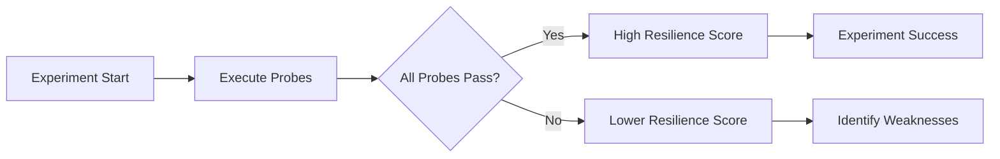

# Probes Overview

Probes are essential monitoring mechanisms that continuously validate system health during chaos experiments. They act as your safety net and validation layer, ensuring experiments provide meaningful insights while maintaining system stability.

## What are Probes?

Probes are **pluggable health checkers** that monitor your applications and infrastructure during chaos experiments. Think of them as intelligent sensors that:

- **Monitor Health**: Continuously check application and infrastructure status
- **Validate Hypotheses**: Confirm your assumptions about system behavior
- **Ensure Safety**: Prevent experiments from causing excessive damage
- **Measure Impact**: Quantify the effects of chaos on your systems


## Why Use Probes?

### **Declarative Hypothesis Validation**
Probes help validate your **declarative hypothesis** - a clear statement of what you expect to happen during the experiment:

```yaml
# Example hypothesis
hypothesis: "User login API should remain available with <200ms response time during pod failures"

# Corresponding probe
http_probe:
  name: "login-api-health"
  url: "https://api.example.com/auth/login"
  method: "POST"
  expected_response_time: "200ms"
  expected_status: 200
```

### **SMART Validation**
Your probes should follow **SMART** criteria:
- **Specific**: Clear, well-defined checks
- **Measurable**: Quantifiable metrics and thresholds
- **Achievable**: Realistic expectations
- **Relevant**: Aligned with business objectives
- **Time-bound**: Defined execution windows

## Probe Types

### **HTTP Probes**
Monitor web services and APIs:
```yaml
http_probe:
  name: "api-health-check"
  url: "https://api.example.com/health"
  method: "GET"
  expected_status: 200
  timeout: "5s"
```

### **Kubernetes Probes**
Validate Kubernetes resources:
```yaml
k8s_probe:
  name: "pod-availability"
  resource: "pods"
  namespace: "production"
  field_selector: "status.phase=Running"
  expected_count: 3
```

### **Command Probes**
Execute custom commands:
```yaml
cmd_probe:
  name: "database-connection"
  command: "pg_isready -h db.example.com -p 5432"
  expected_exit_code: 0
```

### **Prometheus Probes**
Query metrics from Prometheus:
```yaml
prom_probe:
  name: "cpu-usage-check"
  query: "avg(cpu_usage_percent) < 80"
  endpoint: "http://prometheus:9090"
```

### **APM Probes**
Integrate with monitoring tools:
- **Datadog**: Monitor application performance metrics
- **Dynatrace**: Track user experience and performance
- **New Relic**: Validate application health
- **AppDynamics**: Monitor business transactions

### **SLO Probes**
Validate Service Level Objectives:
```yaml
slo_probe:
  name: "availability-slo"
  slo_id: "user-service-availability"
  threshold: "99.9%"
```

## Execution Modes

Probes can run in different modes based on your validation needs:

### **SoT (Start of Test)**
- Executed **before** chaos injection
- Validates baseline system health
- Ensures system is ready for chaos

### **EoT (End of Test)**
- Executed **after** chaos injection
- Validates system recovery
- Confirms hypothesis post-chaos

### **Edge**
- Executed **both** before and after chaos
- Compares pre and post-chaos states
- Most common mode for validation

### **Continuous**
- Executed **throughout** the experiment
- Provides real-time monitoring
- Ideal for performance validation

### **OnChaos**
- Executed **only during** chaos injection
- Monitors immediate impact
- Useful for fault-specific validation

## Common Use Cases

### **1. API Availability Monitoring**
```yaml
# Ensure critical APIs remain accessible
http_probe:
  name: "user-service-availability"
  url: "https://api.example.com/users"
  method: "GET"
  expected_status: 200
  mode: "Continuous"
  interval: "10s"
```

### **2. Database Connectivity**
```yaml
# Validate database connections
cmd_probe:
  name: "db-connection-check"
  command: "mysql -h db.example.com -u app -p$DB_PASSWORD -e 'SELECT 1'"
  expected_exit_code: 0
  mode: "Edge"
```

### **3. Performance Validation**
```yaml
# Monitor response times
http_probe:
  name: "response-time-check"
  url: "https://api.example.com/search"
  method: "GET"
  expected_response_time: "500ms"
  mode: "Continuous"
```

### **4. Resource Availability**
```yaml
# Check Kubernetes pod availability
k8s_probe:
  name: "pod-count-validation"
  resource: "pods"
  namespace: "production"
  label_selector: "app=web-server"
  expected_count: 3
  mode: "Continuous"
```

## Impact on Resilience Score

Probes directly influence your **Resilience Score**:

- **Passed Probes**: Increase resilience score
- **Failed Probes**: Decrease resilience score
- **Probe Errors**: May invalidate experiment results



## Probe Chaining

Combine multiple probes for comprehensive validation:

```yaml
experiment:
  name: "comprehensive-validation"
  probes:
    - name: "api-health"
      type: "http"
      mode: "Continuous"
    - name: "db-connection"
      type: "cmd"
      mode: "Edge"
    - name: "pod-availability"
      type: "k8s"
      mode: "Continuous"
    - name: "performance-metrics"
      type: "prometheus"
      mode: "Continuous"
```

## Best Practices

### **Design Principles**
- **Start Simple**: Begin with basic health checks
- **Add Gradually**: Increase complexity as needed
- **Test Probes**: Validate probe logic before experiments
- **Monitor Results**: Analyze probe data for insights

### **Configuration Tips**
- **Set Appropriate Timeouts**: Avoid false negatives
- **Choose Right Intervals**: Balance accuracy and performance
- **Use Meaningful Names**: Make probes self-documenting
- **Document Expectations**: Clear hypothesis statements

### **Troubleshooting**
- **Check Connectivity**: Ensure probes can reach targets
- **Validate Credentials**: Confirm authentication works
- **Review Logs**: Analyze probe execution logs
- **Test Independently**: Validate probe logic separately

## Getting Started

1. **Define Your Hypothesis**: What do you expect to validate?
2. **Choose Probe Types**: Select appropriate monitoring mechanisms
3. **Configure Probes**: Set up validation logic and thresholds
4. **Test Probes**: Validate probe behavior before experiments
5. **Analyze Results**: Use probe data to improve system resilience

## Next Steps

- [**Probe Types & Modes**](./types-and-modes.md) - Detailed probe configuration
- [**HTTP Probes**](./http-probe.md) - Web service monitoring
- [**Kubernetes Probes**](./kubernetes-probe.md) - Container orchestration validation
- [**Command Probes**](./command-probe.md) - Custom validation scripts
- [**Best Practices**](./best-practices.md) - Advanced probe strategies

---

*Probes are your window into system behavior during chaos. Use them wisely to build confidence in your system's resilience.*
