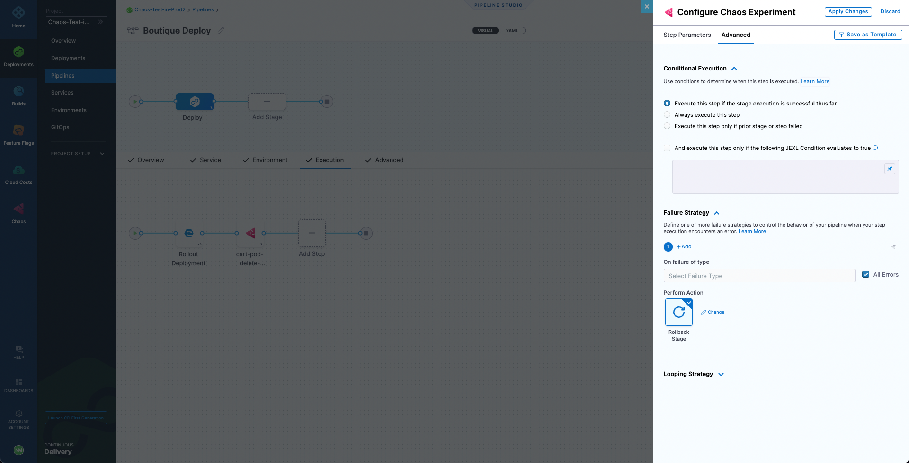
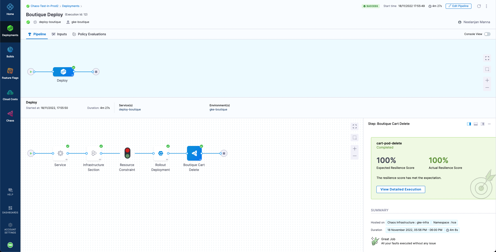

# Execute Chaos Experiment as CD Pipeline

This comprehensive tutorial demonstrates how to execute chaos experiments as part of Harness CD pipeline workflows to validate application resilience continuously during deployments.

## Overview

This tutorial shows how to:
- **Integrate Chaos with CD**: Add chaos experiments to deployment pipelines
- **Validate Resilience**: Ensure applications meet resilience standards before deployment
- **Implement Rollbacks**: Automatically rollback deployments that fail resilience tests
- **Continuous Validation**: Maintain resilience standards across all deployments

## Tutorial Scenario

We'll use the **Online Boutique Shop** demo application to demonstrate:
- A pre-configured CD pipeline for Kubernetes deployment
- Integration of a `cart-pod-delete` chaos experiment
- Automatic rollback on resilience failure
- Resolution of resilience issues through application improvements

## Prerequisites

Before starting, ensure you have:
- A Harness account with CD and CE modules enabled
- A Kubernetes cluster for deployment
- The demo application repository forked from [harness-chaos-demo](https://github.com/chaosnative/harness-chaos-demo/tree/main/boutique-app-manifests)
- A chaos experiment created and tested (we'll use `cart-pod-delete`)

## Step-by-Step Implementation

### Step 1: Review Existing CD Pipeline

Start with the pre-configured deployment pipeline:


**Current Pipeline Features**:
- **Automated Deployment**: Deploys Online Boutique Shop to Kubernetes
- **Webhook Trigger**: Automatically triggers on `main` branch changes
- **Single Replica Deployment**: Currently deploys one replica per microservice

**Application Status**:
The cart service currently runs with a single replica, making it vulnerable to pod failures:


### Step 2: Add Chaos Step to Pipeline

Integrate chaos testing into the deployment workflow:

1. **Navigate to Pipeline**: Open your CD pipeline in the Harness platform
2. **Add Chaos Step**: Select **Add Step** next to the **Rollout Deployment** step
3. **Select Chaos Step**: Choose **Chaos Step** from the step library


### Step 3: Configure Chaos Experiment

Set up the chaos experiment parameters:

1. **Name the Step**: Enter "Boutique Cart Delete" as the step name
2. **Add Description**: Optionally provide a description of the test purpose
3. **Select Experiment**: Choose the `cart-pod-delete` experiment from the dropdown


### Step 4: Set Resilience Criteria

Define the passing criteria for the experiment:

1. **Expected Resilience Score**: Set to **100%** to ensure maximum resilience
2. **Add to Pipeline**: Click **Add to Pipeline** to save the configuration


**Why 100% Score?**
- Ensures the application can handle pod failures without service degradation
- Validates that proper redundancy and failover mechanisms are in place
- Maintains high availability standards for production deployments

### Step 5: Configure Failure Strategy

Set up automatic rollback on resilience failure:

1. **Navigate to Advanced Tab**: Click the **Advanced** tab in the chaos step configuration
2. **Add Failure Strategy**: Under **Failure Strategy**, select **Add**
3. **Configure Rollback**: 
   - **On failure of type**: Select **All Errors**
   - **Perform Action**: Select **Rollback Stage**



**Rollback Benefits**:
- **Safety Net**: Prevents deployment of non-resilient applications
- **Automatic Recovery**: Returns to previous stable version without manual intervention
- **Continuous Validation**: Ensures only resilient applications reach production

### Step 6: Save and Test Pipeline

Complete the configuration and test the integration:

1. **Apply Changes**: Click **Apply Changes** to save the chaos step
2. **Save Pipeline**: Click **Save** to save the entire pipeline configuration


### Step 7: Execute Pipeline and Observe Failure

Run the pipeline to see resilience validation in action:

**Expected Behavior**:
- Pipeline deploys the application
- Chaos step executes the `cart-pod-delete` experiment
- Experiment fails due to insufficient replicas (50% resilience score)
- Pipeline triggers automatic rollback


**Failure Analysis**:
The chaos step fails because:
- **Single Replica**: Only one cart service pod exists
- **No Redundancy**: Pod deletion causes service unavailability
- **Low Resilience Score**: Achieves only 50% instead of required 100%


### Step 8: Resolve Resilience Issues

Fix the application to meet resilience requirements:

1. **Identify Issue**: Single replica deployment lacks redundancy
2. **Apply Fix**: Update the cart service manifest to use 2 replicas
3. **Deploy Changes**: Push the updated manifest to trigger pipeline

**Updated Manifest Example**:
```yaml
apiVersion: apps/v1
kind: Deployment
metadata:
  name: cartservice
spec:
  replicas: 2  # Increased from 1 to 2
  selector:
    matchLabels:
      app: cartservice
  template:
    metadata:
      labels:
        app: cartservice
    spec:
      containers:
      - name: server
        image: gcr.io/google-samples/microservices-demo/cartservice:v0.3.6
        # ... rest of container configuration
```

### Step 9: Validate Successful Deployment

Observe the successful pipeline execution:

1. **Automatic Trigger**: Webhook triggers new pipeline execution
2. **Successful Deployment**: Application deploys with improved resilience
3. **Passing Chaos Test**: Experiment achieves 100% resilience score
4. **Production Ready**: Application is now deployed and resilient




## Advanced Configuration Options

### Multi-Environment Validation

Configure different resilience requirements for different environments:

```yaml
# Staging environment - lower requirements
staging_chaos_step:
  experiment_id: "cart-pod-delete-staging"
  expected_resilience_score: 80
  failure_strategy: "continue_on_failure"

# Production environment - strict requirements  
production_chaos_step:
  experiment_id: "cart-pod-delete-production"
  expected_resilience_score: 100
  failure_strategy: "rollback_stage"
```

### Multiple Chaos Experiments

Run multiple experiments in sequence or parallel:

```yaml
# Sequential chaos testing
chaos_steps:
  - name: "pod-delete-test"
    type: "chaos"
    experiment_id: "cart-pod-delete"
    expected_score: 100
    
  - name: "network-latency-test"
    type: "chaos"
    experiment_id: "cart-network-latency"
    expected_score: 90
    depends_on: ["pod-delete-test"]
    
  - name: "cpu-stress-test"
    type: "chaos"
    experiment_id: "cart-cpu-stress"
    expected_score: 85
    depends_on: ["network-latency-test"]
```

### Conditional Chaos Testing

Execute chaos tests based on conditions:

```yaml
# Run chaos tests only for production deployments
chaos_step:
  when:
    condition: "{{env.name}} == 'production'"
  experiment_id: "comprehensive-chaos-suite"
  expected_score: 95

# Skip chaos tests for hotfix deployments
chaos_step:
  when:
    condition: "{{pipeline.variables.deployment_type}} != 'hotfix'"
  experiment_id: "standard-chaos-tests"
  expected_score: 90
```

## Best Practices

### Experiment Design
- **Start Simple**: Begin with basic experiments like pod deletion
- **Gradual Complexity**: Progressively add more complex failure scenarios
- **Environment-Specific**: Tailor experiments to environment characteristics
- **Realistic Scenarios**: Focus on likely failure modes

### Pipeline Integration
- **Strategic Placement**: Position chaos steps after deployment but before traffic routing
- **Appropriate Thresholds**: Set realistic resilience score expectations
- **Clear Failure Strategies**: Define explicit actions for different failure types
- **Comprehensive Logging**: Ensure detailed logging for troubleshooting

### Operational Considerations
- **Team Training**: Ensure teams understand chaos engineering principles
- **Gradual Rollout**: Implement chaos testing incrementally across applications
- **Monitoring Integration**: Connect chaos results with monitoring systems
- **Documentation**: Document experiment purposes and expected outcomes

## Troubleshooting Common Issues

### Low Resilience Scores

**Problem**: Experiments consistently fail with low resilience scores

**Solutions**:
- Review application architecture for single points of failure
- Implement proper redundancy and failover mechanisms
- Adjust probe configurations to accurately measure resilience
- Consider lowering initial expectations and gradually improving

### Pipeline Timeouts

**Problem**: Chaos experiments timeout during execution

**Solutions**:
- Increase pipeline step timeout settings
- Optimize experiment duration and complexity
- Check infrastructure performance and resource availability
- Implement proper monitoring and alerting

### Rollback Failures

**Problem**: Automatic rollbacks fail to execute properly

**Solutions**:
- Verify rollback strategy configuration
- Ensure proper permissions for rollback operations
- Test rollback procedures independently
- Implement comprehensive rollback validation

### Integration Issues

**Problem**: Chaos steps fail to integrate properly with CD pipeline

**Solutions**:
- Verify chaos experiment exists and is accessible
- Check user permissions for both CD and CE modules
- Validate network connectivity between services
- Review pipeline configuration for syntax errors

## Measuring Success

### Key Metrics

Track these metrics to measure chaos engineering success:

**Resilience Metrics**:
- Average resilience scores over time
- Percentage of experiments passing on first attempt
- Time to achieve target resilience scores
- Reduction in production incidents

**Operational Metrics**:
- Pipeline success rates with chaos testing
- Time added to deployment cycles
- Number of rollbacks triggered by chaos tests
- Developer productivity impact

**Business Metrics**:
- Reduction in customer-impacting outages
- Improved mean time to recovery (MTTR)
- Increased system availability
- Enhanced customer satisfaction

## Next Steps

After successfully implementing chaos experiments in CD pipelines:

1. **Expand Coverage**: Add chaos testing to more applications and services
2. **Advanced Scenarios**: Implement more complex failure scenarios
3. **Automation**: Automate experiment creation and maintenance
4. **Integration**: Connect with monitoring, alerting, and incident management systems
5. **Culture**: Foster a culture of resilience engineering across teams

## Conclusion

Integrating chaos experiments with CD pipelines provides:
- **Continuous Validation**: Ensures resilience standards are maintained
- **Automated Quality Gates**: Prevents deployment of non-resilient applications
- **Risk Mitigation**: Identifies and addresses weaknesses before production
- **Operational Excellence**: Improves overall system reliability and availability

This approach transforms chaos engineering from a periodic activity into a continuous practice that enhances the reliability of your entire deployment pipeline.

For more information about Harness CD integration, visit the [CD tutorials](/docs/category/cd-and-gitops-tutorials) and explore [advanced chaos engineering patterns](/docs/chaos-engineering-new/guides/).
