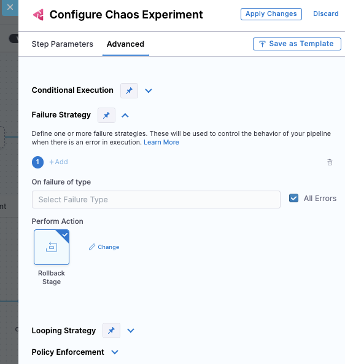

# Harness Continuous Delivery Integration

This guide explains how to integrate Harness Chaos Engineering with Harness Continuous Delivery (CD) pipelines to validate system resilience as part of your deployment process.

## Overview

Harness CD integration enables you to:
- **Seamless Integration**: Native integration between Harness CE and CD
- **Deployment Validation**: Validate resilience with every deployment
- **Automated Rollbacks**: Trigger rollbacks based on resilience scores
- **Multi-Stage Testing**: Run experiments across different deployment stages

## Benefits

Integrating chaos experiments with CD pipelines provides several advantages:

- **Uncover Resilience Unknowns**: Discover failure modes before they impact production
- **Increase Developer Efficiency**: Automate resilience validation in deployment workflows
- **Reduce Resilience Debt**: Continuously validate and improve system resilience
- **Validate Against Changes**: Test resilience impact of new deployments and configuration changes

## Use Cases

Consider using chaos experiments in CD pipelines to validate:

- **Existing Resilience Conditions**: Ensure current resilience measures still work
- **Newly Added Resilience Conditions**: Validate new resilience improvements
- **Platform Changes**: Test impact of infrastructure or platform updates
- **Production Incidents**: Validate fixes for past production issues
- **Configuration Changes**: Ensure configuration updates don't break resilience

## Recommended Chaos Faults for CD Pipelines

### Network Chaos Faults
Verify service dependencies and microservice communication:
- **Pod Network Latency**: Test service behavior under network delays
- **Pod Network Loss**: Validate handling of packet loss scenarios
- **Pod Network Corruption**: Test resilience to network corruption

### Stress Chaos Faults
Validate behavior under resource constraints:
- **Pod CPU Hog**: Test performance under CPU pressure from noisy neighbors
- **Pod Memory Hog**: Validate memory management under stress
- **Node CPU Hog**: Test cluster-level resource competition

### HTTP Chaos Faults
Test API and service resilience:
- **Pod HTTP Latency**: Validate API timeout handling
- **Pod HTTP Status Code**: Test error handling for different HTTP responses
- **Pod HTTP Modify Response**: Validate response parsing resilience

## Setup Instructions

### Step 1: Create and Validate Chaos Experiment

1. **Create Experiment**: Create a chaos experiment in Harness Chaos Engineering
2. **Add Probes**: Configure appropriate resilience probes to avoid false positives/negatives
3. **Test Execution**: Run the experiment to ensure it completes successfully
4. **Note Details**: Record the experiment ID and expected resilience score


### Step 2: Add Chaos Step to CD Pipeline

Chaos experiments can be added as steps in these Harness CD stage types:
- **Feature Flag** stages
- **Deploy** stages  
- **Custom** stages

#### Adding a Chaos Step

1. **Navigate to Pipeline**: Go to **Deployments > Pipelines** and select your pipeline
2. **Add Stage**: Select **Add Stage** and choose an appropriate stage type


3. **Configure Stage**: Enter **Stage Name** and **Deployment Type** (if applicable), then select **Set Up Stage**
4. **Add Step**: With the stage selected, choose **Add Step > Add Step**


5. **Select Chaos Step**: In the Step Library, scroll down and select the **Chaos** step icon


6. **Configure Chaos Experiment**: 
   - Enter a **Name** for the step
   - Select **Select Chaos Experiment** to choose from available experiments


7. **Set Parameters**:
   - Choose your chaos experiment
   - Set the **Expected Resilience Score**
   - Configure optional settings as needed

8. **Advanced Configuration**: Use the **Advanced** tab for additional settings like:
   - Conditional execution
   - Failure strategies
   - Timeout settings
   - Step groups

9. **Save Configuration**: Select **Apply Changes** to save the step, then **Save** to save the pipeline

### Step 3: Configure Failure Strategy

Define how the pipeline should respond when chaos experiments fail:

#### Option 1: Individual Step Failure Strategy

Configure failure strategy for each chaos step:



**Available Strategies**:
- **Rollback**: Automatically rollback the deployment
- **Ignore Failure**: Continue pipeline execution
- **Abort**: Stop the pipeline execution
- **Retry**: Retry the failed step
- **Manual Intervention**: Pause for manual decision

#### Option 2: Conditional Failure Step

Use a Shell Script step after multiple chaos experiments:


This approach allows for:
- **Aggregate Analysis**: Evaluate results from multiple experiments
- **Custom Logic**: Implement complex decision-making logic
- **Flexible Actions**: Define custom remediation actions

## Pipeline Execution Flow

When a CD pipeline with chaos steps runs:

1. **Deployment Stages**: Normal deployment stages execute first
2. **Chaos Step Trigger**: The chaos step triggers the selected experiment
3. **Experiment Execution**: The experiment runs on the target application
4. **Result Analysis**: Resilience score and probe results are evaluated
5. **Decision Point**: Based on results, the pipeline either continues or triggers failure strategy
6. **Logging**: Detailed execution logs are available in both CD and CE modules

### Monitoring Execution

- **CD Pipeline View**: Monitor chaos step execution in the pipeline view
- **Chaos Experiments Page**: View detailed experiment execution in **Chaos > Chaos Experiments**
- **Detailed Logs**: Access comprehensive logs including resilience scores and probe results
- **Cross-Module Navigation**: Use **View Detailed Execution** to jump between CD and CE views

## Advanced Configurations

### Multi-Environment Testing

```yaml
# Example pipeline configuration for different environments
stages:
  - name: staging-deployment
    type: Deploy
    steps:
      - name: deploy-to-staging
        type: K8sRollingDeploy
      - name: staging-chaos-test
        type: Chaos
        spec:
          experimentId: staging-experiment-id
          expectedResilienceScore: 85
  
  - name: production-deployment
    type: Deploy
    steps:
      - name: deploy-to-production
        type: K8sRollingDeploy
      - name: production-chaos-test
        type: Chaos
        spec:
          experimentId: production-experiment-id
          expectedResilienceScore: 95
```

### Conditional Chaos Testing

Execute chaos experiments based on conditions:

```yaml
# Run chaos tests only for main branch deployments
- name: chaos-validation
  type: Chaos
  when:
    condition: <+pipeline.variables.branch> == "main"
  spec:
    experimentId: <+pipeline.variables.chaosExperimentId>
    expectedResilienceScore: 90
```

### Parallel Chaos Testing

Run multiple experiments simultaneously:

```yaml
# Parallel execution of different chaos experiments
- name: parallel-chaos-tests
  type: StepGroup
  steps:
    - name: network-chaos
      type: Chaos
      spec:
        experimentId: network-experiment-id
    - name: cpu-chaos
      type: Chaos
      spec:
        experimentId: cpu-experiment-id
    - name: memory-chaos
      type: Chaos
      spec:
        experimentId: memory-experiment-id
```

## Best Practices

### Experiment Design
- **Start Simple**: Begin with basic experiments and gradually increase complexity
- **Use Appropriate Probes**: Configure probes to accurately measure application health
- **Set Realistic Thresholds**: Use achievable resilience score expectations
- **Test Incrementally**: Validate experiments in lower environments first

### Pipeline Integration
- **Strategic Placement**: Place chaos steps at appropriate points in deployment flow
- **Environment-Specific**: Use different experiments for different environments
- **Failure Handling**: Define clear failure strategies for different scenarios
- **Monitoring**: Implement comprehensive logging and monitoring

### Operational Considerations
- **Team Training**: Ensure teams understand chaos engineering principles
- **Gradual Rollout**: Implement chaos testing gradually across applications
- **Documentation**: Document experiment purposes and expected outcomes
- **Regular Review**: Periodically review and update chaos experiments

## Troubleshooting

### Common Issues

#### Experiment Not Found
```
Error: Chaos experiment with ID 'xxx' not found
```
**Solution**: Verify experiment exists and is accessible in the current project

#### Low Resilience Score
```
Warning: Resilience score 75 is below expected 90
```
**Solution**: 
- Review probe configurations
- Analyze experiment logs
- Adjust application resilience measures
- Update expected score if appropriate

#### Timeout Issues
```
Error: Chaos experiment execution timed out
```
**Solution**:
- Increase step timeout settings
- Optimize experiment duration
- Check infrastructure performance

#### Permission Issues
```
Error: Insufficient permissions to execute chaos experiment
```
**Solution**:
- Verify user has appropriate CE permissions
- Check project-level access controls
- Ensure service account permissions are correct

### Debugging Steps

1. **Check Experiment Status**: Verify experiment runs successfully in CE module
2. **Review Logs**: Examine detailed execution logs in both CD and CE
3. **Validate Probes**: Ensure probes are correctly configured and accessible
4. **Test Connectivity**: Verify network connectivity to target infrastructure
5. **Check Permissions**: Confirm all required permissions are in place

## Integration Benefits

### Development Workflow
- **Shift-Left Testing**: Catch resilience issues early in development cycle
- **Automated Validation**: Reduce manual testing overhead
- **Consistent Testing**: Ensure all deployments undergo resilience validation
- **Fast Feedback**: Quick identification of resilience regressions

### Operational Excellence
- **Reduced MTTR**: Faster identification and resolution of issues
- **Improved Reliability**: Continuous validation of system resilience
- **Risk Mitigation**: Proactive identification of potential failure modes
- **Compliance**: Automated compliance with resilience requirements

## Next Steps

- Explore advanced chaos engineering patterns
- Integrate with monitoring and alerting systems
- Implement chaos testing across your application portfolio
- Set up comprehensive resilience dashboards
- Consider implementing chaos engineering governance policies

For more information about Harness CD, visit the [CD tutorials](/docs/category/cd-and-gitops-tutorials) and learn more about [CE/CD integration benefits](https://www.harness.io/blog/chaos-experiments-in-harness-cd-pipelines).
