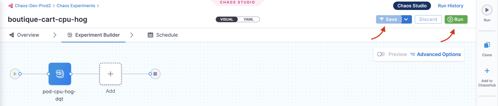

# Quickstart

Welcome to Harness Chaos Engineering! This guide will help you set up your first chaos experiment and execute it on your target infrastructure in just a few minutes.

## Before You Begin

Review the following:
- [All about chaos engineering](/docs/chaos-engineering-new/concepts)
- [What's supported](/docs/chaos-engineering-new/whats-supported)
- Ensure you have access to a Kubernetes cluster, Linux machine, or cloud environment

## Prerequisites

- **Harness Account**: [Sign up for free](https://app.harness.io/auth/#/signup) if you don't have one
- **Target Infrastructure**: Kubernetes cluster with kubectl access, or Linux machine with admin privileges
- **Basic Permissions**: Admin access to your target infrastructure for installing chaos agents

## Step 1: Access Harness Chaos Engineering

1. [Sign up](https://app.harness.io) or log in to your Harness account
2. Navigate to the **Chaos Engineering** module from the left sidebar
3. Create a new project or ask your administrator to add you to an existing project

## Step 2: Create an Environment

A chaos experiment is executed in an infrastructure that is associated with an **environment**.

1. Navigate to the **Environments** page and select **New Environment**
2. Specify the environment name, description (optional), and tags (optional)
3. Select the environment type: **Production** or **Non-Production**
4. Select **Create** to add the new environment


:::tip
You can also select one of the existing environments from the list if available.
:::

## Step 3: Set Up Chaos Infrastructure

After creating an environment, add an infrastructure to it:

### For Kubernetes (Recommended for First Experiment)

1. Select **+New Infrastructure** in your environment
2. Choose **Kubernetes** as the infrastructure type
3. Select installation mode:
   - **Cluster-wide access**: Target resources across all namespaces
   - **Specific namespace access**: Restrict chaos injection to specific namespace
4. Copy and run the provided installation command in your cluster:

```bash
# Example installation command (use the one provided in UI)
kubectl apply -f https://app.harness.io/chaos/delegate/manifest/...
```

5. Wait for the infrastructure to show **CONNECTED** status

### For Linux

1. Select **+New Infrastructure** and choose **Linux**
2. Download and install the chaos agent:

```bash
# Download the agent
curl -O https://app.harness.io/chaos/linux-agent
chmod +x linux-agent

# Install with your infrastructure ID and access key
sudo ./linux-agent --install --infra-id=<YOUR_INFRA_ID> --access-key=<YOUR_ACCESS_KEY>
```

## Step 4: Create Your First Chaos Experiment

Now let's create and run your first chaos experiment. We recommend starting with **Pod Delete** as it has a small blast radius and is safe for most applications.

### Identify Your Target

1. Identify the microservice in your application that you will target
2. For Kubernetes, we'll delete a pod from your application
3. [Pod delete](/docs/chaos-engineering-new/faults/chaos-faults/kubernetes/pod/pod-delete) is the simplest chaos experiment recommended as the first step


### Create the Experiment

1. Navigate to **Chaos Experiments** and select **New Experiment**
2. Choose **Blank Canvas** to create from scratch, or select a **Template**
3. Configure your experiment:
   - **Name**: "My First Pod Delete Experiment"
   - **Description**: "Testing pod resilience"
   - **Tags**: Add relevant tags for organization

### Add Chaos Fault

1. In the experiment builder, select **Add Fault**
2. Choose **Kubernetes** → **Pod** → **Pod Delete**
3. Configure the fault:
   - **Target Pods**: Select specific pods or use label selectors
   - **Chaos Duration**: Start with 30 seconds
   - **Force**: Keep as false for graceful deletion

### Add Resilience Probes (Recommended)

Probes validate your hypothesis during the experiment:

1. Select **Add Probe** in your experiment
2. Choose **HTTP Probe** to monitor application availability:
   - **URL**: Your application endpoint
   - **Method**: GET
   - **Success Criteria**: Response code 200
   - **Run Properties**: Execute during chaos

## Step 5: Run Your First Experiment

1. **Review** your experiment configuration
2. **Save** the experiment
3. **Run** the experiment by clicking the **Run** button
4. **Monitor** the experiment execution in real-time:
   - Watch the experiment timeline
   - Observe probe results
   - Check system metrics and logs


## Step 6: Analyze Results

After the experiment completes:

1. **Review the Resilience Score**: Overall system resilience rating based on probe results
2. **Check Probe Results**: Success/failure of health checks during chaos
3. **Examine Timeline**: Detailed view of experiment execution phases
4. **View Logs**: Detailed execution logs for troubleshooting



### Understanding Results

- **Passed Probes**: Your application handled the chaos well
- **Failed Probes**: Areas that need improvement
- **Resilience Score**: Higher scores indicate better resilience

## Quick Onboarding Options

If you want to get started even faster, Harness CE offers two onboarding methods:

### Automated Onboarding
- **One-click setup**: Automatically creates environment, discovers services, and runs experiments
- **Minimal decisions**: HCE handles most configuration automatically
- **Quick results**: See resilience scores within minutes

### Guided Onboarding
- **Step-by-step guidance**: Walk through each step with options
- **More control**: Customize each step while getting guidance
- **Learning focused**: Understand the process while being guided

To access onboarding, go to **Chaos Engineering** → **Overview** → **Select a cluster**

## Common First Experiments

### 1. Pod Delete (Kubernetes)
**Purpose**: Test application resilience to pod failures
- **Fault**: Pod Delete
- **Duration**: 30 seconds
- **Success Criteria**: Service remains available, new pods start quickly

### 2. CPU Stress (Linux/Kubernetes)
**Purpose**: Test application behavior under CPU pressure
- **Fault**: CPU Stress
- **CPU Load**: 80%
- **Duration**: 2 minutes
- **Success Criteria**: Application performance degrades gracefully

### 3. Network Latency
**Purpose**: Validate application behavior under network delays
- **Fault**: Network Latency
- **Latency**: 100ms
- **Duration**: 1 minute
- **Success Criteria**: Timeouts handled gracefully

## Troubleshooting

### Infrastructure Not Connecting
- Verify network connectivity from your cluster/machine to Harness
- Check if the chaos agent/delegate is running
- Ensure proper permissions for installation

### Experiment Fails to Start
- Verify target resources exist and are accessible
- Check RBAC permissions for chaos operations
- Ensure infrastructure is in CONNECTED state

### Probes Failing
- Validate probe endpoint URLs and configurations
- Check network connectivity to probe targets
- Review success criteria and thresholds

## What's Next?

Congratulations! You've successfully run your first chaos experiment. Here's what to explore next:

### Expand Your Chaos Engineering Practice
1. **[Explore More Faults](/docs/chaos-engineering-new/faults)** - Try different types of chaos faults
2. **[Advanced Probes](/docs/chaos-engineering-new/guides/probes)** - Set up comprehensive monitoring
3. **[GameDays](/docs/chaos-engineering-new/guides/gamedays)** - Organize team chaos engineering events
4. **[CI/CD Integration](/docs/chaos-engineering-new/guides/pipelines)** - Automate chaos testing in your pipelines

### Learn Best Practices
1. **[Key Concepts](/docs/chaos-engineering-new/key-concepts)** - Understand chaos engineering fundamentals
2. **[Security](/docs/chaos-engineering-new/security)** - Implement secure chaos engineering practices
3. **[Governance](/docs/chaos-engineering-new/guides/governance)** - Set up proper controls and policies

### Get Help and Support
- **[Troubleshooting Guide](/docs/chaos-engineering-new/resources/troubleshooting)** - Common issues and solutions
- **[FAQ](/docs/chaos-engineering-new/resources/faq)** - Frequently asked questions
- **[Community](https://harnesscommunity.slack.com)** - Join our Slack community
- **[Support](https://support.harness.io)** - Contact Harness Support

## Harness CE vs LitmusChaos

Harness Chaos Engineering builds upon the open-source LitmusChaos project with additional enterprise features:

- **SaaS Platform**: Fully managed chaos engineering platform
- **Advanced Faults**: 200+ chaos faults across cloud providers
- **Enterprise Security**: RBAC, audit logs, and compliance features
- **Integrations**: Native integration with Harness CD, monitoring tools
- **GameDays**: Collaborative chaos engineering events
- **ChaosGuard**: Governance and safety controls

For a detailed comparison, see our [feature comparison table](/docs/chaos-engineering-new/overview#harness-ce-vs-litmus).

:::tip Success!
You've completed your first chaos experiment! You're now ready to build more resilient systems through systematic chaos engineering practices.
:::
