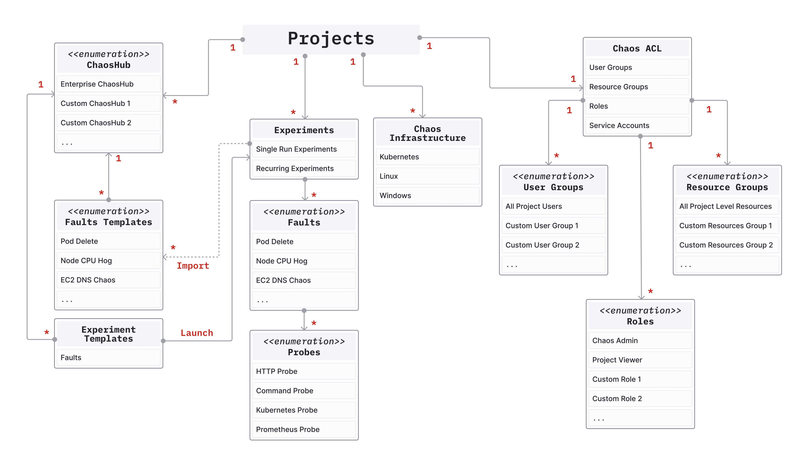

This section describes the Harness Chaos Engineering (HCE) components.

Below is a diagram that shows the component relationships in HCE.

#### 1. Chaos experiment
A **chaos experiment** (or an **experiment**) injects one or more chaos faults into a specified chaos infrastructure and summarizes the result of the chaos execution. You can define the experiment using the Chaos Studio through the guided UI or by uploading the workflow CR (custom resource) manifest.

#### 2. Chaos fault
A **chaos fault** (or a **fault**) refers to the failures injected into the chaos infrastructure as part of a chaos experiment. Every fault is scoped to a particular target resource and you can customize the fault using the fault tunables, which are defined as part of the Chaos Experiment CR and Chaos Engine CR. Optionally, one or more probes can be defined as part of a chaos fault.

#### 3. ChaosHub
**ChaosHub** is a collection of experiment templates (defined as workflow CRs) and faults (defined as ChaosExperiment CR and ChaosEngine CR) that help create and execute new chaos experiments against your target resources. Apart from the Enterprise ChaosHub, which is present by default, custom ChaosHub can be added for the management and distribution of custom experiment templates and faults.

#### 4. Chaos infrastructure
**Chaos infrastructure** represents the individual components of a deployment environment. It is a service that runs within your target environment to aid CE in accessing the target resources and injecting chaos at a cloud-native scale. Multiple chaos infrastructures can be added as part of an environment.

#### 5. Environment
A Harness **environment** represents your deployment environment such as `Dev`, `QA`, `Staging`, `Production`, etc. Each environment may contain multiple chaos infrastructures. It helps isolate the various environments that your engineering, product owners, QA, and automation teams use under a single Harness project. This allows for better segregation of mission-critical infrastructures with several attached dependencies from dev and staging infrastructures for their safety.

#### 6. Chaos Studio
**Chaos Studio** is used for the creation of new chaos experiments using varied chaos faults and templates from ChaosHub, probes, and custom action steps. New experiments can be created using the guided UI or using the experiment manifest represented by the workflow CR.

#### 7. Resilience score
The **resilience score** is a quantitative measure of how resilient the target application is to a chaos experiment. It is [calculated](/docs/chaos-engineering/features/experiments/resilience-score) based on the priority set for every fault in the experiment and the probe success percentage of the faults (if the probes are defined).

#### 8. Probe
Chaos **probes** (or **resilience probes**) automate the chaos hypothesis validation performed during a fault execution. They are declarative checks that determine the outcome of a fault. Probes are scoped to the faults and you can define as many probes as required as part of each fault.

#### 9. Tunables
A fault execution can be customized by changing the various tunables or parameters that it accepts. While some of them are common across all the faults, such as the Chaos Duration, every fault has its own set of tunables. Wherever applicable, default tunables have been provided which may need to be updated. Otherwise, mandatory tunables always need to be provided.

#### 10. Chaos interval
**Chaos interval** is a tunable which specifies the duration between successive iterations of chaos, while the elapsed experiment time is less than the chaos duration.

#### 11. Sequence
**Sequence** is a parameter that defines the manner in which chaos is injected into the target instances of a fault. It can be configured as **serial** mode to inject chaos in one target in a single chaos iteration or as **parallel** to inject chaos in all targets in a single chaos iteration.

#### 12. Chaos duration
**Chaos duration** refers to the total duration through which chaos execution shall take place. This excludes the duration of pre-chaos injection and post-chaos injection execution time.

#### 13. Probe success percentage
**Probe success percentage** refers to the percentage of probes that have been successfully evaluated out of the total number of probes.

#### 14. Experiment templates
**Experiment templates** are stored as part of the ChaosHub, which can be used for creating new chaos experiments. They can be edited by making changes to the existing fault configuration or by adding new faults. New experiments can also be stored in ChaosHub as templates.

#### 15. Result fail step
When an experiment fails, the failed step specifies the exact cause of failure for the experiment run. It contains an error code for the classification of the error, a phase for specifying the execution phase during which the error occurred, and finally the reason which is a user-friendly description of the error.

#### 16. Result phase
**Phase** determines the status of the overall experiment execution. It may be `Awaited`, `Running`, `Completed`, or `Aborted`, depending on the experiment outcome.

#### 17. Chaos engine Custom Resource (CR)
The **Chaos Engine** CR is the user-facing chaos Kubernetes CR which connects a target resource instance with a chaos fault to orchestrate the steps of chaos execution. You can specify run-level details such as overriding fault defaults, provide new environment variables and volumes, delete or retain experiment pods, define probes and update the status of the fault execution.

#### 18. Chaos experiment Custom Resource (CR)
**Chaos Experiment** CR contains the low-level execution information for the execution of a chaos fault. The CR holds granular details of a fault such as the container image, library, necessary permissions, and chaos parameters. Most of the chaos experiment CR parameters are tunables that you can override from the chaos engine CR.

#### 19. Workflow Custom Resource (CR)
A **workflow** CR is used to define the number of operations that are coupled together in a specific sequence to achieve a desired chaos impact. These operations are chaos faults or any custom action associated to the experiment, such as load generation.
