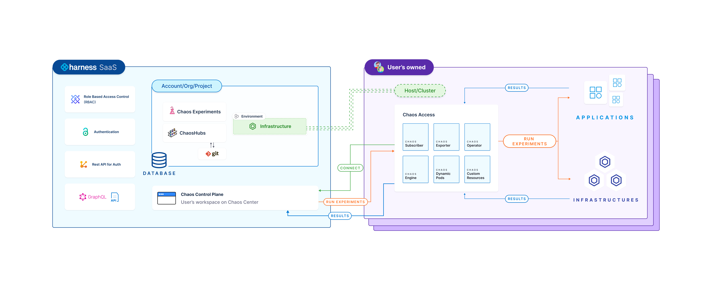

This topic describes the [control plane](#control-plane), the [execution plane](#execution-plane), their [interaction](#interaction-between-the-execution-plane-and-the-control-plane), and their components' [resource utilization](#resource-utilization-matrix) matrix.

### Before you begin:

- [HCE constituents](/docs/chaos-engineering/architecture-and-security/architecture/components)

To determine (or improve) the resilience of an application, you have to execute chaos experiments on your cluster. To execute a chaos experiment, two essential components should interact with each other. The two parts are:

1. **Control plane** (HCE SaaS)
2. **Execution plane** (Your host/cluster)

:::tip
Depending on the version of HCE (SaaS or Self-Managed Platform), the control plane is [hosted](https://app.harness.io) by Harness (for SaaS) or within your domain (for example, `harness.your-domain.io`).
:::

The diagram below provides insight into the relationship between HCE SaaS (the control plane) and your host (or cluster that represents the execution plane), illustrating how experiments are conducted using HCE.

From the diagram, you can infer the following, on a high level:
1. You establish a connection between the execution plane and the control plane.
2. The control plane sends your chaos experiments to the execution plane for execution.
3. Results from the execution plane are sent to the control plane.

Go to [interaction between control plane and execution plane](#interaction-between-the-execution-plane-and-the-control-plane) to understand the detailed set of steps.

### Control plane

**Harness control plane** consists of microservices that help the [web-based portal](https://app.harness.io) perform its functionalities.

You can sign in (or get an invite) to the Harness Platform and leverage the interactive UI dashboard to:

- [Create chaos environment](/docs/chaos-engineering/get-started/tutorials/first-chaos-engineering#step-2-add-a-chaos-environment).
- [Create chaos infrastructure and enable chaos in your infrastructure](/docs/chaos-engineering/get-started/tutorials/first-chaos-engineering#step-3-add-a-chaos-infrastructure).
- [Define chaos experiments](/docs/chaos-engineering/get-started/tutorials/first-chaos-engineering#step-5-construct-a-chaos-experiment).
- [Connect to Enterprise ChaosHubs and execute chaos experiments](/docs/chaos-engineering/features/experiments/export-chaos-experiments#add-an-experiment-to-chaos-hub).
- [Target the resources in your infrastructure](/docs/chaos-engineering/get-started/tutorials/first-chaos-engineering#step-6-observing-chaos-execution).
- [Monitor experiments during their execution](/docs/chaos-engineering/get-started/tutorials/first-chaos-engineering#step-6-observing-chaos-execution).

### Why is a control plane required?

This portal helps [**create**](/docs/chaos-engineering/features/experiments/construct-and-run-custom-chaos-experiments), **schedule**, and **monitor** chaos experiments. It comes with [chaos faults](/docs/chaos-engineering/chaos-faults/) that help achieve the desired chaos impact on the target resources.

The diagram describes how the control plane (Harness Saas) and its components (such as chaos experiment, ChaosHub, database, and so on) interact with the [execution plane](#execution-plane) components such as Kubernetes infrastructure or Linux infrastructure.

### Execution plane

**Harness execution plane** contains the components responsible for orchestrating the chaos injection into the target resources. They are:

1. Operator
2. Exporter (optional)
3. Subscriber
4. Workflow controller

- Go to [HCE constituents](/docs/chaos-engineering/architecture-and-security/architecture/components.md) for definitions.
- Go to [Kubernetes execution plane](/docs/chaos-engineering/architecture-and-security/architecture/components#kubernetes-execution-plane-components) to learn more.
- Go to [Linux execution plane](/docs/chaos-engineering/architecture-and-security/architecture/components#linux-execution-plane-components) to learn more.

### Why is an execution plane required?

The execution plane helps set up the resources (clusters) and you can use the control plane to interact with the cluster and create chaos experiments.

You can install the execution plane components through the chaos infrastructure in clusters (external or internal depending on the type of chaos infrastructure used).

### Interaction between the execution plane and the control plane

Below are the steps that take place in the background when you schedule an experiment.

1. After you schedule the experiment, the control plane sends the experiment to the execution plane.
2. The subscriber (part of execution plane) installs the chaos experiment on the cluster.
3. When the subscriber installs a new experiment, the workflow controller identifies the experiment and triggers it.
4. The operator searches for the chaos faults (present inside the chaos experiment) on the cluster and triggers the execution of these faults.
5. Once the experiment completes execution, experiment data (such as the name of the experiment, faults, probes, and so on) is sent back to the Kubernetes infrastructure server by the execution plane.

### Resource utilization matrix
The resource utilization matrix for execution plane components is summarized below. These components are installed in the target cluster as a part of the Kubernetes-based chaos infrastructure.

:::tip
The table below is indicative of low to medium-load working conditions. As chaos activity increases, more resources will be required, and the values represented here may vary.
:::

| Deployment          | container           | CPU (Requested) | Memory (Requested) | Image                                               |
|---------------------|---------------------|-----------------|--------------------|-----------------------------------------------------|
| chaos-operator-ce   | chaos-operator-ce   | 125m            | 300M               | docker.io/harness/chaos-operator:1.31.0             |
| chaos-exporter      | chaos-exporter      | 125m            | 300M               | docker.io/harness/chaos-exporter:1.31.0             |
| subscriber          | subscriber          | 125m            | 300M               | docker.io/harness/chaos-subscriber:1.31.0           |
| workflow-controller | workflow-controller | 125m            | 300M               | docker.io/harness/chaos-workflow-controller:v3.4.16 |
