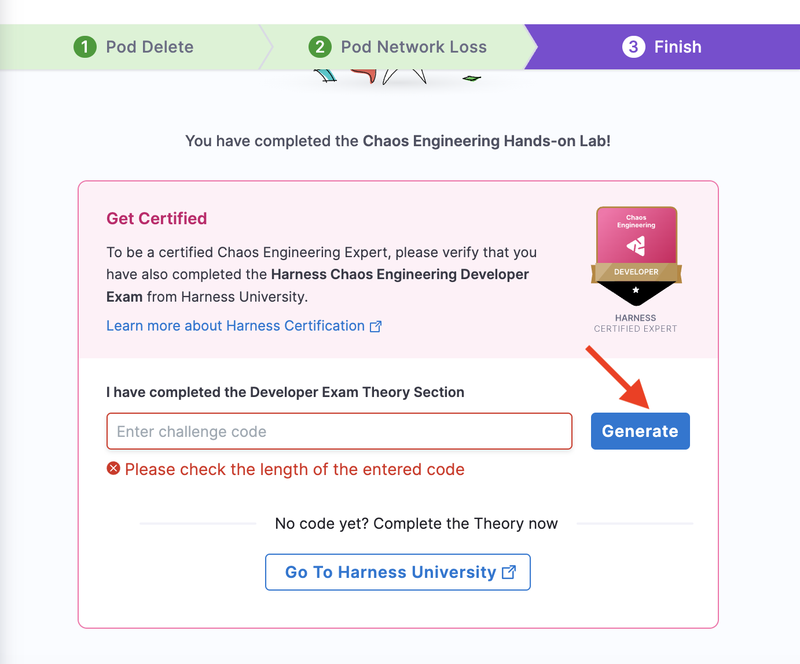
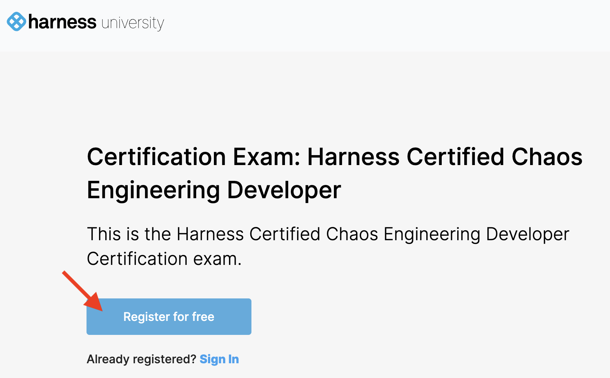
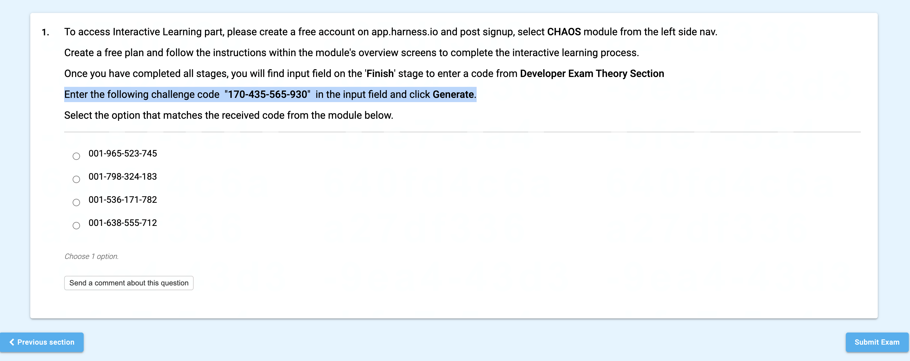
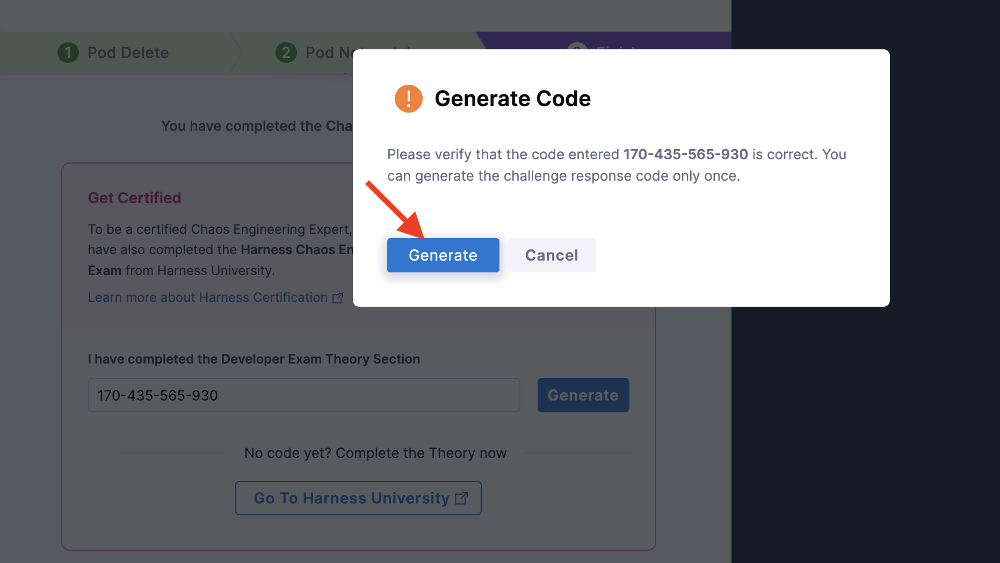

This tutorial guides you through registering for the Harness Chaos developer exam certification and completing it.

## Prerequisites
Before you begin, [execute the Podtato head application in sandbox](./run-experiments-in-sandbox).

### Developer certification exam

1. Once you are done with executing the Podtato head application, you can attempt the Harness Chaos Engineering Developer certification exam. Navigate to [Harness developer hub](https://developer.harness.io/certifications/chaos-engineering?lvl=developer) or click **Go to Harness University**.

2. You can **Register for free** or sign in. 

3. If you haven't previously registered, click **Sign up** and enter the details required. Else **Sign in**. 

4. Click **Register for exam**.

5. Basic connectivity is checked, click **Proceed**.

6. Read through the terms and condition, click **Agree and continue**.

7. Click **I am ready to begin**.

8. Choose the options that you think suit the questions the best. At the end, the screen will display a code, along with 4 options. Go to the sandbox and enter the code. 

9. Once you enter the code, click **Generate**.

10. The code generated on this page is one of the options on the Harness university exam page. Select the code that was generated for you, and click **Submit exam**.

That's it! The screen will determine and display your results. All the best!

## Conclusion
With that, you have successfully completed the Harness chaos engineering developer certification exam. Check [this tutorial](../../../tutorials/chaos-experiments/first-chaos-engineering) to execute your first chaos experiment and the [documentation](../get-started/overview) to learn about various kinds of [faults](../technical-reference/chaos-faults).