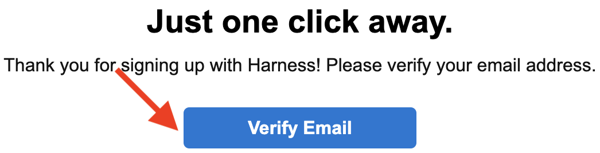
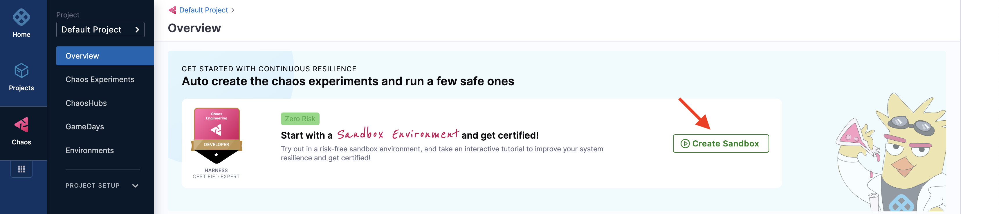
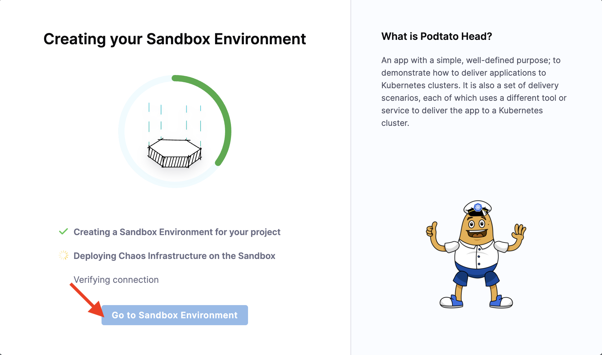
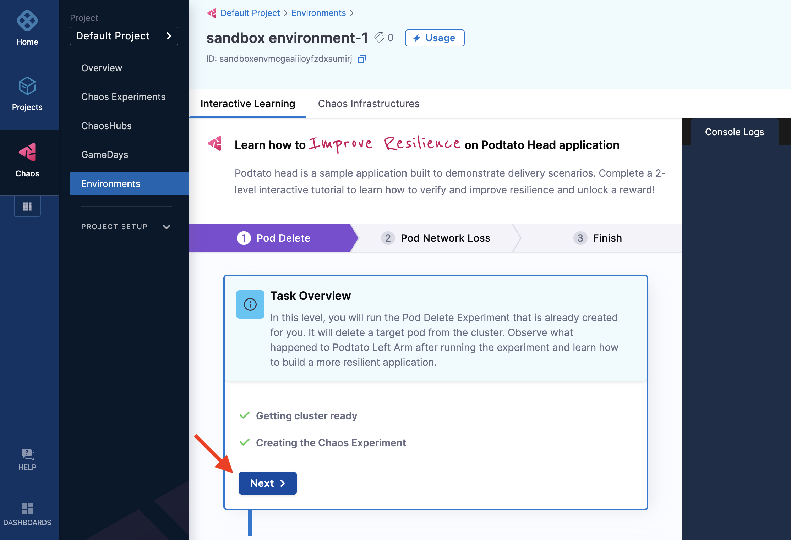
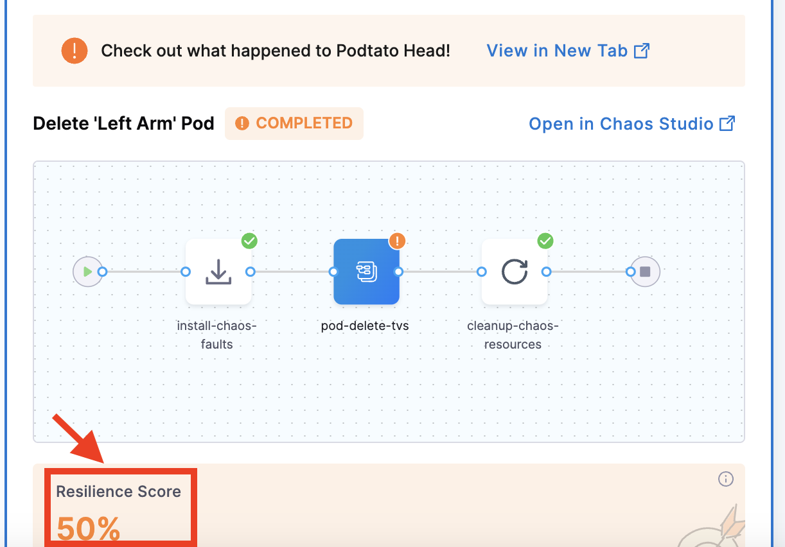
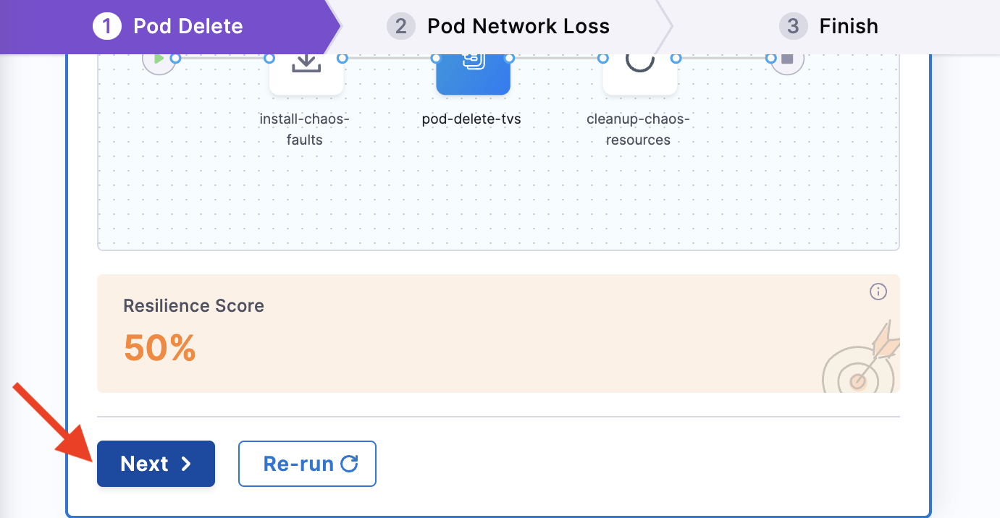
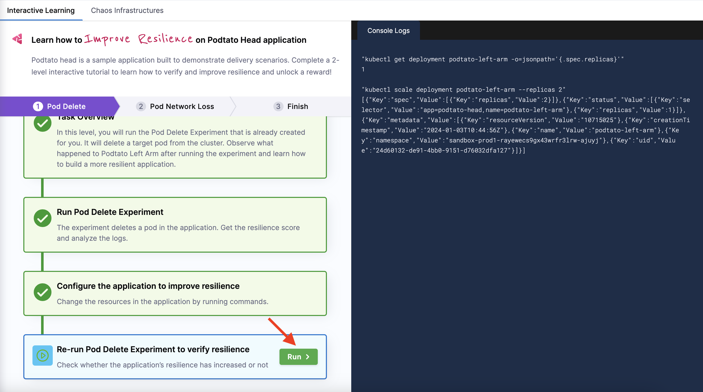
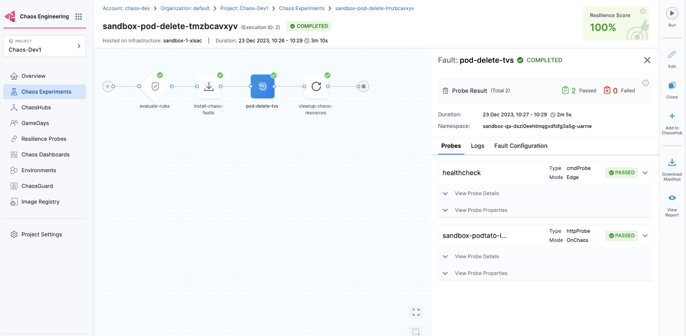
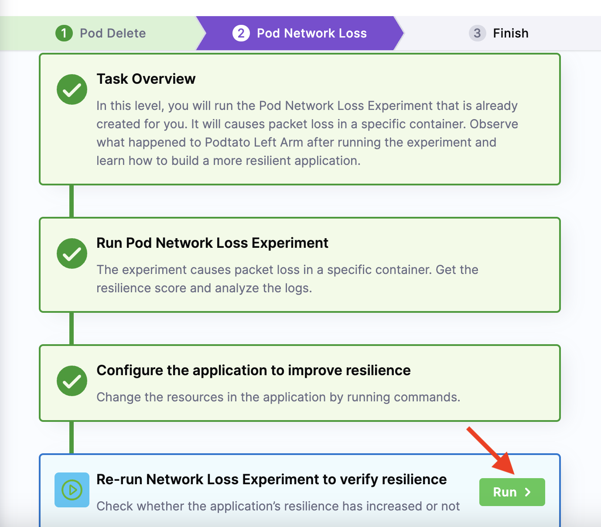
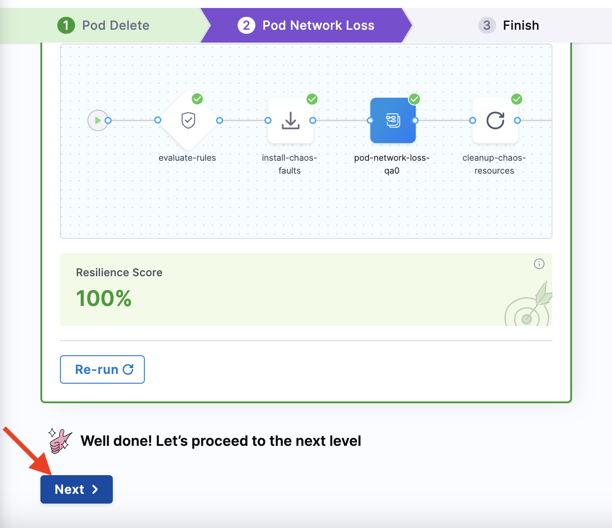

This tutorial guides you through an interactive tutorial that uses a sample application (**Podtato head**) to execute a chaos experiment and improve the resilience of the application.

## Prerequisites
Before you begin the tutorial, you need to have a Harness account. To create one, follow the below-mentioned steps.

### Create a Harness account

1. Navigate to [app.harness.io](https://app.harness.io/auth/#/signin) and **Sign up**.

2. Click **Sign up with Email** and enter your work email and password.

3. You will receive a verification email that will lead you to the page with various modules.

## High-level flow of control in a sandbox

Below is a diagram that shows a high-level view of the flow of control in a sandbox environment:

## Execute pod delete on the Podtato head app

Once you have created an account with Harness, click **Get started** of the **Chaos Engineering** module.

### Create a sandbox

1. This will lead you to the chaos module landing page. Click **Create sandbox**. Notice how it is a **Zero risk** operation!

2. This creates a new environment where chaos experiments can be executed.

3. This takes you to the **Interactive learning** tab, where you click **Start**.

:::note
* A sandbox once created can't be deleted.
* All users within a sandbox can share the same sandbox.
* The first time you create a sandbox, the session starts automatically. After that, you will need to explicitly **Start** the session.
* You will have total of 20 sessions (each session is 60 minutes) valid for 30 days from the day of creation of the sandbox.
* You can **Stop** anytime and **restart** the session. The remaining part of the time will be added to the unused quota.
:::

### Execute pod delete experiment

1. This starts by creating the necessary clusters in the environment you previously created. Once the clusters are ready, the pod delete experiment is created. Click **Next**.

2. In this step, click **Run** to execute the [pod delete chaos experiment](../technical-reference/chaos-faults/kubernetes/pod/pod-delete) that was previously created. In the background, the experiment also creates probes that check for the availability of the Podtato app's left arm, which is deleted during the pod delete experiment.

3. You can see that the experiment deletes a pod (specifically the left arm pod) and displays the resilience of the Podtato head application.

:::note
You will see that the resilience score is 50. The reason behind the value is that when you execute the experiment, two probes of equal weight are configured in the background. When one of them fails, it results in a resilience score of 50.
:::

4. This shows that the Podtato head app is not resilient, and the application's resilience can be enhanced. Click **Next** to configure the application to build resilience.

### Re-run to build resilience

1. You can see two commands on the screen, which you can execute by clicking **Run**. This shows that 2 replicas of the same pod are created, thereby building resilience. This way, even if one of the pods is deleted during the pod delete experiment, the replica pod can take over and the application can function without any glitch.

2. Click **Next**. Once the application is configured, re-run the experiment by clicking **Run**.

3. This runs the pod delete experiment again. But this time, you can observe that the resilience score of the application is 100 percent. This means that even when the pod delete experiment randomly deleted a pod, another pod took its place and ensured that the app ran smoothly.

:::note
The resilience score is 100 because both the probes that were configured with equal weight passed.

:::

4. Click **Next** to execute another experiment (pod network loss).

:::tip
You can start executing the sandbox again if you run out of time by click **Run**.

:::

### Perform the same steps for the next experiment

1. The above steps complete the execution of the pod delete experiment. There is one more experiment to execute, that is, [pod network loss](../technical-reference/chaos-faults/kubernetes/pod/pod-network-loss). You can follow the same steps as you did for pod delete experiment to execute this experiment as well. In this experiment, a probe is configured in the background to check for the availability of the Podtato app's left arm, which is targeted.

2. Click **Next** to enter the last step of the hands-on lab.

3. You have successfully completed the Chaos hands-on lab, by executing two experiments in the sandbox and improving the resilience of the Podtato head application. 

<Accordion color="green">

 Important 

* You can re-run the experiment.
* You can scale up the Podtato head app only once.
* You can delete the Podtato head left arm only once.
* You can execute pod network loss only after completing the pod delete experiment.
* You can re-run the experiment.
* You can't roll back to the previous step/experiment at any point.
</Accordion>

## Next steps
[Harness Chaos Engineering Developer Certification](./developer-certification) 