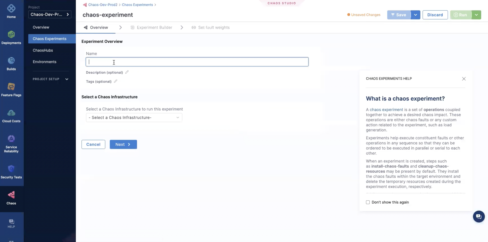
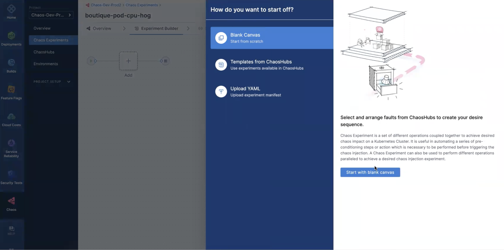

## Introduction

* The first step is to access your project in the **Chaos access center**.

* Now, create a new **Chaos Environment** in the project, and select **Environment Type** as **Production**.

* Click on **Enable Chaos** to setup **Chaos Infrastructure**.

* Create a new **Chaos Infrastructure** within the **Chaos Environment** you just created. Click **Continue**.

* Provide a name, description (optional), and tags(optional). Click **Next**.

* Select the **Installation mode**, and provide values for **Chaos Infrastructure Namespace**, and **Service account name**. Click **Next**.

* Download the YAML file, and copy the command to deploy the infrastructure in your **Chaos Environment**. Click **Done**.

* To create a new chaos experiment, on the left pane, select **Chaos Experiments**, and click on **New Experiment**.

* Specify the name, description(optional), tags(optional), and the **Chaos Infrastrcuture** where this **Chaos Experiment** would be executed. Click **Next**.

* The next step is to choose a **Chaos fault**. For this, select the **blank canvas**, and click on **Start with blank canvas** on the right pane.

* This leads you to the experiment builder where you need to add the next steps in the **chaos experiment**. Click the **+** symbol to specify the chaos fault. 

