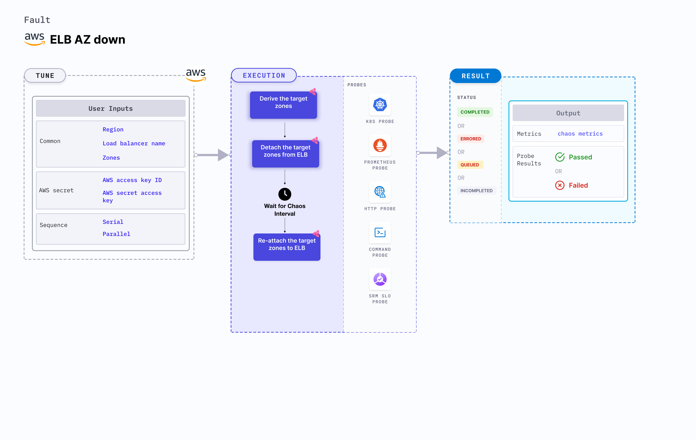

ALB AZ down takes down the AZ (Availability Zones) on a target application load balancer for a specific duration. This fault:
- Restricts access to certain availability zones for a specific duration.
- Tests the application sanity, availability, and recovery workflows of the application pod attached to the load balancer.



## Use cases

- ALB AZ down fault breaks the connectivity of an ALB with the given zones and impacts their delivery. 
- Detaching the AZ from the application load balancer disrupts the application's performance. 

:::note
- Kubernetes > 1.17 is required to execute this fault.
- Appropriate AWS access to attach or detach subnet from the target ALB.
- There needs to be a minimum of two AZs attached to the target ALB after injecting chaos; otherwise, the fault will fail to detach the given AZ.
- The ALB should be attached to the given availability zones.
- Kubernetes secret that has the AWS access configuration(key) in the `CHAOS_NAMESPACE`. Below is a sample secret file.
```yaml
apiVersion: v1
kind: Secret
metadata:
  name: cloud-secret
type: Opaque
stringData:
  cloud_config.yml: |-
    # Add the cloud AWS credentials respectively
    [default]
    aws_access_key_id = XXXXXXXXXXXXXXXXXXX
    aws_secret_access_key = XXXXXXXXXXXXXXX
```
- It is recommended to use the same secret name, that is, `cloud-secret`. Otherwise, you will need to update the `AWS_SHARED_CREDENTIALS_FILE` environment variable in the fault template with the new secret name and you may be unable to use the default health check probes. 
- Refer to [AWS named profile for chaos](./security/aws-switch-profile.md) to know how to use a different profile for AWS faults.
:::

Below is an example AWS policy to execute the fault.

```json
{
    "Version": "2012-10-17",
    "Statement": [
        {
            "Effect": "Allow",
            "Action": [
                "ec2:DescribeInstanceStatus",
                "ec2:DescribeInstances",
                "ec2:DescribeSubnets",
                "elasticloadbalancing:DetachLoadBalancerFromSubnets",
                "elasticloadbalancing:AttachLoadBalancerToSubnets",
                "elasticloadbalancing:DescribeLoadBalancers"
            ],
            "Resource": "*"
        }
    ]
}
```

Refer to the [superset permission or policy](./security/policy-for-all-aws-faults.md) to execute all AWS faults.

## Fault tunables

   <h3>Mandatory fields</h3>
    <table>
      <tr>
        <th> Variables </th>
        <th> Description </th>
        <th> Notes </th>
      </tr>
      <tr>
        <td> LOAD_BALANCER_ARN </td>
        <td> Target load balancer ARN whose AZ should be detached. </td>
        <td> For example, <code>arn:aws:elasticloadbalancing:us-east-2:100054111296:loadbalancer/app/test-alb/09121290906ffab7</code>. </td>
      </tr>
      <tr>
        <td> ZONES </td>
        <td> Target zones that should be detached from ALB. </td>
        <td> For example, <code>us-east-1a</code>. </td>
      </tr>
      <tr>
        <td> REGION </td>
        <td> Region name for the target volumes. </td>
        <td> For example, <code>us-east-1</code>. </td>
      </tr>
    </table>
    <h3>Optional fields</h3>
    <table>
      <tr>
        <th> Variables </th>
        <th> Description </th>
        <th> Notes </th>
      </tr>
      <tr>
        <td> TOTAL_CHAOS_DURATION </td>
        <td> Duration to insert chaos (in seconds). </td>
        <td> Defaults to 30s. For more information, go to <a href="https://developer.harness.io/docs/chaos-engineering/chaos-faults/common-tunables-for-all-faults#duration-of-the-chaos"> duration of the chaos.</a></td>
      </tr>
      <tr>
        <td> CHAOS_INTERVAL </td>
        <td> Duration between the attachment and detachment of the volumes (in seconds). </td>
        <td> Defaults to 30s. For more information, go to <a href="https://developer.harness.io/docs/chaos-engineering/chaos-faults/common-tunables-for-all-faults#chaos-interval"> chaos interval.</a></td>
      </tr>
      <tr>
        <td> SEQUENCE </td>
        <td> Sequence of chaos execution for multiple volumes. </td>
        <td> Default value is parallel. Supports serial and parallel. For more information, go to <a href="https://developer.harness.io/docs/chaos-engineering/chaos-faults/common-tunables-for-all-faults#sequence-of-chaos-execution"> sequence of chaos execution.</a></td>
      </tr>
      <tr>
        <td> RAMP_TIME </td>
        <td> Duration to wait before and after injecting chaos (in seconds). </td>
        <td> For example, 30s. For more information, go to <a href="https://developer.harness.io/docs/chaos-engineering/chaos-faults/common-tunables-for-all-faults#ramp-time"> ramp time.</a></td>
      </tr>
    </table>

### Target zones

It contains the comma-separated list of target zones. Tune it by using the `ZONES` environment variable.

Use the following example to tune the target zones:

[embedmd]:# (./static/manifests/alb-az-down/target-zones.yaml yaml)
```yaml
# contains alb az down for given zones
apiVersion: litmuschaos.io/v1alpha1
kind: ChaosEngine
metadata:
  name: engine-nginx
spec:
  engineState: "active"
  chaosServiceAccount: litmus-admin
  experiments:
  - name: alb-az-down
    spec:
      components:
        env:
        # load balancer arn for chaos
        - name: LOAD_BALANCER_ARN
          value: 'arn:aws:elasticloadbalancing:us-east-2:100054111296:loadbalancer/app/test-alb/09121290906ffab7'
        # target zones for the chaos
        - name: ZONES
          value: 'us-east-1a,us-east-1b'
        # region for chaos
        - name: REGION
          value: 'us-east-1'
```
