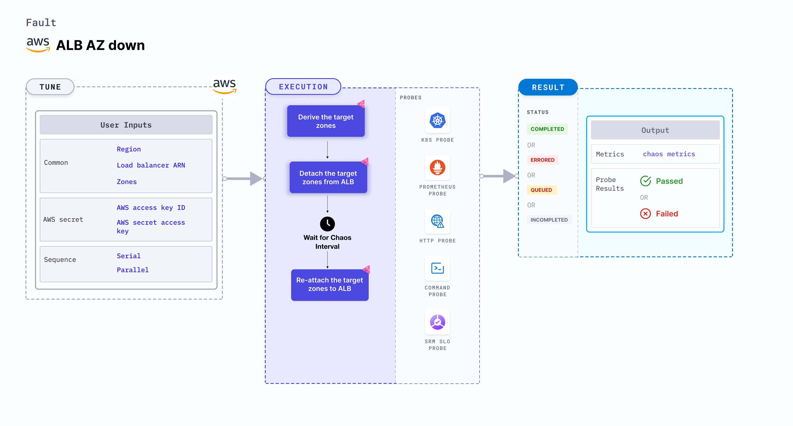

ALB AZ down takes down the AZ (availability zones) on a target application load balancer for a specific duration. 
- It restricts access to certain availability zones for a specific duration.
- It tests the application sanity, availability, and recovery workflows of the application pod attached to the load balancer.



## Uses

<details>
<summary>View the uses of the fault</summary>
<div>
This fault breaks the connectivity of an ALB with the given zones and impacts their delivery. Detaching the AZ from the application load balancer disrupts an application's performance. 
</div>
</details>

## Prerequisites

- Kubernetes > 1.17
- AWS access to attach or detach subnet from from target ALB.
- Minimum two AZs should be attached to the target ALB even after the chaos injection, else the fault will fail to detach the given AZ.
- Kubernetes secret that has the AWS access configuration(key) in the `CHAOS_NAMESPACE`. A sample secret file looks like:
```yaml
apiVersion: v1
kind: Secret
metadata:
  name: cloud-secret
type: Opaque
stringData:
  cloud_config.yml: |-
    # Add the cloud AWS credentials respectively
    [default]
    aws_access_key_id = XXXXXXXXXXXXXXXXXXX
    aws_secret_access_key = XXXXXXXXXXXXXXX
```
- It is recommended to use the same secret name, i.e. `cloud-secret`. Otherwise, you will need to update the `AWS_SHARED_CREDENTIALS_FILE` environment variable in the fault template and you may be unable to use the default health check probes. 

- Refer to [AWS Named Profile For Chaos](./security/aws-switch-profile.md) to know how to use a different profile for AWS faults.

## Permissions required

Here is an example AWS policy to execute the fault.

<details>
<summary>View policy for the fault</summary>

```json
{
    "Version": "2012-10-17",
    "Statement": [
        {
            "Effect": "Allow",
            "Action": [
                "ec2:DescribeInstanceStatus",
                "ec2:DescribeInstances",
                "ec2:DescribeSubnets",
                "elasticloadbalancing:DetachLoadBalancerFromSubnets",
                "elasticloadbalancing:AttachLoadBalancerToSubnets",
                "elasticloadbalancing:DescribeLoadBalancers"
            ],
            "Resource": "*"
        }
    ]
}
```
</details>

Refer to the [superset permission/policy](./security/policy-for-all-aws-faults.md) to execute all AWS faults.

## Default validations

The alb is attached to the given availability zones.

## Fault tunables

<details>
    <summary>Fault tunables</summary>
    <h2>Mandatory fields</h2>
    <table>
      <tr>
        <th> Variables </th>
        <th> Description </th>
        <th> Notes </th>
      </tr>
      <tr>
        <td> LOAD_BALANCER_ARN </td>
        <td> Provide the target load balancer ARN whose AZ has to be detached</td>
        <td> For example, <code>arn:aws:elasticloadbalancing:us-east-2:100054111296:loadbalancer/app/test-alb/09121290906ffab7</code> </td>
      </tr>
      <tr>
        <td> ZONES </td>
        <td> Provide the target zones that have to be detached from ALB</td>
        <td> For example, <code>us-east-1a</code> </td>
      </tr>
      <tr>
        <td> REGION </td>
        <td> The region name for the target volumes</td>
        <td> For example, <code>us-east-1</code> </td>
      </tr>
    </table>
    <h2>Optional fields</h2>
    <table>
      <tr>
        <th> Variables </th>
        <th> Description </th>
        <th> Notes </th>
      </tr>
      <tr>
        <td> TOTAL_CHAOS_DURATION </td>
        <td> The time duration for chaos insertion (in seconds) </td>
        <td> Defaults to 30s </td>
      </tr>
      <tr>
        <td> CHAOS_INTERVAL </td>
        <td> The time duration between the attachment and detachment of the volumes (sec) </td>
        <td> Defaults to 30s </td>
      </tr>
      <tr>
        <td> SEQUENCE </td>
        <td> It defines sequence of chaos execution for multiple volumes</td>
        <td> Default value: parallel. Supported: serial, parallel </td>
      </tr>
      <tr>
        <td> RAMP_TIME </td>
        <td> Period to wait before and after injection of chaos in sec </td>
        <td> For example, 30 </td>
      </tr>
    </table>
</details>

## Fault examples

### Common and AWS-specific tunables

Refer to the [common attributes](../common-tunables-for-all-faults) and [AWS-specific tunables](./aws-fault-tunables) to tune the common tunables for all faults and aws specific tunables.

### Target zones

It contains comma-separated list of target zones. You can tune it using the `ZONES` environment variable.

Use the following example to tune it:

[embedmd]:# (./static/manifests/alb-az-down/target-zones.yaml yaml)
```yaml
# contains alb az down for given zones
apiVersion: litmuschaos.io/v1alpha1
kind: ChaosEngine
metadata:
  name: engine-nginx
spec:
  engineState: "active"
  chaosServiceAccount: litmus-admin
  experiments:
  - name: alb-az-down
    spec:
      components:
        env:
        # load balancer arn for chaos
        - name: LOAD_BALANCER_ARN
          value: 'arn:aws:elasticloadbalancing:us-east-2:100054111296:loadbalancer/app/test-alb/09121290906ffab7'
        # target zones for the chaos
        - name: ZONES
          value: 'us-east-1a,us-east-1b'
        # region for chaos
        - name: REGION
          value: 'us-east-1'
```
