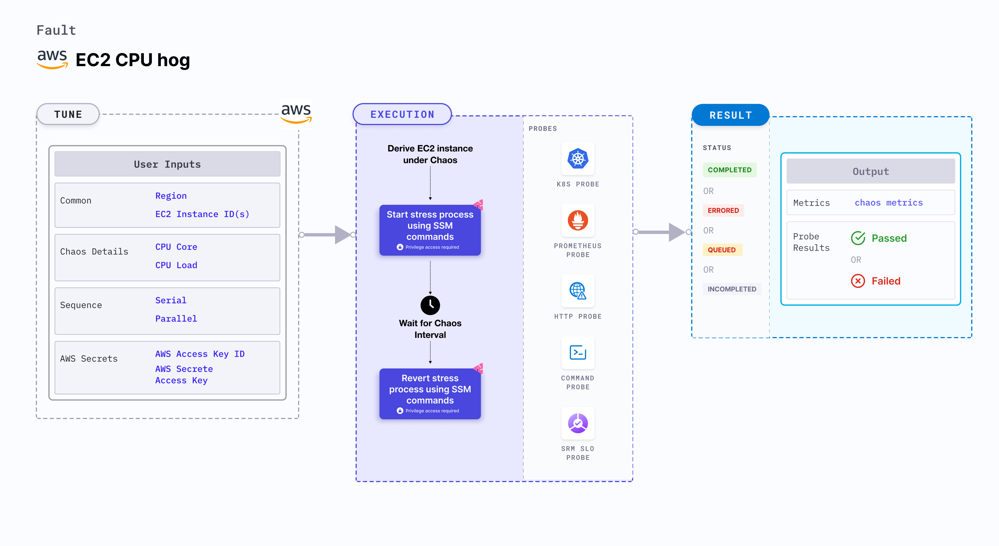

## Introduction

- EC2 CPU Hog contains chaos to disrupt the state of infra resources. The fault can induce stress chaos on AWS EC2 Instance using Amazon SSM Run Command, this is carried out by using SSM Docs which is in-built in the fault for the given chaos scenario.
- It causes CPU Hog chaos on EC2 Instance using an SSM doc for a certain chaos duration.

:::tip Fault execution flow chart

:::

## Uses

### Uses of the experiment

:::info

> The fault causes CPU hog/stress on the target AWS EC2 Instance(s). The idea of this fault is to simulate issues when there is lack of cpu for other runnning processes/applications resulting into degrading their performance.
> Injecting a rogue process into a target EC2 instance, we starve the main processes/applications (typically pid 1) of the resources allocated to it (where limits are defined) causing slowness in application traffic or in other cases unrestrained use can cause instance to exhaust resources leading to degradation in performance of processes/applications present on the instance. So this category of chaos fault helps to build the immunity on the application undergoing any such stress scenario.

:::

## Prerequisites

:::info

- Ensure that Kubernetes Version >= 1.17

**AWS EC2 Access Requirement:**

- Ensure that SSM agent is installed and running in the target EC2 instance.
- Ensure to create a Kubernetes secret having the AWS Access Key ID and Secret Access Key credentials in the `CHAOS_NAMESPACE`. A sample secret file looks like:

```yaml
apiVersion: v1
kind: Secret
metadata:
  name: cloud-secret
type: Opaque
stringData:
  cloud_config.yml: |-
    # Add the cloud AWS credentials respectively
    [default]
    aws_access_key_id = XXXXXXXXXXXXXXXXXXX
    aws_secret_access_key = XXXXXXXXXXXXXXXXXXXXXXXXXXXXXXXXXXXX
```

- If you change the secret name then please also update the `experiment.yml` ENV values for deriving the respective data from the secret. Also account for the path at which this secret is mounted as a file in the manifest ENV `AWS_SHARED_CREDENTIALS_FILE`.

:::

## Default Validations

:::info

- EC2 instance should be in healthy state.

:::

## Fault Tunables

<details>
    <summary>Check the Fault Tunables</summary>
    <h2>Mandatory Fields</h2>
    <table>
        <tr>
            <th> Variables </th>
            <th> Description </th>
            <th> Notes </th>
        </tr>
        <tr>
            <td> EC2_INSTANCE_ID </td>
            <td> ID of the target EC2 instance </td>
            <td> For example: <code>i-044d3cb4b03b8af1f</code> </td>
        </tr>
        <tr>
            <td> REGION </td>
            <td> The AWS region ID where the EC2 instance has been created </td>
            <td> For example: <code>us-east-1</code> </td>
        </tr>
    </table>
    <h2>Optional Fields</h2>
    <table>
        <tr>
            <th> Variables </th>
            <th> Description </th>
            <th> Notes </th>
        </tr>
        <tr>
            <td> TOTAL_CHAOS_DURATION </td>
            <td> The total time duration for chaos injection (sec) </td>
            <td> Defaults to 30s </td>
        </tr>
        <tr>
            <td> CHAOS_INTERVAL </td>
            <td> The interval (in sec) between successive chaos injection</td>
            <td> Defaults to 60s </td>
        </tr>
        <tr>
            <td> AWS_SHARED_CREDENTIALS_FILE </td>
            <td> Provide the path for aws secret credentials</td>
            <td> Defaults to <code>/tmp/cloud_config.yml</code> </td>
        </tr>
        <tr>
            <td> INSTALL_DEPENDENCIES </td>
            <td> Select to install dependencies used to run the CPU chaos. It can be either True or False</td>
            <td> Defaults to True </td>
        </tr>
        <tr>
            <td> CPU_CORE </td>
            <td> Provide the number of CPU cores to consume</td>
            <td> Defaults to 0 </td>
        </tr>
        <tr>
            <td> CPU_LOAD </td>
            <td> Provide the percentage of a single CPU core to be consumed</td>
            <td> Defaults to 100 </td>
        </tr>
        <tr>
            <td> SEQUENCE </td>
            <td> It defines sequence of chaos execution for multiple instance</td>
            <td> Default value: parallel. Supported: serial, parallel </td>
        </tr>
        <tr>
            <td> RAMP_TIME </td>
            <td> Period to wait before and after injection of chaos in sec </td>
            <td> Eg: 30 </td>
        </tr>
    </table>
</details>

## Fault Examples

### Common Fault Tunables

Refer the [common attributes](../common-tunables-for-all-faults) to tune the common tunables for all the faults.

### CPU CORE

It defines the CPU core value to be utilised on the EC2 instance. It can be tuned via `CPU_CORE` ENV.

Use the following example to tune this:

[embedmd]:# (./static/manifests/ec2-cpu-hog/cpu-core.yaml yaml)
```yaml
# CPU cores to utilize
apiVersion: litmuschaos.io/v1alpha1
kind: ChaosEngine
metadata:
  name: engine-nginx
spec:
  engineState: "active"
  chaosServiceAccount: litmus-admin
  experiments:
  - name: ec2-cpu-hog
    spec:
      components:
        env:
        - name: CPU_CORE
          VALUE: '2'
        # ID of the EC2 instance
        - name: EC2_INSTANCE_ID
          value: 'instance-1'
        # region for the EC2 instance
        - name: REGION
          value: 'us-east-1'
```

### CPU PERCENTAGE

It defines the CPU percentage value to be utilised on the EC2 instance. It can be tuned via `CPU_LOAD` ENV.

Use the following example to tune this:

[embedmd]:# (./static/manifests/ec2-cpu-hog/cpu-percentage.yaml yaml)
```yaml
# CPU percentage to utilize
apiVersion: litmuschaos.io/v1alpha1
kind: ChaosEngine
metadata:
  name: engine-nginx
spec:
  engineState: "active"
  chaosServiceAccount: litmus-admin
  experiments:
  - name: ec2-cpu-hog
    spec:
      components:
        env:
        - name: CPU_LOAD
          VALUE: '50'
        # ID of the EC2 instance
        - name: EC2_INSTANCE_ID
          value: 'instance-1'
        # region for the EC2 instance
        - name: REGION
          value: 'us-east-1'
```

### MULTIPLE EC2 INSTANCES

Multiple EC2 instances can be targeted in one chaos run. It can be tuned via `EC2_INSTANCE_ID` ENV.

Use the following example to tune this:

[embedmd]:# (./static/manifests/ec2-cpu-hog/multiple-instances.yaml yaml)
```yaml
# mutilple instance targets
apiVersion: litmuschaos.io/v1alpha1
kind: ChaosEngine
metadata:
  name: engine-nginx
spec:
  engineState: "active"
  chaosServiceAccount: litmus-admin
  experiments:
  - name: ec2-cpu-hog
    spec:
      components:
        env:
        # ids of the EC2 instances
        - name: EC2_INSTANCE_ID
          value: 'instance-1,instance-2,instance-3'
        # region for the EC2 instance
        - name: REGION
          value: 'us-east-1'
```

### CPU CORE WITH PERCENTAGE CONSUMPTION

It defines how many CPU cores to utilise with percentage of utilisation on the EC2 instance. It can be tuned via `CPU_CORE` and `CPU_LOAD` ENV.

Use the following example to tune this:

[embedmd]:# (./static/manifests/ec2-cpu-hog/cpu-core-with-percentage.yaml yaml)
```yaml
# CPU core with percentage to utilize
apiVersion: litmuschaos.io/v1alpha1
kind: ChaosEngine
metadata:
  name: engine-nginx
spec:
  engineState: "active"
  chaosServiceAccount: litmus-admin
  experiments:
  - name: ec2-cpu-hog
    spec:
      components:
        env:
        - name: CPU_CORE
          VALUE: '2'
        - name: CPU_LOAD
          VALUE: '50'
        # ID of the EC2 instance
        - name: EC2_INSTANCE_ID
          value: 'instance-1'
        # region for the EC2 instance
        - name: REGION
          value: 'us-east-1'
```
