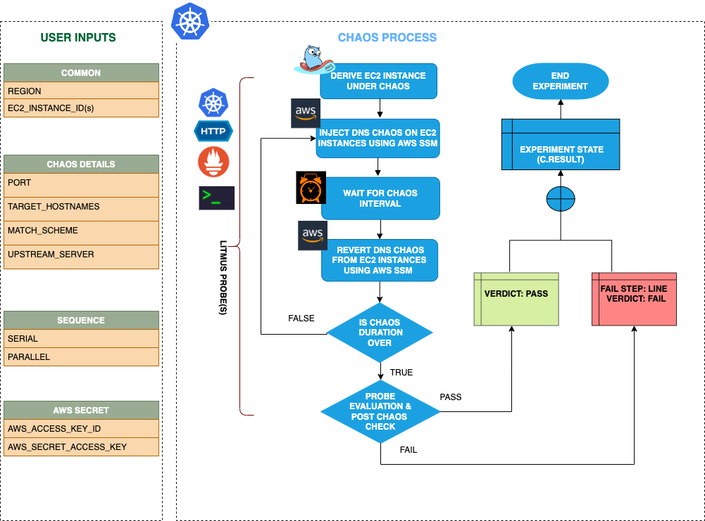

## Introduction
- It causes DNS errors in the provided EC2 instance for a specified chaos duration. 
- It helps to check the performance of the application/process running on the EC2 instance(s).

:::tip Fault execution flow chart

:::

## Uses
<details>
<summary>View the uses of the fault</summary>
<div>
The fault causes DNS errors on the target EC2 instances which can result in unavailability/distorted network connectivity from the VM to the target hosts. This will also help to produce a hypothesis where some services of an application are unreachable from the EC2 instance. This will help the user to think the mitigation steps that should be taken to overcome such situation. This fault can also be used to know how the DNS error can impact your infra and standalone tasks as well.
</div>
</details>

## Prerequisites
:::info
- Ensure that Kubernetes Version > 1.16

**AWS EC2 Access Requirement:**

- Ensure that SSM agent is installed and running in the target EC2 instance.
- Ensure to create a Kubernetes secret having the AWS Access Key ID and Secret Access Key credentials in the `CHAOS_NAMESPACE`. A sample secret file looks like:

```yaml
apiVersion: v1
kind: Secret
metadata:
  name: cloud-secret
type: Opaque
stringData:
  cloud_config.yml: |-
    # Add the cloud AWS credentials respectively
    [default]
    aws_access_key_id = XXXXXXXXXXXXXXXXXXX
    aws_secret_access_key = XXXXXXXXXXXXXXXXXXXXXXXXXXXXXXXXXXXX
```

- If you change the secret name then please also update the `experiment.yml` ENV values for deriving the respective data from the secret. Also account for the path at which this secret is mounted as a file in the manifest ENV `AWS_SHARED_CREDENTIALS_FILE`.

### NOTE
You can pass the VM credentials as secrets or as an ChaosEngine ENV variable.
:::


## Default Validations
:::info
- EC2 instance should be in healthy state.
:::

## Fault Tunables
<details>
    <summary>Check the Fault Tunables</summary>
    <h2>Mandatory Fields</h2>
    <table>
      <tr>
        <th> Variables </th>
        <th> Description </th>
        <th> Notes </th>
      </tr>
      <tr>
        <td> EC2_INSTANCE_ID </td>
        <td> ID of the target EC2 instance </td>
        <td> For example: <code>i-044d3cb4b03b8af1f</code> </td>
      </tr>
      <tr>
        <td> REGION </td>
        <td> The AWS region ID where the EC2 instance has been created </td>
        <td> For example: <code>us-east-1</code> </td>
      </tr>
      <tr>
        <td> PORT </td>
        <td> Provide the DNS Port</td>
        <td> Default value is 54 </td>
      </tr>
    </table>
    <h2>Optional Fields</h2>
    <table>
      <tr>
        <th> Variables </th>
        <th> Description </th>
        <th> Notes </th>
      </tr>
      <tr>
        <td> TOTAL_CHAOS_DURATION </td>
        <td> The total time duration for chaos insertion (sec) </td>
        <td> Defaults to 30s </td>
      </tr>
      <tr>
        <td> CHAOS_INTERVAL </td>
        <td> The interval (in sec) between successive instance termination </td>
        <td> Defaults to 30s </td>
      </tr>
      <tr>
        <td> SEQUENCE </td>
        <td> It defines sequence of chaos execution for multiple instance </td>
        <td> Default value: parallel. Supported: serial, parallel </td>
      </tr>
      <tr>
        <td> RAMP_TIME </td>
        <td> Period to wait before and after injection of chaos in sec </td>
        <td> Eg. 30 </td>
      </tr>
      <tr>
        <td> INSTALL_DEPENDENCY </td>
        <td> Select to install dependencies used to run the network chaos. It can be either True or False </td>
        <td> If the dependency already exists, you can turn it off. Defaults to True.</td>
      </tr>
      <tr>
        <td> TARGET_HOSTNAMES </td>
        <td> List of the target hostnames or keywords eg. '["litmuschaos","chaosnative.com"]' </td>
        <td> If not provided, all hostnames/domains will be targeted</td>
      </tr>
      <tr>
        <td> MATCH_SCHEME </td>
        <td> Determines whether the dns query has to match exactly with one of the targets or can have any of the targets as substring. Can be either exact or substring </td>
        <td> if not provided, it will be set as exact</td>
      </tr>
      <tr>
        <td> UPSTREAM_SERVER </td>
        <td> Custom upstream server to which intercepted dns requests will be forwarded </td>
        <td> defaults to the server mentioned in resolv.conf </td>
      </tr>
    </table>
</details>

## Fault Examples

### Common Fault Tunables
Refer the [common attributes](../common-tunables-for-all-faults) to tune the common tunables for all the faults.

### Run DNS Chaos With Port

It contains the DNS port to inject the DNS chaos. The value can be provided using `PORT` Env.

Use the following example to tune this:

[embedmd]:# (./static/manifests/ec2-dns-chaos/ec2-dns-port.yaml yaml)
```yaml
# induces dns chaos on the EC2 Instances
apiVersion: litmuschaos.io/v1alpha1
kind: ChaosEngine
metadata:
  name: engine-nginx
spec:
  engineState: "active"
  chaosServiceAccount: litmus-admin
  experiments:
  - name: ec2-dns-chaos
    spec:
      components:
        env:
        # target port
        - name: PORT
          value: '54'
        - name: EC2_INSTANCE_ID
          value: 'instance-1'
        - name: REGION
          value: 'us-west-2'
```

### Run DNS Chaos With Target HostNames

It contains the list of the target host name to inject the DNS chaos. The value can be provided using `TARGET_HOSTNAMES` Env.

Use the following example to tune this:

[embedmd]:# (./static/manifests/ec2-dns-chaos/ec2-dns-target-hostnames.yaml yaml)
```yaml
# induces dns chaos on the EC2 Instances
apiVersion: litmuschaos.io/v1alpha1
kind: ChaosEngine
metadata:
  name: engine-nginx
spec:
  engineState: "active"
  chaosServiceAccount: litmus-admin
  experiments:
  - name: ec2-dns-chaos
    spec:
      components:
        env:
        # list of target host names
        - name: TARGET_HOSTNAMES
          value: '["litmuschaos","chaosnative.com"]'
        - name: EC2_INSTANCE_ID
          value: 'instance-1'
        - name: REGION
          value: 'us-west-2'
```


### Run DNS Chaos With Match scheme

It determines whether the dns query has to match exactly with one of the targets or can have any of the targets as substring. It can be either exact or substring. The value can be provided using `MATCH_SCHEME` Env.

Use the following example to tune this:

[embedmd]:# (./static/manifests/ec2-dns-chaos/ec2-dns-match-scheme.yaml yaml)
```yaml
# induces dns chaos on the EC2 Instances
apiVersion: litmuschaos.io/v1alpha1
kind: ChaosEngine
metadata:
  name: engine-nginx
spec:
  engineState: "active"
  chaosServiceAccount: litmus-admin
  experiments:
  - name: ec2-dns-chaos
    spec:
      components:
        env:
        # match scheme type
        - name: MATCH_SCHEME
          value: 'exact'
        - name: EC2_INSTANCE_ID
          value: 'instance-1'
        - name: REGION
          value: 'us-west-2'
```


### Run DNS Chaos With Upstream server

It contains the custom upstream server to which intercepted dns requests will be forwarded. It is defaults to the server mentioned in resolv.conf. The value can be provided using `UPSTREAM_SERVER` Env.

Use the following example to tune this:

[embedmd]:# (./static/manifests/ec2-dns-chaos/ec2-dns-upstream-server.yaml yaml)
```yaml
# induces dns chaos on the EC2 Instances
apiVersion: litmuschaos.io/v1alpha1
kind: ChaosEngine
metadata:
  name: engine-nginx
spec:
  engineState: "active"
  chaosServiceAccount: litmus-admin
  experiments:
  - name: ec2-dns-chaos
    spec:
      components:
        env:
        # name of the upstream server
        - name: UPSTREAM_SERVER
          value: '8.8.8.8'
        - name: EC2_INSTANCE_ID
          value: 'instance-1'
        - name: REGION
          value: 'us-west-2'
```
