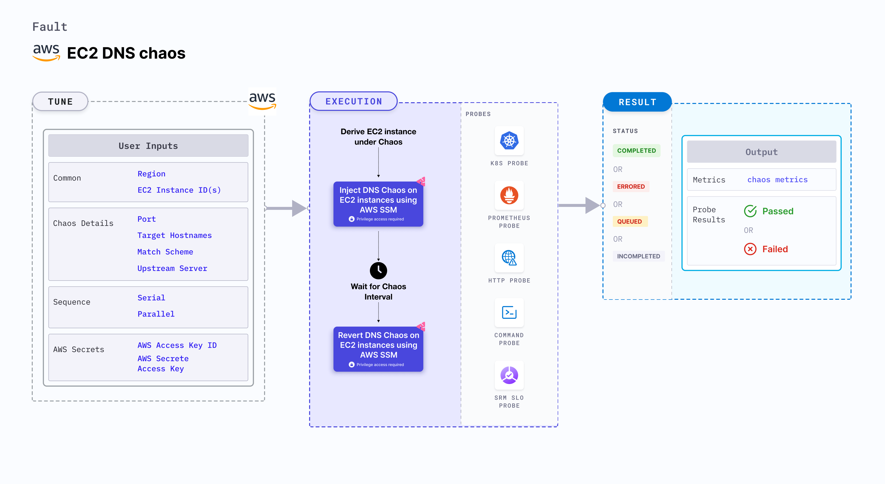

EC2 DNS chaos causes DNS errors such as unavailability or malfunctioning of DNS servers on the specified EC2 instance for a specific duration. 
- It determines the performance of the application (or process) running on the EC2 instance(s).



## Usage
<details>
<summary>View fault usage</summary>
<div>
This fault results in DNS errors on the target EC2 instances. This results in unavailability (or distorted) network connectivity from the VM to the target hosts. This fault determines the impact of DNS chaos on the infrastructure and standalone tasks. It simulates unavailability of DNS server (loss of access to any external domain from a given microservice) and malfunctioning of DNS server (loss of access to specific domains from a given microservice, access to cloud provider dependencies, and access to specific third party services).

</div>
</details>

## Prerequisites
- Kubernetes > 1.16
- SSM agent is installed and running on the target EC2 instance.
- Create a Kubernetes secret that has the AWS Access Key ID and Secret Access Key credentials in the `CHAOS_NAMESPACE`. Below is the sample secret file:

```yaml
apiVersion: v1
kind: Secret
metadata:
  name: cloud-secret
type: Opaque
stringData:
  cloud_config.yml: |-
    # Add the cloud AWS credentials respectively
    [default]
    aws_access_key_id = XXXXXXXXXXXXXXXXXXX
    aws_secret_access_key = XXXXXXXXXXXXXXXXXXXXXXXXXXXXXXXXXXXX
```

- It is recommended to use the same secret name that is `cloud-secret` or else you need to update the `AWS_SHARED_CREDENTIALS_FILE` env in the fault template and you may not be able to use the default healthcheck probes. 

- Refer to [AWS Named Profile For Chaos](./security/aws-switch-profile.md) to know how to use a different profile for AWS faults.

### Note
You can pass the VM credentials as secrets or as a `ChaosEngine` environment variable.

## Permissions required

Here is an example AWS policy to execute the fault.

<details>
<summary>View policy for the fault</summary>

```json
{
    "Version": "2012-10-17",
    "Statement": [
        {
            "Effect": "Allow",
            "Action": [
                "ssm:GetDocument",
                "ssm:DescribeDocument",
                "ssm:GetParameter",
                "ssm:GetParameters",
                "ssm:SendCommand",
                "ssm:CancelCommand",
                "ssm:CreateDocument",
                "ssm:DeleteDocument",
                "ssm:GetCommandInvocation",          
                "ssm:UpdateInstanceInformation",
                "ssm:DescribeInstanceInformation"
            ],
            "Resource": "*"
        },
        {
            "Effect": "Allow",
            "Action": [
                "ec2messages:AcknowledgeMessage",
                "ec2messages:DeleteMessage",
                "ec2messages:FailMessage",
                "ec2messages:GetEndpoint",
                "ec2messages:GetMessages",
                "ec2messages:SendReply"
            ],
            "Resource": "*"
        },
        {
            "Effect": "Allow",
            "Action": [
                "ec2:DescribeInstanceStatus",
                "ec2:DescribeInstances"
            ],
            "Resource": [
                "*"
            ]
        }
    ]
}
```
</details>

Refer to the [superset permission/policy](./security/policy-for-all-aws-faults.md) to execute all AWS faults.

## Default validations
The EC2 instance should be in a healthy state.

## Fault tunables
<details>
    <summary>Fault tunables</summary>
    <h2>Mandatory fields</h2>
    <table>
      <tr>
        <th> Variables </th>
        <th> Description </th>
        <th> Notes </th>
      </tr>
      <tr>
        <td> EC2_INSTANCE_ID </td>
        <td> ID of the target EC2 instance. </td>
        <td> For example, <code>i-044d3cb4b03b8af1f</code>. </td>
      </tr>
      <tr>
        <td> REGION </td>
        <td> AWS region ID where the EC2 instance has been created. </td>
        <td> For example: <code>us-east-1</code>. </td>
      </tr>
      <tr>
        <td> PORT </td>
        <td> DNS port where chaos is injected. </td>
        <td> Defaults to port 54. </td>
      </tr>
    </table>
    <h2>Optional fields</h2>
    <table>
      <tr>
        <th> Variables </th>
        <th> Description </th>
        <th> Notes </th>
      </tr>
      <tr>
        <td> TOTAL_CHAOS_DURATION </td>
        <td> Duration that you specify, through which chaos is injected into the target resource (in seconds).</td>
        <td> Defaults to 30s. </td>
      </tr>
      <tr>
        <td> CHAOS_INTERVAL </td>
        <td> Time interval between two successive instance terminations (in seconds). </td>
        <td> Defaults to 30s. </td>
      </tr>
      <tr>
        <td> SEQUENCE </td>
        <td> It defines sequence of chaos execution for multiple instance </td>
        <td> Defaults to parallel. Supports serial sequence as well. </td>
      </tr>
      <tr>
        <td> RAMP_TIME </td>
        <td> Period to wait before and after injection of chaos in sec </td>
        <td> For example, 30s </td>
      </tr>
      <tr>
        <td> INSTALL_DEPENDENCY </td>
        <td> Select to install dependencies used to run the network chaos. It can be either True or False </td>
        <td> If the dependency already exists, you can turn it off. Defaults to True.</td>
      </tr>
      <tr>
        <td> TARGET_HOSTNAMES </td>
        <td> List of the target host names. If this is not provided, all the host names (or domains) will be targeted. </td>
        <td> For example, <code>'["litmuschaos","chaosnative.com"]'</code>.</td>
      </tr>
      <tr>
        <td> MATCH_SCHEME </td>
        <td> Determines whether the DNS query should exactly match the targets or can be a substring. </td>
        <td> Defaults to exact.</td>
      </tr>
      <tr>
        <td> UPSTREAM_SERVER </td>
        <td> Custom upstream server to which the intercepted DNS requests are forwarded. </td>
        <td> defaults to the server mentioned in the resolv.conf file. </td>
      </tr>
    </table>
</details>

## Fault examples

### Fault tunables
Refer to the [common attributes](../common-tunables-for-all-faults) to tune the common tunables for all the faults.

### Run DNS chaos with port

It contains the DNS port to inject DNS chaos. You can tune it using the `PORT` environment variable.

Use the following example to tune it:

[embedmd]:# (./static/manifests/ec2-dns-chaos/ec2-dns-port.yaml yaml)
```yaml
# induces dns chaos on the EC2 Instances
apiVersion: litmuschaos.io/v1alpha1
kind: ChaosEngine
metadata:
  name: engine-nginx
spec:
  engineState: "active"
  chaosServiceAccount: litmus-admin
  experiments:
  - name: ec2-dns-chaos
    spec:
      components:
        env:
        # target port
        - name: PORT
          value: '54'
        - name: EC2_INSTANCE_ID
          value: 'instance-1'
        - name: REGION
          value: 'us-west-2'
```

### Run DNS chaos with target host names

It contains the list of the target host names to inject DNS chaos. You can tune it using the `TARGET_HOSTNAMES` environment variable.

Use the following example to tune it:

[embedmd]:# (./static/manifests/ec2-dns-chaos/ec2-dns-target-hostnames.yaml yaml)
```yaml
# induces dns chaos on the EC2 Instances
apiVersion: litmuschaos.io/v1alpha1
kind: ChaosEngine
metadata:
  name: engine-nginx
spec:
  engineState: "active"
  chaosServiceAccount: litmus-admin
  experiments:
  - name: ec2-dns-chaos
    spec:
      components:
        env:
        # list of target host names
        - name: TARGET_HOSTNAMES
          value: '["litmuschaos","chaosnative.com"]'
        - name: EC2_INSTANCE_ID
          value: 'instance-1'
        - name: REGION
          value: 'us-west-2'
```


### Run DNS chaos with match scheme

It determines whether the DNS query exactly matches the target or is a substring. You can tune it using the `MATCH_SCHEME` environment variable.

Use the following example to tune it:

[embedmd]:# (./static/manifests/ec2-dns-chaos/ec2-dns-match-scheme.yaml yaml)
```yaml
# induces dns chaos on the EC2 Instances
apiVersion: litmuschaos.io/v1alpha1
kind: ChaosEngine
metadata:
  name: engine-nginx
spec:
  engineState: "active"
  chaosServiceAccount: litmus-admin
  experiments:
  - name: ec2-dns-chaos
    spec:
      components:
        env:
        # match scheme type
        - name: MATCH_SCHEME
          value: 'exact'
        - name: EC2_INSTANCE_ID
          value: 'instance-1'
        - name: REGION
          value: 'us-west-2'
```


### Run DNS chaos with upstream server

It contains the custom upstream server to which intercepted DNS requests are forwarded. It defaults to the server mentioned in the resolv.conf file. You can tune it using the `UPSTREAM_SERVER` environment variable.

Use the following example to tune it:

[embedmd]:# (./static/manifests/ec2-dns-chaos/ec2-dns-upstream-server.yaml yaml)
```yaml
# induces dns chaos on the EC2 Instances
apiVersion: litmuschaos.io/v1alpha1
kind: ChaosEngine
metadata:
  name: engine-nginx
spec:
  engineState: "active"
  chaosServiceAccount: litmus-admin
  experiments:
  - name: ec2-dns-chaos
    spec:
      components:
        env:
        # name of the upstream server
        - name: UPSTREAM_SERVER
          value: '8.8.8.8'
        - name: EC2_INSTANCE_ID
          value: 'instance-1'
        - name: REGION
          value: 'us-west-2'
```