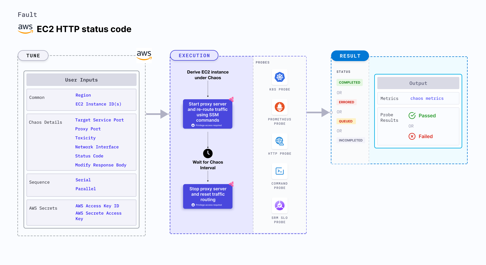

EC2 HTTP status code injects HTTP chaos that affects the request (or response) by modifying the status code (or the body or the headers) by starting a proxy server and redirecting the traffic through the proxy server.
- It tests the application's resilience to erroneous code HTTP responses from the application server.



## Usage
<details>
<summary>View fault usage</summary>
<div>
This fault results in DNS errors on the target EC2 instances. This results in unavailability (or distorted) network connectivity from the VM to the target hosts. This fault determines the impact of DNS chaos on the infrastructure and standalone tasks.
</div>
</details>


## Prerequisites
- Kubernetes >= 1.17
- SSM agent is installed and running in the target EC2 instance.
- Kubernetes secret with AWS Access Key ID and Secret Access Key credentials in the `CHAOS_NAMESPACE`. Below is the sample secret file:

```yaml
apiVersion: v1
kind: Secret
metadata:
  name: cloud-secret
type: Opaque
stringData:
  cloud_config.yml: |-
    # Add the cloud AWS credentials respectively
    [default]
    aws_access_key_id = XXXXXXXXXXXXXXXXXXX
    aws_secret_access_key = XXXXXXXXXXXXXXXXXXXXXXXXXXXXXXXXXXXX
```

- If you change the secret key name (from `cloud_config.yml`) ensure that you update the  `AWS_SHARED_CREDENTIALS_FILE` environment variable in the ChaosExperiment CR with the new name.

### Note

You can pass the VM credentials as secrets or as a `ChaosEngine` environment variable.

## Default validations

- The EC2 instance should be in a healthy state.


## Fault tunables

<details>
    <summary>Fault tunables</summary>
    <h2>Mandatory fields</h2>
    <table>
        <tr>
            <th> Variables </th>
            <th> Description </th>
            <th> Notes </th>
        </tr>
        <tr>
          <td> EC2_INSTANCE_ID </td>
          <td> ID of the target EC2 instance. </td>
          <td> For example, <code>i-044d3cb4b03b8af1f</code>. </td>
        </tr>
        <tr>
          <td> REGION </td>
          <td> The AWS region ID where the EC2 instance has been created. </td>
          <td> For example, <code>us-east-1</code>. </td>
        </tr>
        <tr>
            <td> TARGET_SERVICE_PORT </td>
            <td> Port of the service to target. </td>
            <td> Defaults to port 80. </td>
        </tr>
        <tr>
            <td> STATUS_CODE </td>
            <td> Modified status code for the HTTP response.</td>
            <td> If no value is provided, then a random value is selected from the list of supported values.
            Multiple values can be provided as comma separated, a random value from the provided list will be selected
            Supported values: [200, 201, 202, 204, 300, 301, 302, 304, 307, 400, 401, 403, 404, 500, 501, 502, 503, 504].
            Defaults to random status code. </td>
        </tr>
        <tr>
            <td> MODIFY_RESPONSE_BODY </td>
            <td> Whether to modify the body as per the status code provided.</td>
            <td> If true, then the body is replaced by a default template for the status code. Defaults to true. </td>
        </tr>
    </table>
    <h2>Optional fields</h2>
    <table>
        <tr>
            <th> Variables </th>
            <th> Description </th>
            <th> Notes </th>
        </tr>
        <tr>
            <td> TOTAL_CHAOS_DURATION </td>
            <td> Duration that you specify, through which chaos is injected into the target resource (in seconds). </td>
            <td> Defaults to 30s. </td>
        </tr>
        <tr>
            <td> CHAOS_INTERVAL </td>
            <td> Time interval between two successive instance terminations (in seconds). </td>
            <td> Defaults to 30s. </td>
        </tr>
        <tr>
            <td> AWS_SHARED_CREDENTIALS_FILE </td>
            <td> Provide the path for aws secret credentials.</td>
            <td> Defaults to <code>/tmp/cloud_config.yml</code>. </td>
        </tr>
        <tr>
            <td> SEQUENCE </td>
            <td> It defines the sequence of chaos execution for multiple instances. </td>
            <td> Defaults to parallel. Supports serial sequence as well. </td>
        </tr>
        <tr>
            <td> RAMP_TIME </td>
            <td> Period to wait before and after injection of chaos (in seconds). </td>
            <td> For example, 30s. </td>
        </tr>
        <tr>
            <td> INSTALL_DEPENDENCY </td>
            <td> Select to install dependencies used to run the network chaos. It can be either True or False. </td>
            <td> If the dependency already exists, you can turn it off. Defaults to True.</td>
        </tr>
        <tr>
            <td> PROXY_PORT </td>
            <td> Port where the proxy will be listening for requests.</td>
            <td> Defaults to 20000. </td>
        </tr>
        <tr>
            <td> TOXICITY </td>
            <td> Percentage of HTTP requests to be affected. </td>
            <td> Defaults to 100. </td>
        </tr>
        <tr>
          <td> NETWORK_INTERFACE </td>
          <td> Network interface to be used for the proxy.</td>
          <td> Defaults to `eth0`. </td>
        </tr>
    </table>
</details>

## Fault examples

### Fault tunables

Refer to the [common attributes](../common-tunables-for-all-faults) to tune the common tunables for all the faults.

### Target service port

It is the target service's port being targeted. You can tune it using the `TARGET_SERVICE_PORT` environment variable.

You can tune it using the following example:

[embedmd]:# (./static/manifests/http-status-code/target-service-port.yaml yaml)
```yaml
## provide the port of the targeted service
apiVersion: litmuschaos.io/v1alpha1
kind: ChaosEngine
metadata:
  name: engine-nginx
spec:
  engineState: "active"
  chaosServiceAccount: litmus-admin
  experiments:
  - name: ec2-http-status-code
    spec:
      components:
        env:
        # provide the port of the targeted service
        - name: TARGET_SERVICE_PORT
          value: "80"
```

### Modifying the response status code

You can modify the status code of the response using the following example.

***Note***: `HTTP_CHAOS_TYPE` should be provided as `status_code`

[embedmd]:# (./static/manifests/http-status-code/status-code.yaml yaml)
```yaml
## provide the headers as a map
apiVersion: litmuschaos.io/v1alpha1
kind: ChaosEngine
metadata:
  name: engine-nginx
spec:
  engineState: "active"
  chaosServiceAccount: litmus-admin
  experiments:
  - name: ec2-http-status-code
    spec:
      components:
        env:
        # modified status code for the http response
        # if no value is provided, a random status code from the supported code list will selected
        # if multiple comma separated values are provided, then a random value
        # from the provided list will be selected
        # if an invalid status code is provided, the fault will fail
        # supported status code list:
        # [200, 201, 202, 204, 300, 301, 302, 304, 307, 400, 401, 403, 404, 500, 501, 502, 503, 504]
        - name: STATUS_CODE
          value: '500'
        # whether to modify the body as per the status code provided
        - name: "MODIFY_RESPONSE_BODY"
          value: "true"
        # provide the port of the targeted service
        - name: TARGET_SERVICE_PORT
          value: "80"
```

### Proxy port

It is the port where the proxy server listens for requests. You can tune it using the `PROXY_PORT` environment variable.

You can tune it using the following example:

[embedmd]:# (./static/manifests/http-status-code/proxy-port.yaml yaml)
```yaml
# provide the port for proxy server
apiVersion: litmuschaos.io/v1alpha1
kind: ChaosEngine
metadata:
  name: engine-nginx
spec:
  engineState: "active"
  chaosServiceAccount: litmus-admin
  experiments:
  - name: ec2-http-status-code
    spec:
      components:
        env:
        # provide the port for proxy server
        - name: PROXY_PORT
          value: '8080'
        # provide the port of the targeted service
        - name: TARGET_SERVICE_PORT
          value: "80"
```

### Toxicity

It defines the toxicity value to be added to the http request. You can tune it using the `TOXICITY` environment variable.
Toxicity value defines the percentage of the total number of http requests that are affected.

You can tune it using the following example:

[embedmd]:# (./static/manifests/http-status-code/toxicity.yaml yaml)
```yaml
## provide the toxicity
apiVersion: litmuschaos.io/v1alpha1
kind: ChaosEngine
metadata:
  name: engine-nginx
spec:
  engineState: "active"
  chaosServiceAccount: litmus-admin
  experiments:
  - name: ec2-http-status-code
    spec:
      components:
        env:
        # toxicity is the probability of the request to be affected
        # provide the percentage value in the range of 0-100
        # 0 means no request will be affected and 100 means all request will be affected
        - name: TOXICITY
          value: "100"
        # provide the port of the targeted service
        - name: TARGET_SERVICE_PORT
          value: "80"
```

### Network interface

It defines the network interface used for the proxy. You can tune it using the `NETWORK_INTERFACE` environment variable.

You can tune it using the following example:

[embedmd]:# (./static/manifests/http-status-code/network-interface.yaml yaml)
```yaml
## provide the network interface for proxy
apiVersion: litmuschaos.io/v1alpha1
kind: ChaosEngine
metadata:
  name: engine-nginx
spec:
  engineState: "active"
  chaosServiceAccount: litmus-admin
  experiments:
  - name: ec2-http-status-code
    spec:
      components:
        env:
        # provide the network interface for proxy
        - name: NETWORK_INTERFACE
          value: "eth0"
        # provide the port of the targeted service
        - name: TARGET_SERVICE_PORT
          value: '80'
```


