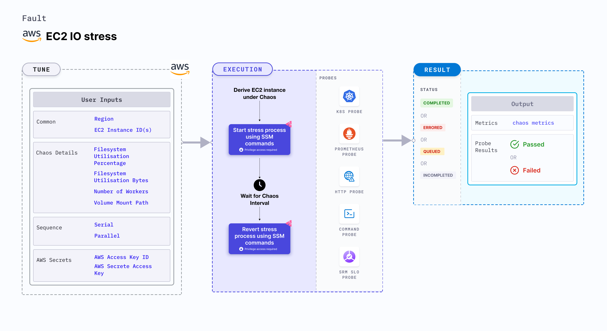

## Introduction

- EC2 IO Stress contains chaos to disrupt the state of infra resources. The fault can induce a stress chaos on AWS EC2 Instance using Amazon SSM Run Command, this is carried out by using SSM Docs which is in-built in the fault for the give chaos scenario.
- It causes IO Stress chaos on EC2 Instance using an SSM doc for a certain chaos duration.

:::tip Fault execution flow chart

:::

## Uses

### Uses of the fault

:::info

- Filesystem read and write is another very common and frequent scenario we find with processes/applications that can result in the impact on its delivery. These problems are generally referred to as "Noisy Neighbour" problems.
- Injecting a rogue process into a target EC2 instance, we starve the main processes/applications (typically pid 1) of the resources allocated to it (where limits are defined) causing slowness in application traffic or in other cases unrestrained use can cause instance to exhaust resources leading to degradation in performance of processes/applications present on the instance. So this category of chaos fault helps to build the immunity on the application undergoing any such stress scenario.

:::

## Prerequisites

:::info

### Verify the prerequisites

- Ensure that Kubernetes Version >= 1.17

**AWS EC2 Access Requirement:**

- Ensure that SSM agent is installed and running in the target EC2 instance.
- Ensure to create a Kubernetes secret having the AWS Access Key ID and Secret Access Key credentials in the `CHAOS_NAMESPACE`. A sample secret file looks like:

```yaml
apiVersion: v1
kind: Secret
metadata:
  name: cloud-secret
type: Opaque
stringData:
  cloud_config.yml: |-
    # Add the cloud AWS credentials respectively
    [default]
    aws_access_key_id = XXXXXXXXXXXXXXXXXXX
    aws_secret_access_key = XXXXXXXXXXXXXXXXXXXXXXXXXXXXXXXXXXXX
```

- If you change the secret name then please also update the `experiment.yml` ENV values for deriving the respective data from the secret. Also account for the path at which this secret is mounted as a file in the manifest ENV `AWS_SHARED_CREDENTIALS_FILE`.

:::

## Default Validations

:::info

- EC2 instance should be in healthy state.

:::

## Fault Tunables

<details>
<summary>Check the Fault Tunables</summary>

<h2>Mandatory Fields</h2>

<table>
    <tr>
        <th> Variables </th>
        <th> Description </th>
        <th> Notes </th>
    </tr>
    <tr>
        <td> EC2_INSTANCE_ID </td>
        <td> ID of the target EC2 instance </td>
        <td> For example: <code>i-044d3cb4b03b8af1f</code> </td>
    </tr>
    <tr>
        <td> REGION </td>
        <td> The AWS region ID where the EC2 instance has been created </td>
        <td> For example: <code>us-east-1</code> </td>
    </tr>
</table>

<h2>Optional Fields</h2>

<table>
    <tr>
        <th> Variables </th>
        <th> Description </th>
        <th> Notes </th>
    </tr>
    <tr>
        <td> TOTAL_CHAOS_DURATION </td>
        <td> The total time duration for chaos injection (sec) </td>
        <td> Defaults to 30s </td>
    </tr>
    <tr>
        <td> CHAOS_INTERVAL </td>
        <td> The interval (in sec) between successive chaos injection</td>
        <td> Defaults to 60s </td>
    </tr>
    <tr>
        <td> AWS_SHARED_CREDENTIALS_FILE </td>
        <td> Provide the path for aws secret credentials</td>
        <td> Defaults to <code>/tmp/cloud_config.yml</code> </td>
    </tr>
    <tr>
        <td> INSTALL_DEPENDENCIES </td>
        <td> Select to install dependencies used to run the io chaos. It can be either True or False</td>
        <td> Defaults to True </td>
    </tr>
    <tr>
        <td> FILESYSTEM_UTILIZATION_PERCENTAGE </td>
        <td> Specify the size as percentage of free space on the file system </td>
        <td> Default to 0%, which will result in 1 GB Utilization </td>
    </tr>
    <tr>
        <td> FILESYSTEM_UTILIZATION_BYTES </td>
        <td> Specify the size in GigaBytes(GB). <code>FILESYSTEM_UTILIZATION_PERCENTAGE</code> & <code>FILESYSTEM_UTILIZATION_BYTES</code> are mutually exclusive. If both are provided, <code>FILESYSTEM_UTILIZATION_PERCENTAGE</code> is prioritized. </td>
        <td> Default to 0GB, which will result in 1 GB Utilization </td>
    </tr>
    <tr>
        <td> NUMBER_OF_WORKERS </td>
        <td> It is the number of IO workers involved in IO disk stress </td>
        <td> Default to 4 </td>
    </tr>
    <tr>
        <td> VOLUME_MOUNT_PATH </td>
        <td> Fill the given volume mount path</td>
        <td> Defaults to the user HOME directory </td>
    </tr>
    <tr>
        <td> SEQUENCE </td>
        <td> It defines sequence of chaos execution for multiple instance</td>
        <td> Default value: parallel. Supported: serial, parallel </td>
    </tr>
    <tr>
        <td> RAMP_TIME </td>
        <td> Period to wait before and after injection of chaos in sec </td>
        <td> Eg: 30 </td>
    </tr>
</table>

</details>

## Fault Examples

### Common Fault Tunables

Refer the [common attributes](../common-tunables-for-all-faults) to tune the common tunables for all the faults.

### FILESYSTEM UTILIZATION IN MEGABYTES

It defines the filesystem value to be utilised in megabytes on the EC2 instance. It can be tuned via `FILESYSTEM_UTILIZATION_BYTES` ENV.

Use the following example to tune this:

[embedmd]:# (./static/manifests/ec2-io-stress/filesystem-bytes.yaml yaml)
```yaml
# filesystem bytes to utilize
apiVersion: litmuschaos.io/v1alpha1
kind: ChaosEngine
metadata:
  name: engine-nginx
spec:
  engineState: "active"
  chaosServiceAccount: litmus-admin
  experiments:
  - name: ec2-io-stress
    spec:
      components:
        env:
        - name: FILESYSTEM_UTILIZATION_BYTES
          VALUE: '1024'
        # ID of the EC2 instance
        - name: EC2_INSTANCE_ID
          value: 'instance-1'
        # region for the EC2 instance
        - name: REGION
          value: 'us-east-1'
```

### FILESYSTEM UTILIZATION IN PERCENTAGE

It defines the filesystem percentage to be utilised on the EC2 instance. It can be tuned via `FILESYSTEM_UTILIZATION_PERCENTAGE` ENV.

Use the following example to tune this:

[embedmd]:# (./static/manifests/ec2-io-stress/filesystem-percentage.yaml yaml)
```yaml
# filesystem percentage to utilize
apiVersion: litmuschaos.io/v1alpha1
kind: ChaosEngine
metadata:
  name: engine-nginx
spec:
  engineState: "active"
  chaosServiceAccount: litmus-admin
  experiments:
  - name: ec2-io-stress
    spec:
      components:
        env:
        - name: FILESYSTEM_UTILIZATION_PERCENTAGE
          VALUE: '50'
        # ID of the EC2 instance
        - name: EC2_INSTANCE_ID
          value: 'instance-1'
        # region for the EC2 instance
        - name: REGION
          value: 'us-east-1'
```

### MULTIPLE WORKERS

It defines the CPU threads to be run to spike the filesystem utilisation, this will increase the growth of filesystem consumption. It can be tuned via `NUMBER_OF_WORKERS` ENV.

Use the following example to tune this:

[embedmd]:# (./static/manifests/ec2-io-stress/multiple-workers.yaml yaml)
```yaml
# multiple workers to utilize resources
apiVersion: litmuschaos.io/v1alpha1
kind: ChaosEngine
metadata:
  name: engine-nginx
spec:
  engineState: "active"
  chaosServiceAccount: litmus-admin
  experiments:
  - name: ec2-io-stress
    spec:
      components:
        env:
        - name: NUMBER_OF_WORKERS
          VALUE: '3'
        # ID of the EC2 instance
        - name: EC2_INSTANCE_ID
          value: 'instance-1'
        # region for the EC2 instance
        - name: REGION
          value: 'us-east-1'
```

### VOLUME MOUNT PATH

It defines volume mount path to target attached to the EC2 instance. It can be tuned via `VOLUME_MOUNT_PATH` ENV.

Use the following example to tune this:

[embedmd]:# (./static/manifests/ec2-io-stress/volume-path.yaml yaml)
```yaml
# volume path to be used for io stress
apiVersion: litmuschaos.io/v1alpha1
kind: ChaosEngine
metadata:
  name: engine-nginx
spec:
  engineState: "active"
  chaosServiceAccount: litmus-admin
  experiments:
  - name: ec2-io-stress
    spec:
      components:
        env:
        - name: VOLUME_MOUNT_PATH
          VALUE: '/tmp'
        # ID of the EC2 instance
        - name: EC2_INSTANCE_ID
          value: 'instance-1'
        # region for the EC2 instance
        - name: REGION
          value: 'us-east-1'
```

### MULTIPLE EC2 INSTANCES

Multiple EC2 instances can be targeted in one chaos run. It can be tuned via `EC2_INSTANCE_ID` ENV.

Use the following example to tune this:

[embedmd]:# (./static/manifests/ec2-io-stress/multiple-instances.yaml yaml)
```yaml
# multiple instance targets
apiVersion: litmuschaos.io/v1alpha1
kind: ChaosEngine
metadata:
  name: engine-nginx
spec:
  engineState: "active"
  chaosServiceAccount: litmus-admin
  experiments:
  - name: ec2-io-stress
    spec:
      components:
        env:
        # ids of the EC2 instances
        - name: EC2_INSTANCE_ID
          value: 'instance-1,instance-2'
        # region for the EC2 instance
        - name: REGION
          value: 'us-east-1'
```
