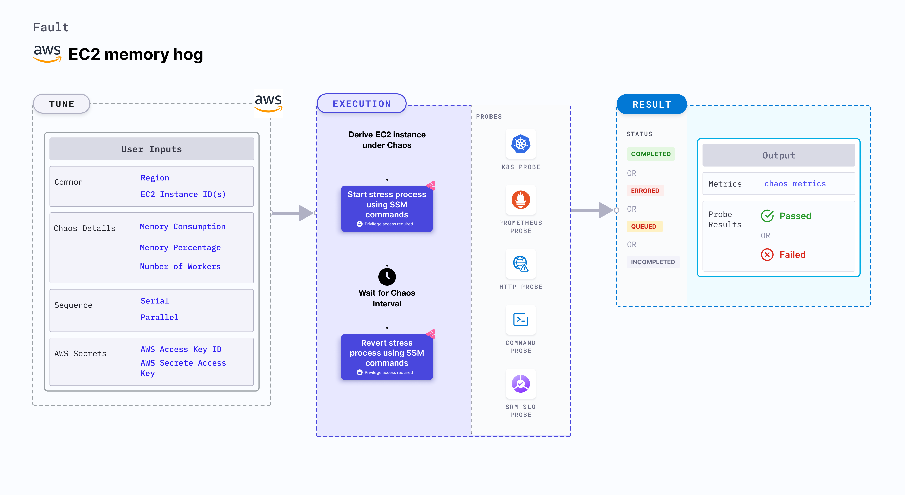

EC2 memory hog disrupts the state of infrastructure resources. 
- The fault induces stress on AWS EC2 instance using Amazon SSM Run command that is carried out using the SSM docs that comes in-built in the fault.
- It causes memory exhaustion on the EC2 instance for a specific duration.





## Usage
<details>
<summary>View fault usage</summary>
<div>
The fault causes memory stress on the target AWS EC2 instance(s). It simulates the situation of lack of CPU for processes running on the application, which degrades their performance.
Injecting a rogue process into the target EC2 instance starves the main processes (or applications) (typically pid 1) of the resources allocated to it. This slows down the application traffic or exhausts the resources leading to degradation in performance of processes on the instance. These faults build resilience to such stress cases. 
</div>
</details>


## Prerequisites

- Kubernetes >= 1.17

- Ensure that the SSM agent is installed and running on the target EC2 instance.
- Ensure to create a Kubernetes secret has the AWS Access Key ID and Secret Access Key credentials in the `CHAOS_NAMESPACE`. Below is the sample secret file:

```yaml
apiVersion: v1
kind: Secret
metadata:
  name: cloud-secret
type: Opaque
stringData:
  cloud_config.yml: |-
    # Add the cloud AWS credentials respectively
    [default]
    aws_access_key_id = XXXXXXXXXXXXXXXXXXX
    aws_secret_access_key = XXXXXXXXXXXXXXXXXXXXXXXXXXXXXXXXXXXX
```

- If you change the secret name,ensure that you update the `experiment.yml` environment variable for deriving the respective data from the secret. Also account for the path at which this secret is mounted as a file in the manifest environment variable  `AWS_SHARED_CREDENTIALS_FILE`.

## Permissions required

Here is an example AWS policy to execute the fault.

<details>
<summary>View policy for the fault</summary>

```json
{
    "Version": "2012-10-17",
    "Statement": [
        {
            "Effect": "Allow",
            "Action": [
                "ssm:GetDocument",
                "ssm:DescribeDocument",
                "ssm:GetParameter",
                "ssm:GetParameters",
                "ssm:SendCommand",
                "ssm:CancelCommand",
                "ssm:CreateDocument",
                "ssm:DeleteDocument",
                "ssm:GetCommandInvocation",          
                "ssm:UpdateInstanceInformation",
                "ssm:DescribeInstanceInformation"
            ],
            "Resource": "*"
        },
        {
            "Effect": "Allow",
            "Action": [
                "ec2messages:AcknowledgeMessage",
                "ec2messages:DeleteMessage",
                "ec2messages:FailMessage",
                "ec2messages:GetEndpoint",
                "ec2messages:GetMessages",
                "ec2messages:SendReply"
            ],
            "Resource": "*"
        },
        {
            "Effect": "Allow",
            "Action": [
                "ec2:DescribeInstanceStatus",
                "ec2:DescribeInstances"
            ],
            "Resource": [
                "*"
            ]
        }
    ]
}
```
</details>

Refer to the [superset permission/policy](./policy-for-all-aws-faults) to execute all AWS faults.

## Default validations

The EC2 instance should be in a healthy state.


## Fault tunables

<details>
<summary>Check the Fault Tunables</summary>
<h2>Mandatory Fields</h2>
<table>
    <tr>
        <th> Variables </th>
        <th> Description </th>
        <th> Notes </th>
    </tr>
    <tr>
        <td> EC2_INSTANCE_ID </td>
        <td> ID of the target EC2 instance. </td>
        <td> For example, <code>i-044d3cb4b03b8af1f</code>. </td>
    </tr>
    <tr>
        <td> REGION </td>
        <td> The AWS region ID where the EC2 instance has been created. </td>
        <td> For example, <code>us-east-1</code>. </td>
    </tr>
</table>
<h2>Optional Fields</h2>
<table>
    <tr>
        <th> Variables </th>
        <th> Description </th>
        <th> Notes </th>
    </tr>
    <tr>
        <td> TOTAL_CHAOS_DURATION </td>
        <td> Duration that you specify, through which chaos is injected into the target resource (in seconds). </td>
        <td> Defaults to 30s. </td>
    </tr>
    <tr>
        <td> CHAOS_INTERVAL </td>
        <td> Time interval between two successive instance terminations (in seconds).</td>
        <td> Defaults to 60s. </td>
    </tr>
    <tr>
        <td> AWS_SHARED_CREDENTIALS_FILE </td>
        <td> Provide the path for aws secret credentials.</td>
        <td> Defaults to <code>/tmp/cloud_config.yml</code>. </td>
    </tr>
    <tr>
        <td> INSTALL_DEPENDENCIES </td>
        <td> Select to install dependencies used to run the network chaos. It can be either True or False. </td>
        <td> If the dependency already exists, you can turn it off. Defaults to True.</td>
    </tr>
    <tr>
        <td> MEMORY_CONSUMPTION </td>
        <td> The amount of memory to be hogged in the EC2 instance in terms of megabytes. </td>
        <td> Defaults to 500MB. </td>
    </tr>
    <tr>
        <td> MEMORY_PERCENTAGE </td>
        <td> The amount of memory to be hogged in the EC2 instance in terms of percentage.</td>
        <td> Defaults to 0. </td>
    </tr>
    <tr>
        <td> NUMBER_OF_WORKERS </td>
        <td> The number of workers used to run the stress process. </td>
        <td> Defaults to 1. </td>
    </tr>
    <tr>
        <td> SEQUENCE </td>
        <td> It defines sequence of chaos execution for multiple instance</td>
        <td> Defaults to parallel. Supports serial sequence as well. </td>
    </tr>
    <tr>
        <td> RAMP_TIME </td>
        <td> Period to wait before and after injecting chaos (in seconds).  </td>
        <td> For example, 30s </td>
    </tr>
</table>

</details>

## Fault examples

### Common fault tunables

Refer to the [common attributes](../common-tunables-for-all-faults) to tune the common tunables for all the faults.

### Memory consumption in megabytes

It defines the memory value to be utilized in megabytes on the EC2 instance. You can tune it using the `MEMORY_CONSUMPTION` environment variable.

You can tune it using the following example:

[embedmd]:# (./static/manifests/ec2-memory-hog/memory-bytes.yaml yaml)
```yaml
# memory in mb to utilize
apiVersion: litmuschaos.io/v1alpha1
kind: ChaosEngine
metadata:
  name: engine-nginx
spec:
  engineState: "active"
  chaosServiceAccount: litmus-admin
  experiments:
  - name: ec2-memory-hog
    spec:
      components:
        env:
        - name: MEMORY_CONSUMPTION
          VALUE: '1024'
        # ID of the EC2 instance
        - name: EC2_INSTANCE_ID
          value: 'instance-1'
        # region for the EC2 instance
        - name: REGION
          value: 'us-east-1'
```

### Memory consumption by percentage

It defines the memory percentage value to be utilized on the EC2 instance. You can tune it using the `MEMORY_PERCENTAGE` environment variable.

You can tune it using the following example:

[embedmd]:# (./static/manifests/ec2-memory-hog/memory-percentage.yaml yaml)
```yaml
# memory percentage to utilize
apiVersion: litmuschaos.io/v1alpha1
kind: ChaosEngine
metadata:
  name: engine-nginx
spec:
  engineState: "active"
  chaosServiceAccount: litmus-admin
  experiments:
  - name: ec2-memory-hog
    spec:
      components:
        env:
        - name: MEMORY_PERCENTAGE
          VALUE: '50'
        # ID of the EC2 instance
        - name: EC2_INSTANCE_ID
          value: 'instance-1'
        # region for the EC2 instance
        - name: REGION
          value: 'us-east-1'
```

### Multiple EC2 instances

Multiple EC2 instances can be targeted in one chaos run by providing comma-separated instance IDs. You can tune it using the `EC2_INSTANCE_ID` environment variable.

You can tune it using the following example:

[embedmd]:# (./static/manifests/ec2-memory-hog/multiple-instances.yaml yaml)
```yaml
# multiple instance targets
apiVersion: litmuschaos.io/v1alpha1
kind: ChaosEngine
metadata:
  name: engine-nginx
spec:
  engineState: "active"
  chaosServiceAccount: litmus-admin
  experiments:
  - name: ec2-memory-hog
    spec:
      components:
        env:
        # ids of the EC2 instances
        - name: EC2_INSTANCE_ID
          value: 'instance-1,instance-2,instance-3'
        # region for the EC2 instance
        - name: REGION
          value: 'us-east-1'
```

### Multiple workers

It defines the CPU threads to be run to spike the memory utilization, this will increase the growth of memory consumption. You can tune it using the `NUMBER_OF_WORKERS` environment variable.

You can tune it using the following example:

[embedmd]:# (./static/manifests/ec2-memory-hog/multiple-workers.yaml yaml)
```yaml
# multiple workers to utilize resources
apiVersion: litmuschaos.io/v1alpha1
kind: ChaosEngine
metadata:
  name: engine-nginx
spec:
  engineState: "active"
  chaosServiceAccount: litmus-admin
  experiments:
  - name: ec2-memory-hog
    spec:
      components:
        env:
        - name: NUMBER_OF_WORKERS
          VALUE: '3'
        # ID of the EC2 instance
        - name: EC2_INSTANCE_ID
          value: 'instance-1'
        # region for the EC2 instance
        - name: REGION
          value: 'us-east-1'
```