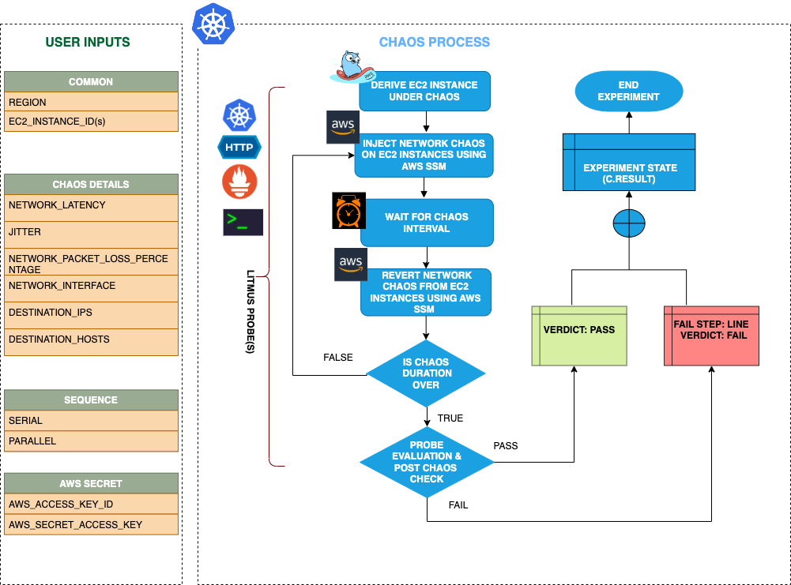

## Introduction
- It causes flaky access to the application/services by injecting network packet latency to Ec2 instance(s).
- It helps to check the performance of the application/process running on the EC2 instances.

:::tip Fault execution flow chart

:::

## Uses
<details>
<summary>View the uses of the fault</summary>
<div>
The fault causes network degradation without the EC2 instance being marked unhealthy/unworthy of traffic. The idea of this fault is to simulate issues within your instance network OR microservice communication across services in different hosts etc.

Mitigation (in this case keep the timeout i.e., network latency low) could be via some middleware that can switch traffic based on some SLOs/perf parameters. If such an arrangement is not available the next best thing would be to verify if such a degradation is highlighted via notification/alerts etc,. so the admin/SRE has the opportunity to investigate and fix things. Another utility of the test would be to see what the extent of impact caused to the end-user OR the last point in the app stack on account of degradation in access to a downstream/dependent microservice. Whether it is acceptable OR breaks the system to an unacceptable degree. The fault provides <code>DESTINATION_IPS</code> or <code>DESTINATION_HOSTS</code> so that you can control the chaos against specific services within or outside the EC2 instance.

The EC2 instance may stall or get corrupted while they wait endlessly for a packet. The fault limits the impact (blast radius) to only the traffic you want to test by specifying IP addresses or application information. This fault will help to improve the resilience of your services over time
</div>
</details>

## Prerequisites
:::info
- Ensure that Kubernetes Version > 1.16

**AWS EC2 Access Requirement:**

- Ensure that SSM agent is installed and running in the target EC2 instance.
- Ensure to create a Kubernetes secret having the AWS Access Key ID and Secret Access Key credentials in the `CHAOS_NAMESPACE`. A sample secret file looks like:

```yaml
apiVersion: v1
kind: Secret
metadata:
  name: cloud-secret
type: Opaque
stringData:
  cloud_config.yml: |-
    # Add the cloud AWS credentials respectively
    [default]
    aws_access_key_id = XXXXXXXXXXXXXXXXXXX
    aws_secret_access_key = XXXXXXXXXXXXXXXXXXXXXXXXXXXXXXXXXXXX
```

- If you change the secret name then please also update the `experiment.yml` ENV values for deriving the respective data from the secret. Also account for the path at which this secret is mounted as a file in the manifest ENV `AWS_SHARED_CREDENTIALS_FILE`.

### NOTE
You can pass the VM credentials as secrets or as an ChaosEngine ENV variable.
:::


## Default Validations
:::info
- EC2 instance should be in healthy state.
:::

## Fault Tunables
<details>
    <summary>Check the Fault Tunables</summary>
    <h2>Mandatory Fields</h2>
    <table>
      <tr>
        <th> Variables </th>
        <th> Description </th>
        <th> Notes </th>
      </tr>
      <tr>
        <td> EC2_INSTANCE_ID </td>
        <td> ID of the target EC2 instance </td>
        <td> For example: <code>i-044d3cb4b03b8af1f</code> </td>
      </tr>
      <tr>
        <td> REGION </td>
        <td> The AWS region ID where the EC2 instance has been created </td>
        <td> For example: <code>us-east-1</code> </td>
      </tr>
    </table>
    <h2>Optional Fields</h2>
    <table>
        <tr>
            <th> Variables </th>
            <th> Description </th>
            <th> Notes </th>
        </tr>
        <tr>
            <td> TOTAL_CHAOS_DURATION </td>
            <td> The total time duration for chaos insertion (sec) </td>
            <td> Defaults to 30s </td>
        </tr>
        <tr>
            <td> CHAOS_INTERVAL </td>
            <td> The interval (in sec) between successive instance termination </td>
            <td> Defaults to 30s </td>
        </tr>
        <tr>
            <td> AWS_SHARED_CREDENTIALS_FILE </td>
            <td> Provide the path for aws secret credentials</td>
            <td> Defaults to <code>/tmp/cloud_config.yml</code> </td>
        </tr>
        <tr>
            <td> INSTALL_DEPENDENCY </td>
            <td> Select to install dependencies used to run the network chaos. It can be either True or False </td>
            <td> If the dependency already exists, you can turn it off. Defaults to True.</td>
        </tr>
        <tr>
            <td> NETWORK_LATENCY </td>
            <td> The latency/delay in milliseconds</td>
            <td> Default 2000, provide numeric value only </td>
        </tr>
        <tr>
            <td> JITTER </td>
            <td> The network jitter value in ms</td>
            <td> Default 0, provide numeric value only </td>
        </tr>
        <tr>
            <td> DESTINATION_IPS </td>
            <td> IP addresses of the services or the CIDR blocks(range of IPs), the accessibility to which is impacted </td>
            <td> Comma separated IP(S) or CIDR(S) can be provided. if not provided, it will induce network chaos for all ips/destinations </td>
        </tr>
        <tr>
            <td> DESTINATION_HOSTS </td>
            <td> DNS Names of the services, the accessibility to which, is impacted </td>
            <td> if not provided, it will induce network chaos for all ips/destinations or DESTINATION_IPS if already defined </td>
        </tr>
        <tr>
            <td> NETWORK_INTERFACE </td>
            <td> Name of ethernet interface considered for shaping traffic	</td>
            <td> Defaults to `eth0` </td>
        </tr>
        <tr>
            <td> SEQUENCE </td>
            <td> It defines sequence of chaos execution for multiple instance </td>
            <td> Default value: parallel. Supported: serial, parallel </td>
        </tr>
        <tr>
            <td> RAMP_TIME </td>
            <td> Period to wait before and after injection of chaos in sec </td>
            <td> Eg: 30 </td>
        </tr>
    </table>
</details>

## Fault Examples

### Common Fault Tunables
Refer the [common attributes](../common-tunables-for-all-faults) to tune the common tunables for all the faults.

### Network Packet Latency

It defines the network packet latency to be injected on the EC2 instances. It can be tuned via `NETWORK_LATENCY` ENV.

Use the following example to tune this:

[embedmd]:# (./static/manifests/ec2-network-latency/network-latency.yaml yaml)
```yaml
# it injects the chaos into the egress traffic
apiVersion: litmuschaos.io/v1alpha1
kind: ChaosEngine
metadata:
  name: engine-nginx
spec:
  engineState: "active"
  chaosServiceAccount: litmus-admin
  experiments:
  - name: ec2-network-latency
    spec:
      components:
        env:
        # network packet latency
        - name: NETWORK_LATENCY
          value: '2000'
        - name: EC2_INSTANCE_ID
          value: 'instance-1'
        - name: REGION
          value: 'us-west-2'
```

### Run With Jitter

It defines the jitter (in ms), a parameter that allows introducing a network delay variation. It can be tuned via `JITTER` ENV. Its default value is 0.

Use the following example to tune this:

[embedmd]:# (./static/manifests/ec2-network-latency/network-latency-with-jitter.yaml yaml)
```yaml
# it injects the chaos into the egress traffic
apiVersion: litmuschaos.io/v1alpha1
kind: ChaosEngine
metadata:
  name: engine-nginx
spec:
  engineState: "active"
  chaosServiceAccount: litmus-admin
  experiments:
  - name: ec2-network-latency
    spec:
      components:
        env:
        # value of the network latency jitter (in ms)
        - name: JITTER
          value: '200'
        - name: NETWORK_LATENCY
          value: '2000'
        - name: EC2_INSTANCE_ID
          value: 'instance-1'
        - name: REGION
          value: 'us-west-2'
```

### Run With Destination IPs And Destination Hosts

The network faults interrupt traffic for all the IPs/hosts by default. The interruption of specific IPs/Hosts can be tuned via `DESTINATION_IPS` and `DESTINATION_HOSTS` ENV.

`DESTINATION_IPS`: It contains the IP addresses of the services or the CIDR blocks(range of IPs), the accessibility to which is impacted.
`DESTINATION_HOSTS`: It contains the DNS Names of the services, the accessibility to which, is impacted

Use the following example to tune this:

[embedmd]:# (./static/manifests/ec2-network-latency/destination-host-and-ip.yaml yaml)
```yaml
# it injects the chaos into the egress traffic for specific IPs/hosts
apiVersion: litmuschaos.io/v1alpha1
kind: ChaosEngine
metadata:
  name: engine-nginx
spec:
  engineState: "active"
  chaosServiceAccount: litmus-admin
  experiments:
  - name: ec2-network-latency
    spec:
      components:
        env:
        # supports comma separated destination ips
        - name: DESTINATION_IPS
          value: '8.8.8.8,192.168.5.6'
        # supports comma separated destination hosts
        - name: DESTINATION_HOSTS
          value: 'google.com'
        - name: EC2_INSTANCE_ID
          value: 'instance-1'
        - name: REGION
          value: 'us-west-2'
```

###  Network Interface

The defined name of the ethernet interface, which is considered for shaping traffic. It can be tuned via `NETWORK_INTERFACE` ENV. Its default value is `eth0`.

Use the following example to tune this:

[embedmd]:# (./static/manifests/ec2-network-latency/network-interface.yaml yaml)
```yaml
# it injects the chaos into the egress traffic for specific network interface
apiVersion: litmuschaos.io/v1alpha1
kind: ChaosEngine
metadata:
  name: engine-nginx
spec:
  engineState: "active"
  chaosServiceAccount: litmus-admin
  experiments:
  - name: ec2-network-latency
    spec:
      components:
        env:
        # name of the network interface
        - name: NETWORK_INTERFACE
          value: 'eth0'
        - name: EC2_INSTANCE_ID
          value: 'instance-1'
        - name: REGION
          value: 'us-west-2'
```
