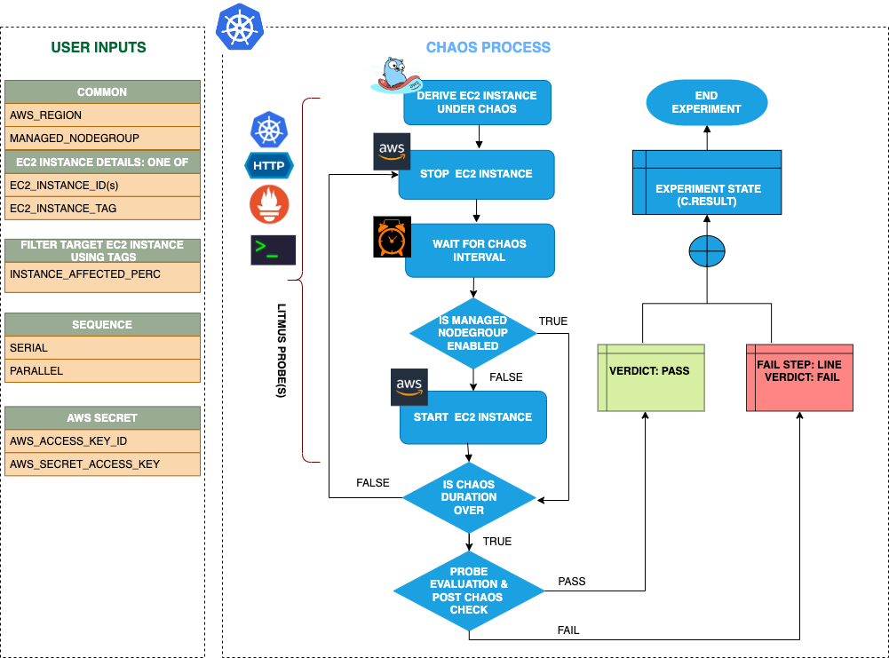

## Introduction
- It causes termination of an EC2 instance by tag before bringing it back to running state after the specified chaos duration.
- It helps to check the performance of the application/process running on the EC2 instance.
When the `MANAGED_NODEGROUP` is enable then the fault will not try to start the instance post chaos instead it will check of the addition of the new node instance to the cluster.

:::tip Fault execution flow chart

:::

## Uses

<details>
<summary>View the uses of the fault</summary>
<div>
Coming soon.
</div>
</details>

## Prerequisites

:::info
- Ensure that Kubernetes Version > 1.16.
- Ensure that you have sufficient AWS access to stop and start an EC2 instance. 
- Ensure to create a Kubernetes secret having the AWS access configuration(key) in the `CHAOS_NAMESPACE`. A sample secret file looks like:
```yaml
apiVersion: v1
kind: Secret
metadata:
  name: cloud-secret
type: Opaque
stringData:
  cloud_config.yml: |-
    # Add the cloud AWS credentials respectively
    [default]
    aws_access_key_id = XXXXXXXXXXXXXXXXXXX
    aws_secret_access_key = XXXXXXXXXXXXXXX
```
- If you change the secret key name (from `cloud_config.yml`) please also update the `AWS_SHARED_CREDENTIALS_FILE` ENV value in the ChaosExperiment CR with the same name.

### WARNING

If the target EC2 instance is a part of a self-managed nodegroup then make sure to drain the target node if any application is running on it and also ensure to cordon the target node before running the fault so that the fault pods do not schedule on it.
:::

## Default Validations

:::info

- EC2 instance should be in healthy state.

:::

## Fault Tunables

<details>
    <summary>Check the Fault Tunables</summary>
    <h2>Mandatory Fields</h2>
    <table>
      <tr>
        <th> Variables </th>
        <th> Description </th>
        <th> Notes </th>
      </tr>
      <tr>
        <td> INSTANCE_TAG </td>
        <td> Instance Tag to filter the target EC2 instance.</td>
        <td> The <code>INSTANCE_TAG</code> should be provided as <code>key:value</code> ex: <code>team:devops</code></td>
      </tr>
      <tr>
        <td> REGION </td>
        <td> The region name of the target instance</td>
        <td> </td>
      </tr>
    </table>
    <h2>Optional Fields</h2>
    <table>
      <tr>
        <th> Variables </th>
        <th> Description </th>
        <th> Notes </th>
      </tr>
      <tr>
        <td> INSTANCE_AFFECTED_PERC </td>
        <td> The Percentage of total EC2 instance to target </td>
        <td> Defaults to 0 (corresponds to 1 instance), provide numeric value only </td>
      </tr>
      <tr>
        <td> TOTAL_CHAOS_DURATION </td>
        <td> The total time duration for chaos insertion (sec) </td>
        <td> Defaults to 30s </td>
      </tr>
      <tr>
        <td> CHAOS_INTERVAL </td>
        <td> The interval (in sec) between successive instance termination.</td>
        <td> Defaults to 30s </td>
      </tr>
      <tr>
        <td> MANAGED_NODEGROUP </td>
        <td> Set to <code>enable</code> if the target instance is the part of self-managed nodegroups </td>
        <td> Defaults to <code>disable</code> </td>
      </tr>
      <tr>
        <td> SEQUENCE </td>
        <td> It defines sequence of chaos execution for multiple instance</td>
        <td> Default value: parallel. Supported: serial, parallel </td>
      </tr>
      <tr>
        <td> RAMP_TIME </td>
        <td> Period to wait before and after injection of chaos in sec </td>
        <td> Eg. 30 </td>
      </tr>    
    </table>
</details>

## Fault Examples

### Common and AWS specific tunables

Refer the [common attributes](../common-tunables-for-all-faults) and [AWS specific tunable](./aws-fault-tunables) to tune the common tunables for all faults and aws specific tunables.

### Target single instance

It will stop a random single EC2 instance with the given `INSTANCE_TAG` tag and the `REGION` region.

Use the following example to tune this:

[embedmd]:# (./static/manifests/ec2-stop-by-tag/instance-tag.yaml yaml)
```yaml
# target the EC2 instances with matching tag
apiVersion: litmuschaos.io/v1alpha1
kind: ChaosEngine
metadata:
  name: engine-nginx
spec:
  engineState: "active"
  chaosServiceAccount: litmus-admin
  experiments:
  - name: ec2-terminate-by-tag
    spec:
      components:
        env:
        # tag of the EC2 instance
        - name: INSTANCE_TAG
          value: 'key:value'
        # region for the EC2 instance
        - name: REGION
          value: 'us-east-1'
```

### Target Percent of instances

It will stop the `INSTANCE_AFFECTED_PERC` percentage of EC2 instances with the given `INSTANCE_TAG` tag and `REGION` region.

Use the following example to tune this:

[embedmd]:# (./static/manifests/ec2-stop-by-tag/instance-affected-percentage.yaml yaml)
```yaml
# percentage of EC2 instances, needs to terminate with provided tags
apiVersion: litmuschaos.io/v1alpha1
kind: ChaosEngine
metadata:
  name: engine-nginx
spec:
  engineState: "active"
  chaosServiceAccount: litmus-admin
  experiments:
  - name: ec2-terminate-by-tag
    spec:
      components:
        env:
        # percentage of EC2 instance filtered by tags
        - name: INSTANCE_AFFECTED_PERC
          value: '100'
        # tag of the EC2 instance
        - name: INSTANCE_TAG
          value: 'key:value'
        # region for the EC2 instance
        - name: REGION
          value: 'us-east-1'
```
