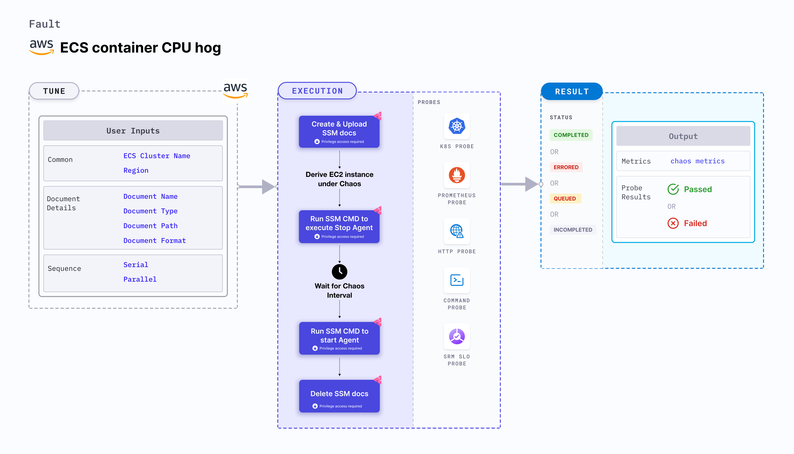

## Introduction

- ECS Container CPU hog contains chaos to disrupt the state of infra resources. The fault can induce stress chaos on the AWS ECS container using SSM Run Command, this is carried out by using SSM Docs which is in-built into the fault for the give chaos experiment.

- Injects cpu resource stress/exhaustion on the target task container for the given duration. The number of cpu cores stressed can be provided as input. 

- To select the Task Under Chaos (TUC) you can make use of servie name associated with the task that is - if you provide the service name along with cluster name only all the tasks associated with the given service will be selected as chaos targets.

- It tests the ECS task sanity (service availability) and recovery of the task containers subjected to CPU stress.

:::tip Fault execution flow chart

:::

## Uses

<details>
<summary>View the uses of the fault</summary>
<div>
CPU hogs are another very common and frequent scenario we find with containers/applications that can result in the eviction of the application (task container) and impact its delivery. Such scenarios can still occur despite whatever availability aids docker provides. These problems are generally referred to as "Noisy Neighbour" problems.

Injecting a rogue process into a target task container, we starve the main microservice process (typically pid 1) of the resources allocated to it (where limits are defined) causing slowness in application traffic or in other cases unrestrained use can cause instance to exhaust resources leading to eviction of all task container. So this category of chaos fault helps to build the immunity on the application undergoing any such stress scenario.
</div>
</details>

## Prerequisites

:::info

- Ensure that Kubernetes Version >= 1.17

<details>
<summary>Enable Container Metadata</summary>

Ensure that the ECS container metadata is <code>enabled</code>;this feature is <code>disabled</code> by default. Refer AWS docs - <a href="https://docs.aws.amazon.com/AmazonECS/latest/developerguide/container-metadata.html">Enabling container metadata</a>. This will allow HCE to know the container details like containerID that is running the ECS tasks.

<b>NOTE:</b> You need to do the following steps to enable container metadata and attach IAM role to the cluster instances:

- In the EC2 dashboard sidebar click on Launch Configurations under Auto Scaling.


- Create a copy of autoscaling configuration used in target ECS cluster. This will create a new (copied) Launch Template.


- In the new(copied) Launch Template, update the IAM role of the instances with ECS-SSM permissions (as shown in below permission requirement section).


- Now update the user data with <code>ECS_ENABLE_CONTAINER_METADATA</code> to be <code>true</code> as shown below.


- Now save the launch configuration by clicking on ‘Create Launch Template'.


- Now go back to auto scaling group and switch to launch template (as launch configuration is deprecating by AWS).


- Update the cluster auto-scaling group with the newer launch template.


- Restart the instances of the ECS cluster to pull the updated configuration:


</details>

- Ensure both user and ECS cluster instances have a Role with required AWS access to do SSM and ECS operations. Refer the below mentioned sample policy for the fault.

- Ensure to create a Kubernetes secret having the AWS access configuration(key) in the `CHAOS_NAMESPACE`. A sample secret file looks like:

```yaml
apiVersion: v1
kind: Secret
metadata:
  name: cloud-secret
type: Opaque
stringData:
  cloud_config.yml: |-
    # Add the cloud AWS credentials respectively
    [default]
    aws_access_key_id = XXXXXXXXXXXXXXXXXXX
    aws_secret_access_key = XXXXXXXXXXXXXXX
```

- If you change the secret key name (from `cloud_config.yml`) please also update the `AWS_SHARED_CREDENTIALS_FILE` ENV value in the ChaosExperiment CR with the same name.
:::

## Permission Requirement

- Here is an example AWS policy to execute this fault.

<details>
<summary>View policy for this fault</summary>

```json
{
    "Version": "2012-10-17",
    "Statement": [
        {
            "Sid": "VisualEditor0",
            "Effect": "Allow",
            "Action": [
                "ecs:UpdateContainerInstancesState",
                "ecs:RegisterContainerInstance",
                "ecs:ListContainerInstances",
                "ecs:DeregisterContainerInstance",
                "ecs:DescribeContainerInstances",
                "ecs:ListTasks",
                "ecs:DescribeClusters"

            ],
            "Resource": "*"
        },
        {
            "Effect": "Allow",
            "Action": [
                "ssm:GetDocument",
                "ssm:DescribeDocument",
                "ssm:GetParameter",
                "ssm:GetParameters",
                "ssm:SendCommand",
                "ssm:CancelCommand",
                "ssm:CreateDocument",
                "ssm:DeleteDocument",
                "ssm:GetCommandInvocation",          
                "ssm:UpdateInstanceInformation",
                "ssm:DescribeInstanceInformation"
            ],
            "Resource": "*"
        },
        {
            "Effect": "Allow",
            "Action": [
                "ec2messages:AcknowledgeMessage",
                "ec2messages:DeleteMessage",
                "ec2messages:FailMessage",
                "ec2messages:GetEndpoint",
                "ec2messages:GetMessages",
                "ec2messages:SendReply"
            ],
            "Resource": "*"
        },
        {
            "Effect": "Allow",
            "Action": [
                "ec2:DescribeInstances"
            ],
            "Resource": [
                "*"
            ]
        }
    ]
}
```
</details>

- Refer a [superset permission/policy](../policy-for-all-aws-faults) to execute all AWS faults.

## Default Validations

:::info

- ECS container instance should be in healthy state.

:::

## Fault Tunables

<details>
    <summary>Check the Fault Tunables</summary>
    <h2>Mandatory Fields</h2>
    <table>
        <tr>
        <th> Variables </th>
        <th> Description </th>
        <th> Notes </th>
        </tr>
        <tr> 
        <td> CLUSTER_NAME </td>
        <td> Name of the target ECS cluster</td>
        <td> Eg. cluster-1 </td>
        </tr>
        <tr>
        <td> REGION </td>
        <td> The region name of the target ECS cluster</td>
        <td> Eg. us-east-1 </td>
        </tr>
    </table>
    <h2>Optional Fields</h2>
    <table>
      <tr>
        <th> Variables </th>
        <th> Description </th>
        <th> Notes </th>
      </tr>
      <tr>
        <td> TOTAL_CHAOS_DURATION </td>
        <td> The total time duration for chaos insertion (sec) </td>
        <td> Defaults to 30s </td>
      </tr>
      <tr>
        <td> CHAOS_INTERVAL </td>
        <td> The interval (in sec) between successive instance termination.</td>
        <td> Defaults to 30s </td>
      </tr>
      <tr> 
        <td> AWS_SHARED_CREDENTIALS_FILE </td>
        <td> Provide the path for aws secret credentials</td>
        <td> Defaults to <code>/tmp/cloud_config.yml</code> </td>
      </tr>
      <tr> 
        <td> CPU_CORE </td>
        <td> Provide the number of cpu core to consume</td>
        <td> Defaults to 0 </td>
      </tr>
      <tr> 
        <td> CPU_LOAD </td>
        <td> Provide the percentage of CPU to be consumed</td>
        <td> Defaults to 100 </td>
      </tr>
      <tr>
        <td> SEQUENCE </td>
        <td> It defines sequence of chaos execution for multiple instance</td>
        <td> Default value: parallel. Supported: serial, parallel </td>
      </tr>
      <tr>
        <td> RAMP_TIME </td>
        <td> Period to wait before and after injection of chaos in sec </td>
        <td> Eg. 30 </td>
      </tr>
    </table>
</details>

## Fault Examples

### Common and AWS specific tunables

Refer the [common attributes](../common-tunables-for-all-faults) and [AWS specific tunable](./aws-fault-tunables) to tune the common tunables for all faults and aws specific tunables.

### CPU Cores

It contains the cores of CPU to hog for the target container instances. It can be tuned via ` CPU_CORE` ENV. `0` core means all the available CPU resources should be consumed.

Use the following example to tune this:

[embedmd]:# (./static/manifests/ecs-stress-chaos/cpu-core.yaml yaml)
```yaml
# cpu cores for the stress
apiVersion: litmuschaos.io/v1alpha1
kind: ChaosEngine
metadata:
  name: engine-nginx
spec:
  engineState: "active"
  annotationCheck: "false"
  chaosServiceAccount: litmus-admin
  experiments:
  - name: ecs-container-cpu-hog
    spec:
      components:
        env:
        # provide the cpu core to be hogged
        - name: CPU_CORE
          value: '0'
        - name: REGION
          value: 'us-east-2'
        - name: TOTAL_CHAOS_DURATION
          VALUE: '60'
```

### CPU Load

It contains the percentage of CPU to be consumed for the target container instances. It can be tuned via ` CPU_LOAD` ENV. CPU Load `100` means 100% per cpu core provided.

Use the following example to tune this:

[embedmd]:# (./static/manifests/ecs-stress-chaos/cpu-load.yaml yaml)
```yaml
# cpu load for the stress
apiVersion: litmuschaos.io/v1alpha1
kind: ChaosEngine
metadata:
  name: engine-nginx
spec:
  engineState: "active"
  annotationCheck: "false"
  chaosServiceAccount: litmus-admin
  experiments:
  - name: ecs-container-cpu-hog
    spec:
      components:
        env:
        # provide the cpu load percentage
        - name: CPU_LOAD
          value: '100'
        - name: CPU_CORE
          value: '0'
        - name: TOTAL_CHAOS_DURATION
          VALUE: '60'
```
