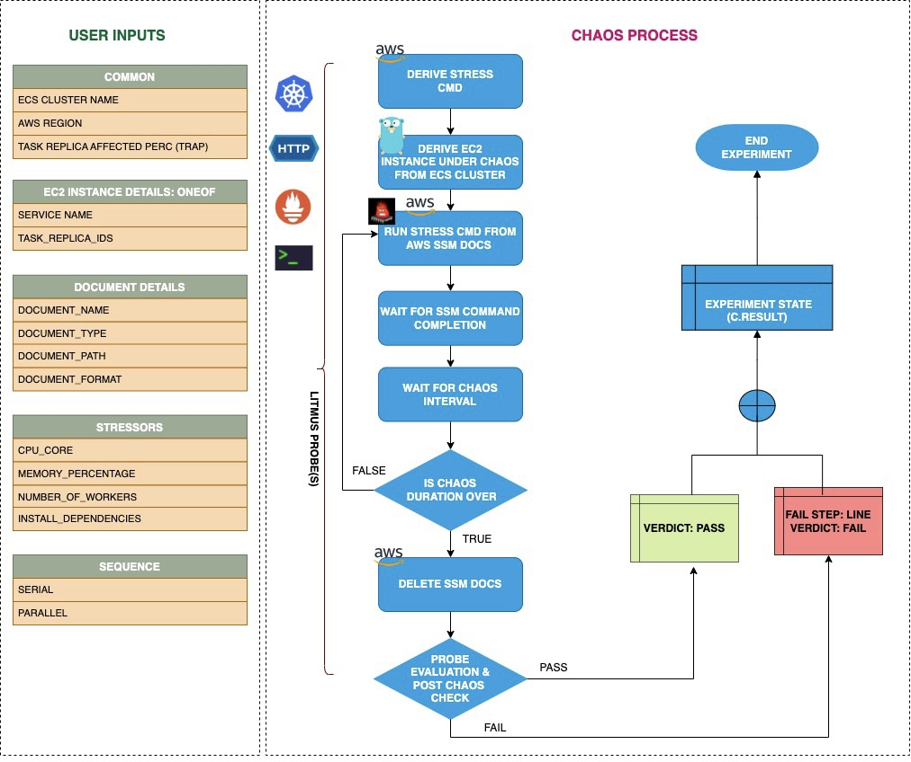

## Introduction

- ECS Container Memory hog contains chaos to disrupt the state of infra resources. The fault can induce a stress chaos on AWS ECS container using Amazon SSM Run Command, this is carried out by using SSM Docs which is in-built in the fault for the give chaos scenario.

- It causes memory chaos on containers of ECS task with given cluster name using an SSM docs for a certain chaos duration.

- To select the Task Under Chaos (TUC) you can make use of servie name associated with the task that is, if you provide the service name along with cluster name only all the tasks associated with the given service will be selected as chaos targets.

- It tests the ECS task sanity (service availability) and recovery of the task containers subjected to memory stress.

:::tip Fault execution flow chart

:::

## Uses

<details>
<summary>View the uses of the fault</summary>
<div>
Memory usage within containers is subject to various constraints. If the limits are specified in their spec, exceeding them can cause termination of the container (due to OOMKill of the primary process, often pid 1) - the restart of the container by docker, subject to the policy specified. For containers with no limits placed, the memory usage is uninhibited until such time as the VM level OOM Behaviour takes over. In this case, containers on the Instance can be killed based on their oom_score. This eval is extended to all task containers running on the instance - thereby causing a bigger blast radius.

This fault launches a stress process within the target container - which can cause either the primary process in the container to be resource constrained in cases where the limits are enforced OR eat up available system memory on the instance in cases where the limits are not specified.
</div>
</details>

## Prerequisites

:::info

- Ensure that Kubernetes Version >= 1.17

**AWS EC2 Access Requirement:**

- Ensure that the ECS container metadata is enabled this feature is disabled by default. To enable it please follow the aws docs to [Enabling container metadata](https://docs.aws.amazon.com/AmazonECS/latest/developerguide/container-metadata.html). If you have your task running prior this activity you may need to restart it to get the metadata directory as mentioned in the docs.

- Ensure that both you and ECS cluster instances have a Role with required AWS access to do SSM and ECS operations. Refer the below mentioned sample policy for the fault (please note that the sample policy can be minimised further). To know more checkout [Systems Manager Docs](https://docs.aws.amazon.com/systems-manager/latest/userguide/setup-launch-managed-instance.html). Also, please refer the below mentioned policy required for the experiment.

- Ensure to create a Kubernetes secret having the AWS access configuration(key) in the `CHAOS_NAMESPACE`. A sample secret file looks like:

```yaml
apiVersion: v1
kind: Secret
metadata:
  name: cloud-secret
type: Opaque
stringData:
  cloud_config.yml: |-
    # Add the cloud AWS credentials respectively
    [default]
    aws_access_key_id = XXXXXXXXXXXXXXXXXXX
    aws_secret_access_key = XXXXXXXXXXXXXXX
```

- If you change the secret key name (from `cloud_config.yml`) please also update the `AWS_SHARED_CREDENTIALS_FILE` ENV value in the ChaosExperiment CR with the same name.
:::

## Default Validations

:::info

- ECS container instance should be in healthy state.

:::

## Fault Tunables

<details>
    <summary>Check the Fault Tunables</summary>
    <h2>Mandatory Fields</h2>
    <table>
        <tr>
        <th> Variables </th>
        <th> Description </th>
        <th> Notes </th>
        </tr>
        <tr> 
        <td> CLUSTER_NAME </td>
        <td> Name of the target ECS cluster</td>
        <td> Eg. cluster-1 </td>
        </tr>
        <tr>
        <td> REGION </td>
        <td> The region name of the target ECS cluster</td>
        <td> Eg. us-east-1 </td>
        </tr>
    </table>
    <h2>Optional Fields</h2>
    <table>
      <tr>
        <th> Variables </th>
        <th> Description </th>
        <th> Notes </th>
      </tr>
      <tr>
        <td> TOTAL_CHAOS_DURATION </td>
        <td> The total time duration for chaos insertion (sec) </td>
        <td> Defaults to 30s </td>
      </tr>
      <tr>
        <td> CHAOS_INTERVAL </td>
        <td> The interval (in sec) between successive instance termination.</td>
        <td> Defaults to 30s </td>
      </tr>
      <tr> 
        <td> AWS_SHARED_CREDENTIALS_FILE </td>
        <td> Provide the path for aws secret credentials</td>
        <td> Defaults to <code>/tmp/cloud_config.yml</code> </td>
      </tr>
      <tr> 
        <td>  MEMORY_CONSUMPTION </td>
        <td> Provide the value of memory consumption in Mebibytes	</td>
        <td> Defaults to 100 </td>
      </tr>
      <tr> 
        <td>  MEMORY_PERCENTAGE </td>
        <td> Provide the value of memory consumption in Percentage	</td>
        <td> Defaults to 0 </td>
      </tr>
      <tr>
        <td> SEQUENCE </td>
        <td> It defines sequence of chaos execution for multiple instance</td>
        <td> Default value: parallel. Supported: serial, parallel </td>
      </tr>
      <tr>
        <td> RAMP_TIME </td>
        <td> Period to wait before and after injection of chaos in sec </td>
        <td> Eg. 30 </td>
      </tr>
    </table>
</details>

## Fault Examples

### Common and AWS specific tunables

Refer the [common attributes](../common-tunables-for-all-faults) and [AWS specific tunable](./aws-fault-tunables) to tune the common tunables for all faults and aws specific tunables.

### Memory Percentage

It stresses the `MEMORY_PERCENTAGE` percent of memory from the targeted container for the `TOTAL_CHAOS_DURATION` duration.

Use the following example to tune this:

[embedmd]:# (./static/manifests/ecs-stress-chaos/memory-percentage.yaml yaml)
```yaml
# define the memory percentage in MB
apiVersion: litmuschaos.io/v1alpha1
kind: ChaosEngine
metadata:
  name: engine-nginx
spec:
  engineState: "active"
  annotationCheck: "false"
  chaosServiceAccount: litmus-admin
  experiments:
  - name: ecs-container-memory-hog
    spec:
      components:
        env:
        # memory percentage value
        - name: MEMORY_PERCENTAGE
          value: '100' #in MB
        - name: TOTAL_CHAOS_DURATION
          value: '60'
```

### Memory Consumption

It stresses the `MEMORY_CONSUMPTION` MB memory of the targeted container for the `TOTAL_CHAOS_DURATION` duration.

Use the following example to tune this:

[embedmd]:# (./static/manifests/ecs-stress-chaos/memory-consumption.yaml yaml)
```yaml
# define the memory consumption in MB
apiVersion: litmuschaos.io/v1alpha1
kind: ChaosEngine
metadata:
  name: engine-nginx
spec:
  engineState: "active"
  annotationCheck: "false"
  chaosServiceAccount: litmus-admin
  experiments:
  - name: ecs-container-memory-hog
    spec:
      components:
        env:
        # memory consumption value
        - name: MEMORY_CONSUMPTION
          value: '500' #in MB
        - name: TOTAL_CHAOS_DURATION
          value: '60'
```

### Workers For Stress

The worker's count for the stress can be tuned with `NUMBER_OF_WORKERS` ENV

Use the following example to tune this:

[embedmd]:# (./static/manifests/ecs-stress-chaos/memory-number-of-worker.yaml yaml)
```yaml
# number of workers used for the stress
apiVersion: litmuschaos.io/v1alpha1
kind: ChaosEngine
metadata:
  name: engine-nginx
spec:
  engineState: "active"
  annotationCheck: "false"
  chaosServiceAccount: litmus-admin
  experiments:
  - name: ecs-container-memory-hog
    spec:
      components:
        env:
        # number of workers for stress
        - name: NUMBER_OF_WORKERS
          value: '1'
        - name: TOTAL_CHAOS_DURATION
          value: '60'
```
