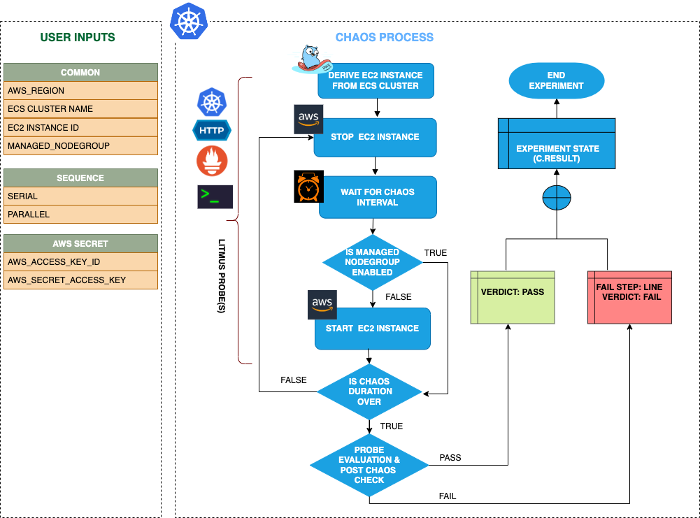

## Introduction

- ECS Instance Stop can induce an EC2 instance stop chaos on AWS ECS cluster. It derives the instance under chaos from ECS cluster.

- It causes EC2 instance to stopped and further gets deleted on ECS cluster for a certain chaos duration.

:::tip Fault execution flow chart

:::

## Uses

<details>
<summary>View the uses of the fault</summary>
<div>
EC2 instance chaos stop is another very common and frequent scenario we find with ECS clusters that can result in breaking of agent that manages task container on ECS cluster and impact its delivery. Such scenarios that can still occur despite whatever availability aids docker provides.

Killing the EC2 instance container will distrupt the performance of it and impact to smooth working of task containers. So this category of chaos fault helps to build the immunity on the application undergoing any such scenarios.
</div>
</details>

## Prerequisites

:::info

- Ensure that Kubernetes Version >= 1.17

**AWS EC2 Access Requirement:**

- Ensure that you have sufficient AWS access to stop and start an EC2 instance.

- Ensure to create a Kubernetes secret having the AWS access configuration(key) in the `CHAOS_NAMESPACE`. A sample secret file looks like:

```yaml
apiVersion: v1
kind: Secret
metadata:
  name: cloud-secret
type: Opaque
stringData:
  cloud_config.yml: |-
    # Add the cloud AWS credentials respectively
    [default]
    aws_access_key_id = XXXXXXXXXXXXXXXXXXX
    aws_secret_access_key = XXXXXXXXXXXXXXX
```

- If you change the secret key name (from `cloud_config.yml`) please also update the `AWS_SHARED_CREDENTIALS_FILE` ENV value in the ChaosExperiment CR with the same name.
:::

## Default Validations

:::info

- ECS container instance should be in healthy state.

:::

## Fault Tunables

<details>
    <summary>Check the Fault Tunables</summary>
    <h2>Mandatory Fields</h2>
    <table>
        <tr>
        <th> Variables </th>
        <th> Description </th>
        <th> Notes </th>
        </tr>
        <tr> 
        <td> CLUSTER_NAME </td>
        <td> Name of the target ECS cluster</td>
        <td> Eg. cluster-1 </td>
        </tr>
        <tr>
        <td> REGION </td>
        <td> The region name of the target ECS cluster</td>
        <td> Eg. us-east-1 </td>
        </tr>
    </table>
    <h2>Optional Fields</h2>
    <table>
      <tr>
        <th> Variables </th>
        <th> Description </th>
        <th> Notes </th>
      </tr>
      <tr>
        <td> TOTAL_CHAOS_DURATION </td>
        <td> The total time duration for chaos insertion (sec) </td>
        <td> Defaults to 30s </td>
      </tr>
      <tr>
        <td> CHAOS_INTERVAL </td>
        <td> The interval (in sec) between successive instance termination.</td>
        <td> Defaults to 30s </td>
      </tr>
      <tr> 
        <td> AWS_SHARED_CREDENTIALS_FILE </td>
        <td> Provide the path for aws secret credentials</td>
        <td> Defaults to <code>/tmp/cloud_config.yml</code> </td>
      </tr>
      <tr> 
        <td> EC2_INSTANCE_ID </td>
        <td> Provide the target instance ID from ECS cluster</td>
        <td> If not provided will select randomly </td>
      </tr>
      <tr>
        <td> SEQUENCE </td>
        <td> It defines sequence of chaos execution for multiple instance</td>
        <td> Default value: parallel. Supported: serial, parallel </td>
      </tr>
      <tr>
        <td> RAMP_TIME </td>
        <td> Period to wait before and after injection of chaos in sec </td>
        <td> Eg. 30 </td>
      </tr>
    </table>
</details>

## Fault Examples

### Common and AWS specific tunables

Refer the [common attributes](../common-tunables-for-all-faults) and [AWS specific tunable](./aws-fault-tunables) to tune the common tunables for all faults and aws specific tunables.

### ECS Instance Stop

It stops the instance of an ECS cluster for a certain chaos duration. We can provide the EC2 instance ID using `EC2_INSTANCE_ID` ENVs as well. If not provided it will select randomly.

Use the following example to tune this:

[embedmd]:# (./static/manifests/ecs-instance-stop/instance-stop.yaml yaml)
```yaml
# stops the agent of an ECS cluster
apiVersion: litmuschaos.io/v1alpha1
kind: ChaosEngine
metadata:
  name: engine-nginx
spec:
  engineState: "active"
  annotationCheck: "false"
  chaosServiceAccount: litmus-admin
  experiments:
  - name: ecs-instance-stop
    spec:
      components:
        env:
        # provide the name of ECS cluster
        - name: CLUSTER_NAME
          value: 'demo'
        - name: EC2_INSTANCE_ID
          value: 'us-east-2'
        - name: TOTAL_CHAOS_DURATION
          VALUE: '60'
```
